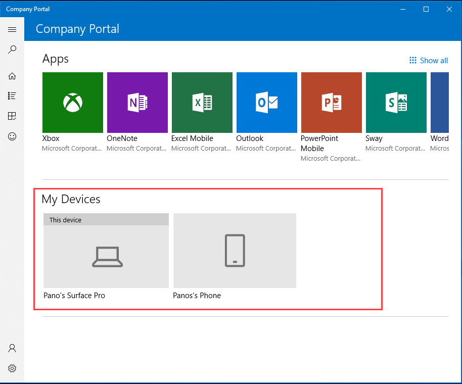
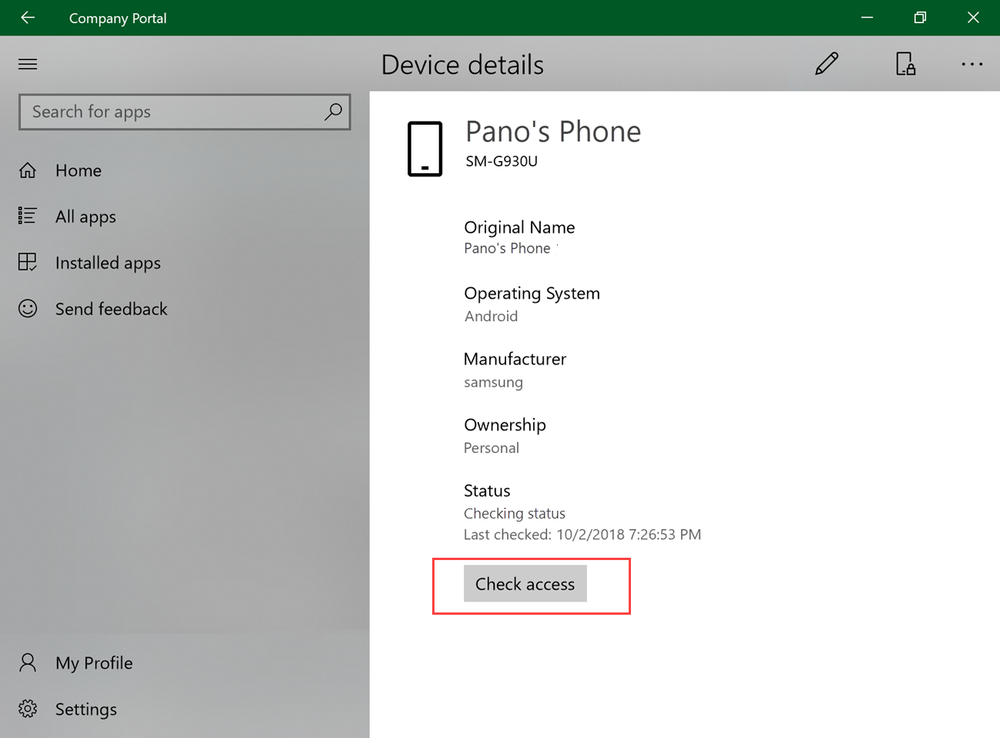
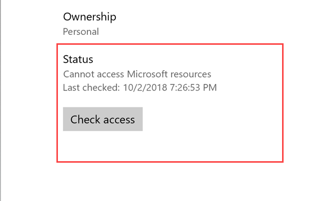
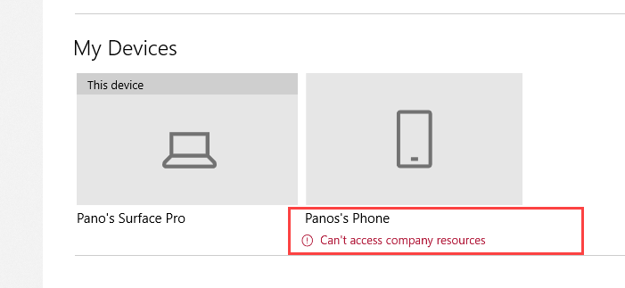

---
# required metadata

title: Check device access | Microsoft Docs
description: Check device access to find out if your device meets requirements, and is able to access work or school resources.
keywords:
author: lenewsad
ms.author: lanewsad
manager: dougeby
ms.date: 10/05/2018
ms.topic: article
ms.prod:
ms.service: microsoft-intune
ms.technology:
ms.assetid: 
searchScope:
 - User help

# optional metadata

ROBOTS:  
#audience:
#ms.devlang:
ms.reviewer: 
ms.suite: ems
#ms.tgt_pltfrm:
ms.custom: intune-enduser

---

# Check access from Company Portal app for Windows

Verify that your device has access to work or school resources. 

Organizations enforce requirements&ndash;such as encryption and password limits&ndash; to make sure only secure, trusted devices access their data. Managed devices must meet and maintain these requirements to access the organization's resources.

When your device loses access to these resources, the Company Portal app's **Device details** page alerts you. It also lists the settings you need to adjust, and provides information to help you resolve them. After they're resolved, **Check access** to confirm that you can access resources again.

Complete the steps in this article to check access from the Company Portal app for Windows.

## Check access from Device details page  
1. Open the Company Portal app for Windows and go to **My Devices**.  

      
2. Select a device.  
3. On the **Device details** page, select **Check access**. The app syncs your device with your organization's current requirements and checks to make sure your device matches them. This check can take a few minutes.  

     

The status updates to let you know that the device **Can access your organization's resources** or **Cannot access your organization's resources**.  

     
5. If your device can't access resources, reew the message and list of affected settings at the top of the page. Click **More** to expand the problem details. Click **Less** to collapse the details.  

      

Some settings show additional links and options to help you fix the problem right away. The resolve, sync, and contact options, described below, are only visible when using the Company Portal app on the affected device. 
     * **How to resolve this** opens a relevant help article, if available.
     * **Resolve** redirects you to the setting on your device.
     * **Sync** evalutes your device to make sure it matches your organization's requirements.
     * **Contact IT** redirects you to your IT team's contact information.  

## Check access from device context menu  
1. Open the Company Portal app for Windows and go to **My Devices**.  

      

2. Right-click or press and hold a device to open its [context menu](https://docs.microsoft.com//windows/uwp/design/controls-and-patterns/menus).  

      
3. Select **Check access**. The app syncs your device with your organization's current requirements and checks to make sure your device matches. This check can take a few minutes.  
 
4. A message appears under the device to let you know that the device **Can access company resources** or **Can't access company resources**. 

     

5. If your device can't access resources, select the device.
6. On the **Device details** page:  
    a. Review the message and list of affected settings at the top of the page.  
    b. Click **More** to expand the problem details. Click **Less** to collapse the details.  
    c. Under certain settings, you'll see **How to resolve this** or **Resolve**. Click either link to, respectively, open the relevant help article or Settings app on your device. If these links aren't available, you'll see your IT department's contact information.  

      
3. After you've updated the settings, click **Check access** at the bottom of the page.  

     

Need more help? Find your company support's contact information on the [Company Portal website](https://go.microsoft.com/fwlink/?linkid=2010980).
