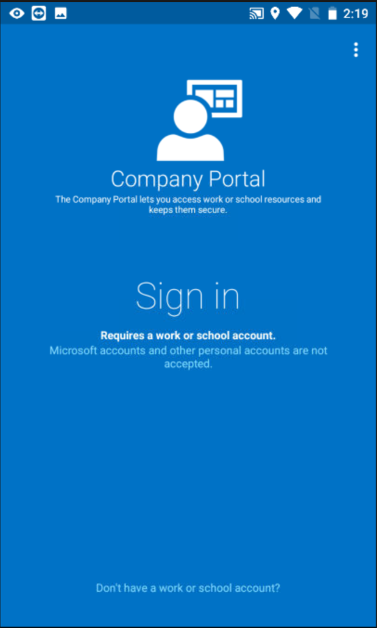
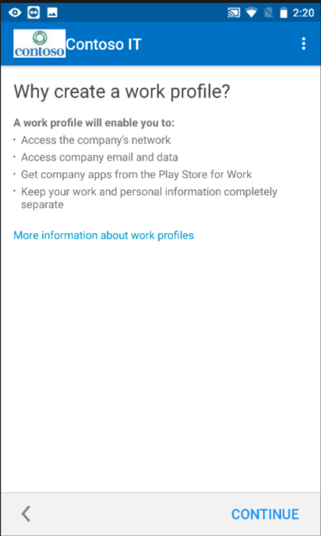
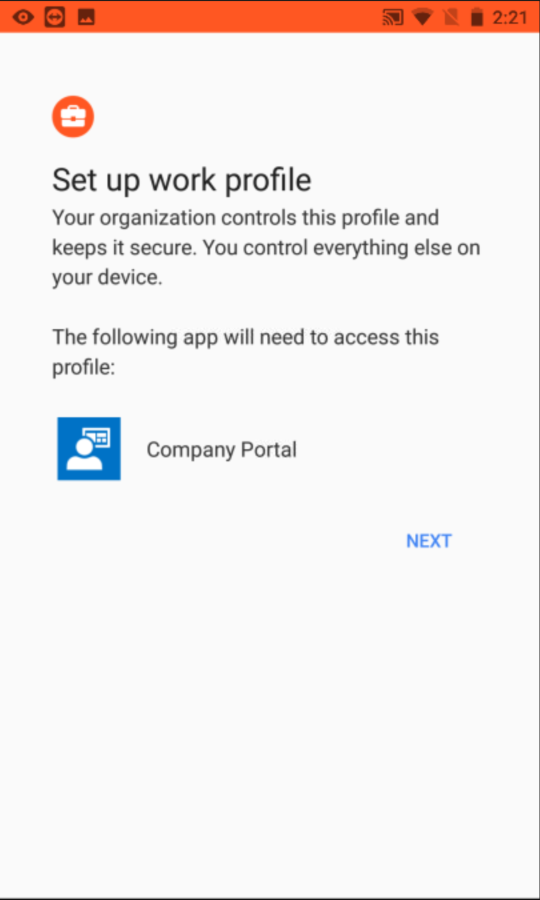
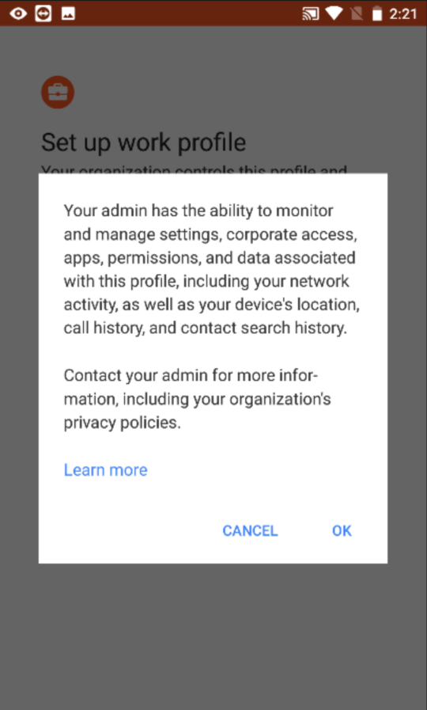
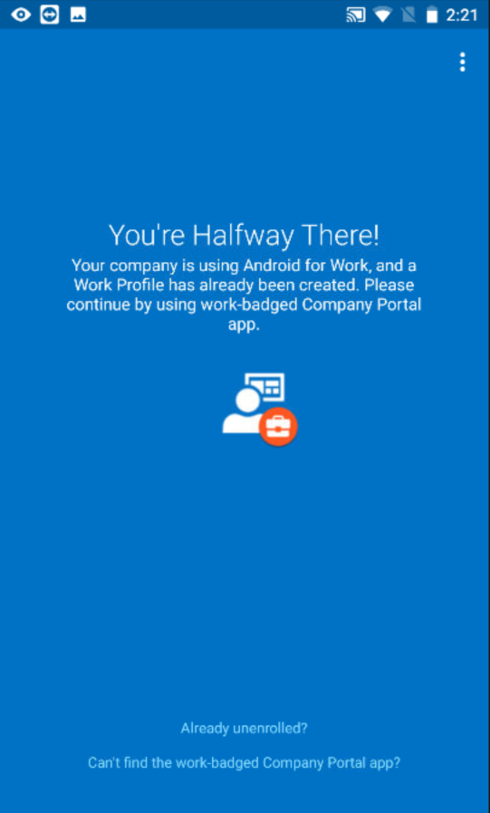
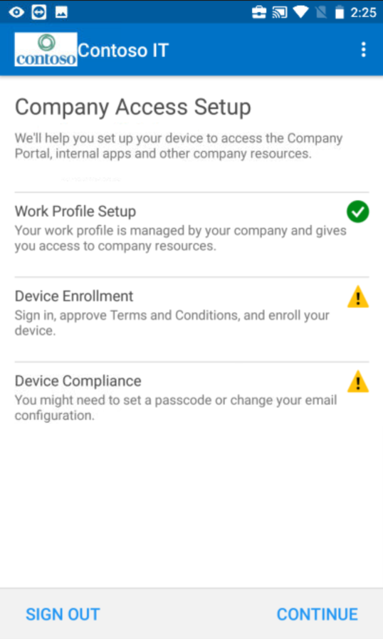
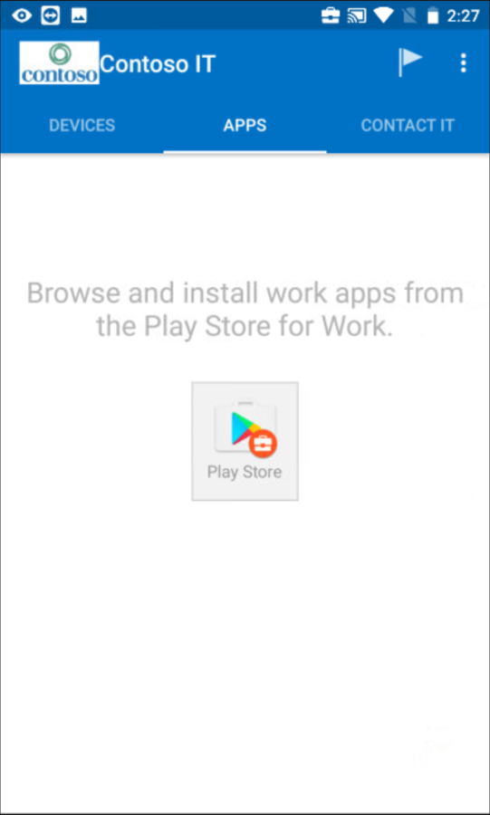

---
# required metadata

title: Enroll your device using a work profile | Microsoft Docs
description: How to make Android devices safer with work profiles.
keywords:
author: barlanmsft
ms.author: barlan
manager: angrobe
ms.date: 10/02/2017
ms.topic: article
ms.prod:
ms.service: microsoft-intune
ms.technology:
ms.assetid: 33ffff16-0280-43bf-87b3-74ddf4439bfa
searchScope:
 - User help

# optional metadata

ROBOTS:  
#audience:
#ms.devlang:
ms.reviewer: arnab
ms.suite: ems
#ms.tgt_pltfrm:
ms.custom: intune-enduser

---

# Create a work profile and enroll your device in Intune

Enrolling your Android device gives you access to company email, apps, and other work data. As part of enrollment, you set up a work profile, which separates the personal data on your device from your work data.

Your company support can manage only the work profile, which contains your work data. Your company support cannot manage the personal data on your device. Find out more about [what happens when you create a work profile](what-happens-when-you-create-a-work-profile-android.md).

To create a work profile:

1.  On the Android Company Portal **Welcome** screen, tap **Sign in**, and then sign in with your work or school account. If you haven't installed the free app yet, download and install it from [Google Play](http://play.google.com/store/apps/details?id=com.microsoft.windowsintune.companyportal).

	

2. On the **Company Access Setup** screen, tap **CONTINUE**.

	

3.  On the **Why create a work profile?** screen, read about what you'll be able to do, and then tap **CONTINUE**.

	

4.  Review a list of what your company support can and can't see on your device, and tap **CONTINUE**.

	

5.  On the **What's next?** screen, read about what happens during enrollment, and then tap **ENROLL**.

	

6. On the **Set up work profile** screen, tap **NEXT** to let the Company Portal app access the work profile.

	

7. Review the Google screen that describes what your company support can do when you create a work profile, and then tap **OK**.

	

	You'll see a couple of messages that say "Setting up your work profile" and "Enrolling your device."

8. On the **You're Halfway There!** screen, wait a few seconds until the Company Portal app opens.

	

9. On the Android Company Portal **Welcome** screen, tap **Sign in**, and then sign in with the same work or school account that you used to sign in earlier in this process.

10. On the **Company Access Setup** screen, note that your Work Profile Setup is now complete, and then tap **CONTINUE**.

	

	You'll briefly see the message "Enrolling your device."

11. When the **You're all set!** screen shows that everything has been set up correctly, tap **DONE**.

	

	You can now get company apps from the Play Store for Work.

	

Still need help? Contact your company support. For contact information, check the [Company Portal website](https://portal.manage.microsoft.com).
