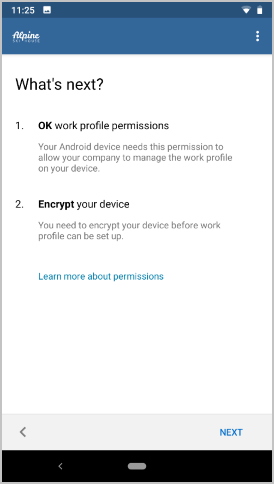

---
# required metadata

title: Enroll Android work profile in Intune Company Portal | Microsoft Docs
description: How create a work profile and enroll device in Intune Company Portal.
keywords:
author: lenewsad
ms.author: lanewsad
manager: dougeby
ms.date: 07/18/2019  
ms.topic: article
ms.prod:
ms.service: microsoft-intune
ms.technology:
ms.assetid: 33ffff16-0280-43bf-87b3-74ddf4439bfa
searchScope:
 - User help

# optional metadata

ROBOTS:  
#audience:
#ms.devlang:
ms.reviewer: arnab
ms.suite: ems
#ms.tgt_pltfrm:
ms.custom: intune-enduser
ms.collection: M365-identity-device-management
---

# Enroll device with Android work profile

Enroll your personal Android device to get access to company email, apps, and other work data. During enrollment, you'll set up an Android work profile. This profile separates the personal data on your device from your work data. Your company support only manages the work profile, which consists of work files and data. Your company support can't manage the personal data on your device. Find out more about [what happens when you create a work profile](what-happens-when-you-create-a-work-profile-android.md).  

## Create work profile and enroll device

1. Sign in to the Company Portal for Android app with your work or school account. If you haven't installed the free app, install it from [Google Play](https://play.google.com/store/apps/details?id=com.microsoft.windowsintune.companyportal).  

2. On the **Company Access Setup** screen, tap **CONTINUE**.  

      

3. Read the list of what your company support can and can't see on your device. Then tap **CONTINUE**.   

      

4. On the **What's next?** screen, read about what will happen during enrollment. Then tap **NEXT**.  

    

5. The next screen shows the Google terms for creating a work profile. Read the terms and then tap **ACCEPT & CONTINUE**. The appearance of this screen will vary based on your device's Android version. 

      

    Your work profile will begin setup. 

      

     Depending on your Android version, you might see an additional screen that indicates you're halfway through setup. If you see this screen, wait a few moments until you're redirected and signed in to the Company Portal app.  

      

6. On the **Company Access Setup** screen, check that your work profile is created. Then tap **CONTINUE**.  

      

7. Check that your work profile is active. Then tap **CONTINUE**. 

      

8. Your organization might require that you update your device settings, such as setting a password. After you’ve done that, tap **CONTINUE**.  

     

9. When you see the **You're all set!** screen, tap **DONE**.  

      

You can now install company apps on your device. Go to the managed Google Play store to find and install these apps. 

## Next steps  

Still need help? Contact your company support. For contact information, check the [Company Portal website](https://go.microsoft.com/fwlink/?linkid=2010980).
