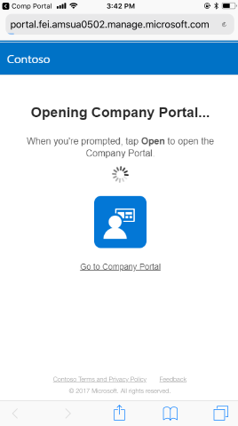
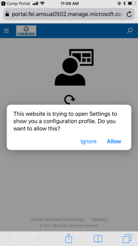
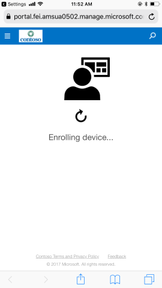
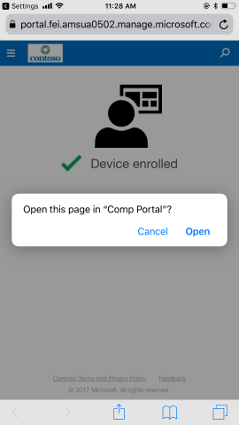

---
# required metadata

title: Set up iOS device access to your company resources | Microsoft Docs
description: Describes how to get your iOS device managed by Intune
keywords:
author: lenewsad
ms.author: lanewsad
manager: dougeby
ms.date: 10/05/2018
ms.topic: article
ms.prod:
ms.service: microsoft-intune
ms.technology:
ms.assetid: 6eeec7aa-1b07-4ce3-894c-13e09b89bdd4
searchScope:
 - User help

# optional metadata

ROBOTS:  
#audience: 
#ms.devlang:
ms.reviewer: esmich
ms.suite: ems
#ms.tgt_pltfrm:
ms.custom: intune-enduser
ms.collection: M365-identity-device-management
---

# Set up iOS device access to your company resources

Enroll your iOS device with the Intune Company Portal app to gain secure access to your organization's email, files, and apps.

Before you're allowed to access proprietary data from a coporate or personal device, you're required to get your device managed. After your device becomes managed, your organization will assign policies and apps to the device through their mobile device management (MDM) provider. 

To maintain access to work or school information from your device, you must configure your device to match your organization's preferred settings. This article describes how Company Portal helps you enroll, configure, and maintain your device to meet these requirements.

> [!NOTE]
> If you tried to access company email in the Mail app, and received a prompt to get your device managed, you're in the right place. Follow the instructions below to get access to your email and other company resources on your iOS device.

## What to expect from the Company Portal app

### Security
During initial setup, the app requires that you authenticate yourself with your organization. It then informs you of any device settings you must update. For example, organizations often set minimum or maximum character password requirements that you'll be required to meet.    

### Protection
After your device is enrolled, the Company Portal app will continue to make sure that your device is protected. If you install an app from an untrusted source, for example, the app will alert you and sometimes revoke access to company data. App protection policies like this one are common in organizations. They often require you to uninstall the untrusted app before you can regain access.

### Setting notifications
If after enrollment your organization enforces a new security requirement, such as multi-factor authentication, the Company Portal app will notify you. You'll have the chance to adjust your settings so that you can continue to work from your device.  

To learn more about enrollment, see [What happens when I install the Company Portal app and enroll my device?](https://docs.microsoft.com//intune-user-help/what-happens-if-you-install-the-company-portal-app-and-enroll-your-device-in-intune-ios). 

## Before you start

- Once you begin enrollment, make sure that you finish the entire process. If you pause for more than a few minutes, setup may end and require you to start over.  
- If this process should fail, return to the Company Portal app and try again.  
- Check that your Wi-Fi is working, and that Safari works on your device.
- Download and install the [Intune Company Portal app](install-and-sign-in-to-the-intune-company-portal-app-ios.md).  

## Using the Company Portal app to set up access to company resources

|What you see|Explanation|
|---|---|
||Open the Company Portal app and tap **Sign In**.|
||Enter your company email address, then tap **Next**.|
||Enter your password, then tap **Sign in**.|
||Wait for this screen to load.|
||Read and **Accept All** of the Terms and Conditions.|
||Tap on **Begin** to begin the process of making your device able to access company resources. If you can't do this right now, you can **Postpone** the process, but it means you won't be able to get email, documents, and more.|
||You can **Learn more** about what your company can see by tapping the link at the bottom. Otherwise, tap **Continue**.|
||This screen walks you through what's happening in the setup. You'll spend time in Safari, the Settings app, and the Company Portal app. Tap **Continue**.|
||Wait for this screen to load.|
||You're sent to Safari to get management information for your device.|
||Tap **Allow** to open the Settings app to download the configuration profile. You install this to let your company manage corporate information on your device.|
||Tap **Install**.|
||Tap **Install**.|
||Wait for this screen to load.|
||This warning, written by Apple, lets you know more about what types of actions could be taken on a device under management. Find out more about [what information your company can see](what-info-can-your-company-see-when-you-enroll-your-device-in-intune.md).|
||Tap **Trust** to allow your company to manage corporate information and settings on your device.|
||Wait for this screen to load.|
||Your profile is installed and your device's corporate information and settings are much closer to being managed.|
||You're sent back to Safari to finish getting management information for your device. |
||Tap **Open**.|
||Wait for this screen to load.|
||Select the best category for your device. This usually has to do with who owns the device, or where it's located most of the time.|
|||
||You've successfully gotten your device managed. There are likely still settings, like the length of your password, that your company may need you to update. Tap **Continue** to proceed.|
||Company Portal will check to see if any of your settings need to be updated.|
||Company Portal will provide instructions on how you can fix any issues with your settings. Once you finish fixing the issues, tap **Check Settings**.|
||Your device will check to see if your settings are secure enough to access company resources.|
||Congratulations! Your device is now enrolled in Intune.|

> [!Note]
> You may have a few more steps to complete before your device is fully managed. Find out more about [enrolling your device using telecom expense management](enroll-your-device-with-telecom-expense-management-ios.md). If your organization is using Apple's Device Enrollment Program, find out more [here](enroll-your-device-dep-ios.md).

Still need help? Check in with your company support. You can find their contact information on the [Company Portal website](https://go.microsoft.com/fwlink/?linkid=2010980).  
