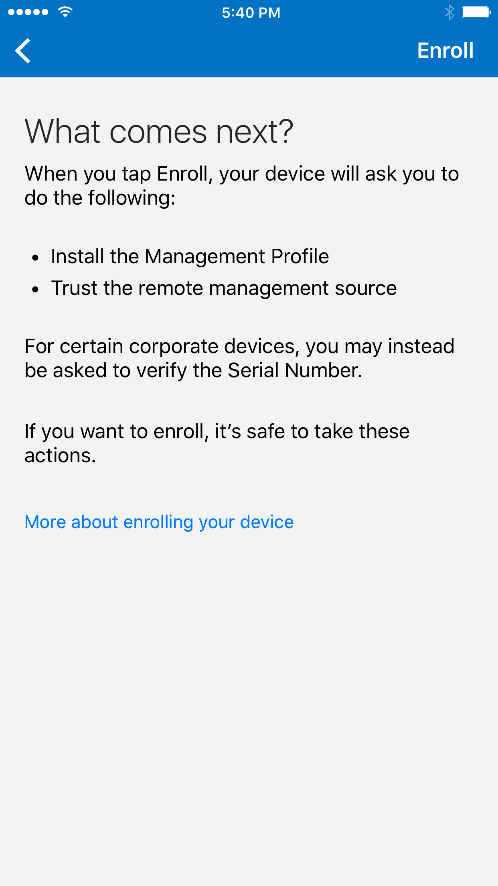

---
# required metadata

title: Enroll your iOS device in Intune | Microsoft Docs
description: Describes how to enroll an iOS device in Intune
keywords:
author: barlanmsft
ms.author: barlan
manager: angrobe
ms.date: 07/06/2017
ms.topic: article
ms.prod:
ms.service: microsoft-intune
ms.technology:
ms.assetid: 6eeec7aa-1b07-4ce3-894c-13e09b89bdd4
searchScope:
 - User help

# optional metadata

ROBOTS:  
#audience:
#ms.devlang:
ms.reviewer: esmich
ms.suite: ems
#ms.tgt_pltfrm:
ms.custom: intune-enduser

---

# Enroll your iOS device in Intune

If your company or school uses Microsoft Intune, you can enroll your iOS device to get access to company email, files, and other resources. When you enroll your devices, your IT department can manage those work or school resources, keep them secure, and give you the freedom to use your preferred device to get your work done. To learn more about enrollment, see [What happens if you install the Company Portal app and enroll your device in Intune?](what-happens-if-you-install-the-company-portal-app-and-enroll-your-device-in-intune-ios.md)

<iframe src="https://channel9.msdn.com/Series/IntuneEnrollment/iOS-Enrollment/player" width="960" height="540" allowFullScreen frameBorder="0"></iframe>

> [!NOTE]
> If you're actually trying to enroll a macOS device, such as a MacBook Pro or iMac, [try these instructions instead](enroll-your-device-in-intune-macos.md).

**Before you start:**

- Make sure that you finish enrolling after you start the steps. Pausing for more than a few minutes usually stops the process, and will require you to restart.
- If your enrollment fails for any reason, you need to return to the Company Portal app to try again.
- Make sure that your Wi-Fi is working. Otherwise, enrollment fails.
- If you blocked Safari on your device, unblock it. Safari is used as part the device enrollment process. 

**To enroll your iOS device:**

1.  Follow the steps in [Install and sign in to the Intune Company Portal app](install-and-sign-in-to-the-intune-company-portal-app-ios.md).

2. On the **Company Access Setup** page, tap **Begin**.

	

3. On the **Why enroll your device?** screen, read about what you can do when you enroll your device, and then tap **Continue**.

	

  > [!NOTE]
  > The yellow triangles don't mean you've already got an error. Those icons indicate that there are still steps to be completed in the enrollment process.

4. Review a list of what your IT admin can and can’t see on your enrolled device, and then tap **Continue**.

	

5.  On the **What comes next** screen, read about what happens during enrollment, and then tap **Enroll**.

 	

6.  On the **Install Profile** screen, tap **Install**, and enter your passcode, if prompted.

	

7.  Tap **Install**.

	    

8.  Tap **Install** to indicate that you've read the warning.

   	

9.  Tap **Trust**.

   	

10.  When the screen changes to show that the profile has finished installing, Tap **Done**.

 	

	An “Enrolling device” message shows on the screen.

11.  When a message asks if you want to open the page in the Company Portal, tap **Open**.

	

12. On the **Company Access Setup** screen, tap **Continue**. This screen shows you what other requirements you may have to do to make your device compliant, like setting a password. Follow the on-screen instructions until you meet all the compliance requirements. Once you finish, you are returned to the Company Access Setup screen. Tap **Continue**.

	

13. Tap **Done**.

	

Your device is now enrolled in Intune, and you are taken back to the Company Portal app.

> [!Note]
> You have a few more steps to complete before your device is fully enrolled. Find out more about [enrolling your device using telecom expense management](enroll-your-device-with-telecom-expense-management-ios.md). If your organization is using Apple's Device Enrollment Program, find out more [here](enroll-your-device-dep-ios.md).

Still need help? Contact your IT admin. For contact information, check the [Company Portal website](http://portal.manage.microsoft.com).
