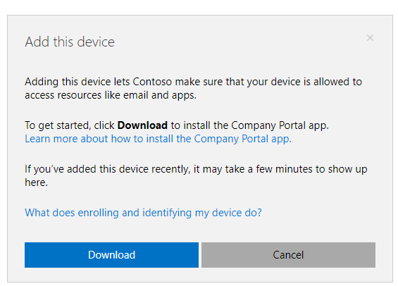

---
# required metadata

title: Enroll your macOS device in Intune with Company Portal | Microsoft Docs
description: Describes how to enroll a macOS device in Intune with Company Portal app
keywords: Mac OS X, macOS, OS X
author: lenewsad
ms.author: lanewsad
manager: dougeby
ms.date: 10/03/2018
ms.topic: article
ms.prod:
ms.service: microsoft-intune
ms.technology:
ms.assetid: 3bb659cc-9b57-4d19-8631-2c26749fa71c
searchScope:
 - User help

# optional metadata

ROBOTS:  
#audience:
#ms.devlang:
ms.reviewer: elocholi
ms.suite: ems
#ms.tgt_pltfrm:
ms.custom: intune-enduser
ms.collection: M365-identity-device-management
---

# Enroll your macOS device in Intune with the Company Portal app

Enroll your macOS device with the Intune Company Portal app to gain secure access to your organization's email, files, and apps.

Organizations often require you to get your device managed before you can access proprietary data from it. After a device becomes managed, organizations can push policies and apps to the device through their mobile device management provider. To get continuous access to work or school information from your device, you must configure your device to match policy settings.  

This article describes how the Intune Company Portal app for macOS helps you enroll, configure, and maintain your device to meet your organization's requirements.  
 
> [!VIDEO https://www.youtube.com/embed/Pa2pfhwq_yk?rel=0]

## What to expect from the Company Portal app

During initial setup, the app requires that you authenticate yourself with your organization. It then informs you of any device settings you must make. For example, organizations often set minimum or maximum character password requirements that you'll be required to meet.    

After your device is enrolled, the Company Portal app will continue to make sure that your device is protected. If you install an app from an untrusted source, for example, the app will alert you and sometimes revoke access to company data. App protection policies like this one are common in organizations, and often require you to uninstall untrusted apps before you can regain access.

If after enrollment your organization enforces a new security requirement, such as multi-factor authentication, the Company Portal app will notify you. You'll have the chance to adjust your settings so that you can continue to work from your device.  

To learn more about enrollment, see [What happens when I install the Company Portal app and enroll my device?](what-happens-if-you-install-the-Company-Portal-app-and-enroll-your-device-in-intune-macos.md).  

## Get your device managed  
Use the following steps to enroll macOS devices running macOS 10.12 and later.   

1. To access the Company Portal website, open a new window in __Safari__, and go to https://portal.manage.microsoft.com.  

2. Sign in to the Company Portal website with your work or school account.

   [!INCLUDE [wit_nextref](includes/end-user-password-guidance.md)]

3. Go to the top left-corner of the page and click **Menu** > **Devices**.  

4. The __Devices__ page, will show either a list of managed devices, or a banner. What you see depends on if you already have a managed device. 
    * To add a device that's not listed, select the banner that reads, **Tap here to tell us which device you're using or add a new device.**
    * If you don't have any devices, the banner reads: **You don't have any managed devices. Add this one by tapping here.** Click the banner to add your device.  

       
5. Complete the step below that matches the message you currently see in the Company Portal.  
    * If you're adding a device for the first time, you'll be prompted to download the Company Portal app on your device. Click **Download** to continue.  

           

    * If you already have a managed macOS device, you'll receive a prompt with a list of your currently managed macOS devices. Select **My device isn't listed here** > **Download** to download the Company Portal app on the device you're adding.  

           

6. Your device will check to make sure that the installation file **CompanyPortal.pkg** is safe to open. After it's complete, open the installer and complete the installation.  

7. When the installer has finished, go to the **Launchpad** and open **Company Portal**.  

8. Your macOS device will prompt you to confirm that you want to open the Company Portal app. Click **Open**.  

   > [!TIP]
   > Intune needs access to your computer to make sure that your device is secure enough to access your organization's resources. If your computer refuses to open the Company Portal app, [turn off Gatekeeper](https://support.apple.com/HT202491). Then open the app.

9. The first screen you see in the Company Portal app prompts you to **Sign In**. Use the same work or school account you used to sign in to the Company Portal website.

10. The Company Portal confirms your account information, and shows your **Device Enrollment** and **Device Compliance** statuses. Yellow triangles highlight the actions you need to take to secure your macOS device for school or work. Click **Begin** to start enrollment. 

11. If prompted, type in your computer's sign-in information.  

It might take a few minutes to enroll your device in management. During this time, you can do other things on your device. You'll receive a message after you've completed Company Access Setup to let you know you're done.  

## Unverified profiles
When you view the installed mobile device management (MDM) profiles for your macOS device, some profiles might show an **Unverified** status. As long as the **Management profile** shows a **Verified** status, you don’t need to be concerned.  

The management profile is what defines the MDM channel connection. As long as the management profile is verified, any other profiles delivered to the machine, via that channel, inherit the security traits of the management profile.

Also, because those other profiles don’t require individual verifications, they're more quickly generated and delivered to devices. 

## Updating the Company Portal app

Updating the Company Portal app is done the same way as any other Office app, through Microsoft AutoUpdate for Mac. Find out more about [updating Microsoft apps for macOS here](https://support.office.com/article/Check-for-Office-for-Mac-updates-automatically-bfd1e497-c24d-4754-92ab-910a4074d7c1).  

## Next Steps  
Need additional help? Check in with your company support. You can find their contact information on the [Company Portal website](https://go.microsoft.com/fwlink/?linkid=2010980).  

