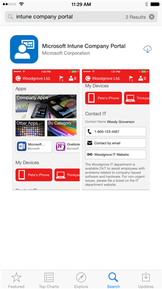

---
# required metadata

title: Install and sign in to the Company Portal app | Microsoft Docs
description:
keywords:
author: barlanmsft
ms.author: barlan
manager: angrobe
ms.date: 06/27/2017
ms.topic: article
ms.prod:
ms.service: microsoft-intune
ms.technology:
ms.assetid: 8dfe66b4-f585-4862-87fa-7dbb4487549c
searchScope:
 - User help

# optional metadata

ROBOTS:  
#audience:
#ms.devlang:
ms.reviewer: esmich
ms.suite: ems
#ms.tgt_pltfrm:
ms.custom: intune-enduser

---

# Install and sign in to the Company Portal app

The Company Portal is an app that you install on your iOS device to give you access to your company or school apps, email, and network.  Before you can get access, you must install the Company Portal app, and then  use the app to enroll your device in Microsoft Intune. For more information, see [What happens if you install the Company Portal app and enroll your device in Intune?](what-happens-if-you-install-the-company-portal-app-and-enroll-your-device-in-intune-ios.md).

1.  Open the **App Store** and search for **intune company portal**.

2.  Download the **Microsoft Intune Company Portal** app.

    

3.  Open the Company Portal app, enter your work or school email address and password, and then tap **Sign in**.

    If you are signing into the Company Portal app for the first time, and your company or school is using Intune, you will be prompted to enroll your device in Intune. To enroll, follow the steps in [enroll your iOS device in Intune](enroll-your-device-in-intune-ios.md) or [enroll your macOS device in Intune](enroll-your-device-in-intune-macos.md). You can also [sign in using another device](https://docs.microsoft.com/intune-user-help/sign-in-to-the-company-portal#signing-in-from-another-device). 

Still need help? Contact your IT admin. For contact information, check the [Company Portal website](http://portal.manage.microsoft.com).
