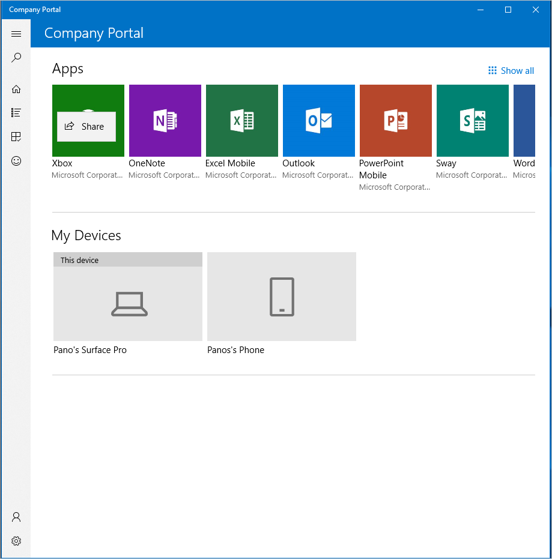
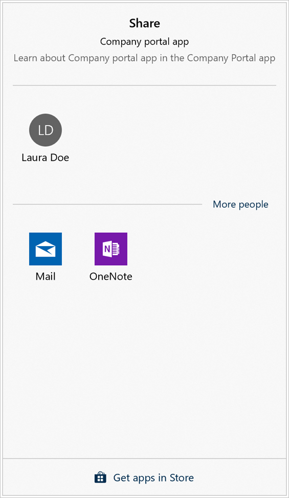

---
# required metadata

title: Installing apps from Company Portal app for Windows
description:
keywords:
author: lenewsad
ms.author: lanewsad
manager: dougeby
ms.date: 09/28/2018
ms.topic: article
ms.prod:
ms.service: microsoft-intune
ms.technology:
ms.assetid:

searchScope:
 - User help

# optional metadata

ROBOTS:  
#audience:
#ms.devlang:
ms.reviewer: 
ms.suite: ems
#ms.tgt_pltfrm:
ms.custom: intune-enduser

---

# Install apps on your device
Install apps on your device from the Company Portal app for Windows.

1. Open the Company Portal app and sign in with your work or school account.

2. Find and install apps from any of the following sections of the Company Portal app:
    * **Apps**: Select from a list of your organization's featured apps. 
    * **Show all**: Within the **Apps** section, click **Show all** to view all available apps.
    * **Search for apps**: A static search bar sits in the navigation menu on the left side of the app. Type in the name of an app to find out if it's available to you.
    * **All apps**: View, sort, and filter all available apps.
3. Select an app to install.
4. On the Apps details page, click **Install**. After installation is done, the page will show an **Installed** status.
  
    

 Depending on the size of your company, you might see multiple versions of Office available to download from Company Portal. For specific information about the Office suite for Windows devices, see [Installing Office 365 on your Windows device](./install-office-windows.md).

## Share apps with others
Share and recommend apps to your work or school contacts. The following steps describe how to share a link directly from Company Portal.

1. In Company Portal, right-click or press and hold on any app to open its [context menu](https://docs.microsoft.com/en-us/windows/uwp/design/controls-and-patterns/menus).  

      

2. Select **Share**.
3. Choose from individual contacts or select another program, such as OneNote, to send to a group. If you don't see an app you want to use, select **Get apps in Store** to see other available apps.  

     

After you share, the recipient will receive a link and a message to view the app's details. The link opens the Company Portal **App details** page. 

Still need help? Contact your company support. For contact information, check the [Company Portal website](https://go.microsoft.com/fwlink/?linkid=2010980).
