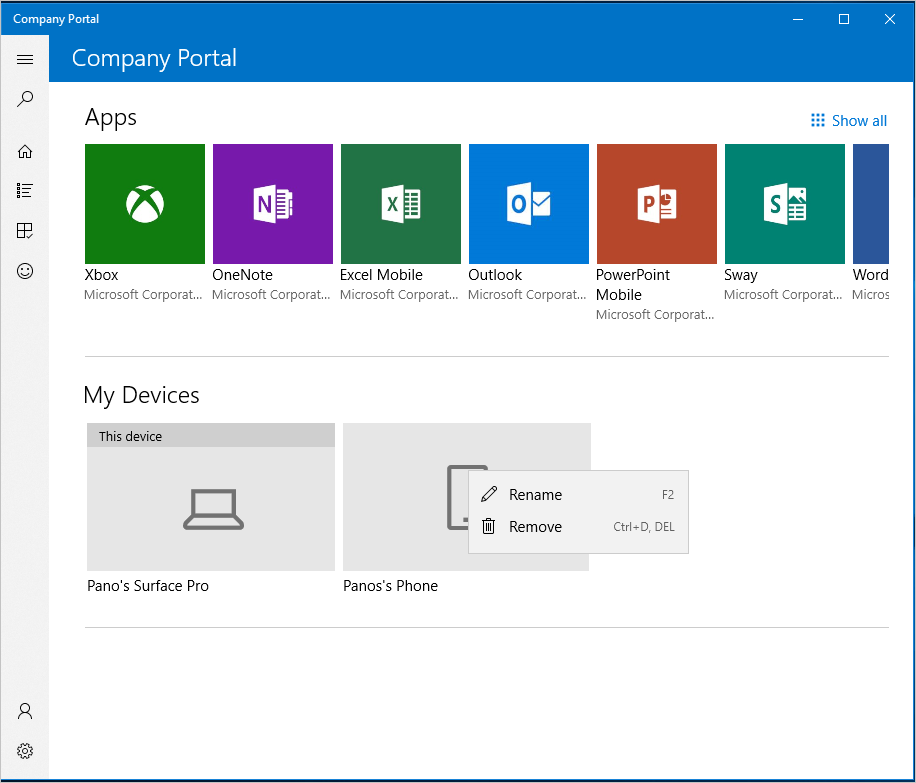

---
# required metadata

title: Rename device from the Intune Company Portal app for Windows 
description: Edit and rename a Windows 10, Android, iOS, or Microsoft HoloLens device in the Intune Company portal app for Windows
keywords:
author: lenewsad
ms.author: lanewsad
manager: dougeby
ms.date: 10/01/2018
ms.topic: article
ms.prod:
ms.service: microsoft-intune
ms.technology:
ms.assetid: 
searchScope:
 - User help

# optional metadata

ROBOTS:  
#audience:
#ms.devlang:
ms.reviewer: 
ms.suite: ems
#ms.tgt_pltfrm:
ms.custom: intune-enduser

---

# Rename device from the Company Portal app for Windows
Rename a device to make it easier to recognize from other devices. The Company Portal app for Windows lets you rename the following types of connected devices:  
* Windows 10
* iOS
* Android  

## Rename device from **Device details** page  
To rename a device:
1. Open the Company Portal app.
2. In the **My devices** section, select the device you want to rename.
3. On the **Device details** page, go to the top, right-corner and select the **Rename** pencil icon. 
4. Type in the new name and click **Rename**. The device name updates immediately in the app. 

## Rename device from device context menu
1. On the **Home** page of the Company Portal app, go down to **My Devices**.
2. Right-click or press and hold the device you want to rename.
3. Select **Rename**.
 
4. Type in the new name and select **Rename**. The device name updates immediately in the app.

Still need help? Contact your company support. For contact information, check the [Company Portal website](https://go.microsoft.com/fwlink/?linkid=2010980).

