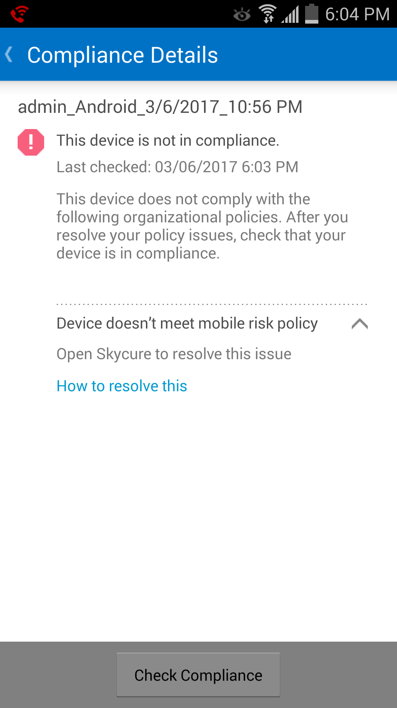

---
# required metadata

title: You need to install Skycure on your Android device | Microsoft Docs
description:
keywords:
author: barlanmsft
ms.author: barlan
manager: angrobe
ms.date: 03/17/2017
ms.topic: article
ms.prod:
ms.service: microsoft-intune
ms.technology:
ms.assetid: 627cd171-6e1b-439e-809a-2e6f007c4b3d
searchScope:
 - User help

# optional metadata

ROBOTS:  
#audience:
#ms.devlang:
#ms.reviewer: heenamac
#ms.suite: ems
#ms.tgt_pltfrm:
ms.custom: intune-enduser

---

# You need to install Skycure

Before you can access your work, your IT admin needs you to install the Skycure app, which helps to protect your device by finding potential security threats.

If you have trouble with the installation, try the troublshooting steps at the end of this topic.

**What you need to do:**

1.	Drag down from the top of the screen to open the Notifications bar, and then tap **Required application – Install Skycure from Play Store**. You can also find this inside of the Company Portal app under __Compliance Details__.

	

	You are taken to the Skycure installation page in the Play Store.

2.	Install Skycure, and then tap **ACCEPT** to let Skycure access your device.

3. Open Skycure, and then tap **VERIFY**.

4. Tap **Sign in with Azure Active Directory**, and then enter the account that you use to access work or school email and files.

5. Select the account that you use to access work or school email and files, and then tap **ADD ACCOUNT**.

6. Tap **Accept** to give Skycure permission to sign you in and read your profile.

7. Review the items about how Lookout protects your device, and then tap **OK**.

	

	When you see the following screen, Lookout is now set up and connected.

	

	Skycure starts to check right away for security threats on your device. If no threats are found, you’ll see the following screen.

	

	The Device Details screen in the Company Portal shows that you are now in compliance with your company’s security requirements.

	

	If Skycure finds a security threat on your device, you will see instructions about how to fix the issue.

**If the installation doesn't work**

Sometimes installations can fail due to technical issues beyond your control. If this happens, try installing Skycure [manually from the Play Store](https://play.google.com/store/apps/details?id=com.skycure.skycure).

Still need help? Contact your IT admin. For contact information, check the [Company Portal website](http://portal.manage.microsoft.com).
