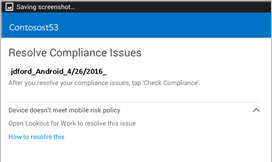
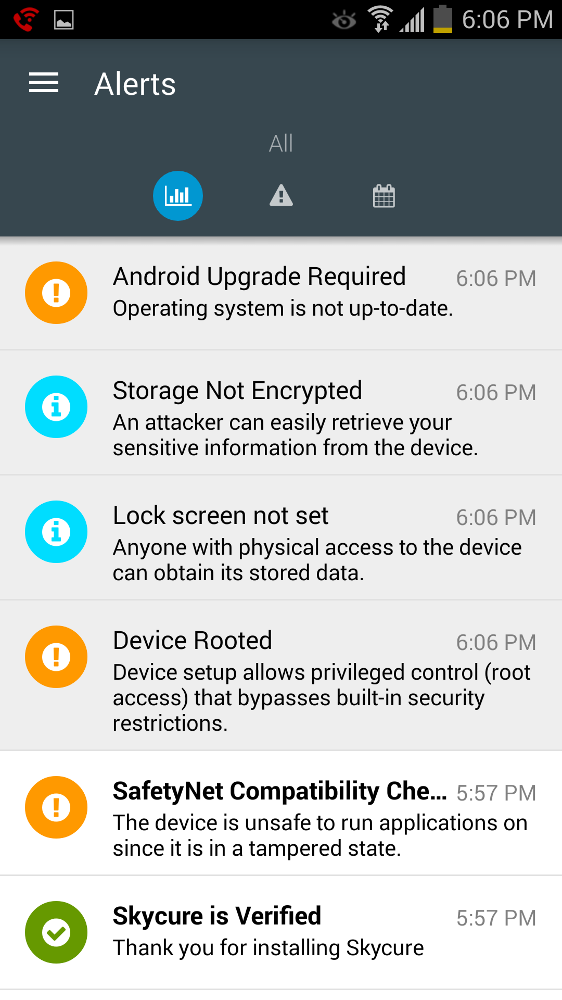
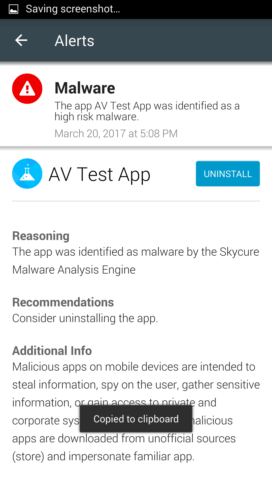

---
# required metadata

title: Resolving threats found by Symantec Endpoint Protection Mobile for Android | Microsoft Docs
description: Learn how to fix threats found on your Android device.
keywords:
author: barlanmsft

ms.author: barlan
manager: angrobe
ms.date: 09/25/2017
ms.topic: article
ms.prod:
ms.service: microsoft-intune
ms.technology:
ms.assetid: b5521762-a80c-4630-ae30-38b471da216b

searchScope:
 - User help

# optional metadata

ROBOTS:  
#audience:
#ms.devlang:
#ms.reviewer: heenamac
#ms.suite: ems
#ms.tgt_pltfrm:
ms.custom: intune-enduser

---

# Resolve a threat found by Symantec Endpoint Protection Mobile

Symantec Endpoint Protection Mobile has found a potential threat on your device, and you must fix the issue to regain access to your company or school email, apps, and files. The message that you see might look something like this one:

To fix the issue, open the Symantec Endpoint Protection Mobile app, and follow the instructions shown in the app.

## What you might see if your enrolled device is blocked from accessing email or files

If there is a virus or other security threat on your enrolled device, and you try to access your company email or files, you might see a message like this one:

Tap the **device management portal** link to go to the [Company Portal website](https://portal.manage.microsoft.com#HelpDeskDialog), where you will see instructions on how to fix the issue.

## Example of an app that Symantec Endpoint Protection Mobile sees as a threat

If you have installed an app that Symantec Endpoint Protection Mobile thinks is a threat, you'll see a screen that is similar to this one:

After you uninstall the app, you regain access to your company email and data right away. If you ignore the request to uninstall the app, you will lose access to your email and data until you uninstall the app.

Still need help? Contact your company support. For contact information, check the [Company Portal website](https://portal.manage.microsoft.com#HelpDeskDialog).

