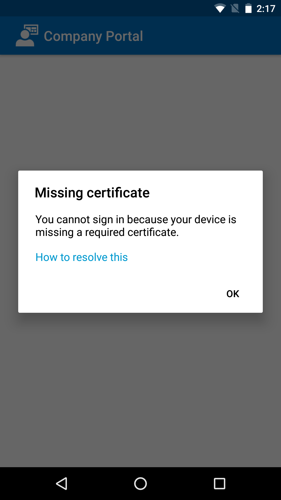

---
# required metadata

title: Your device is missing a certificate | Microsoft Docs
description:
keywords:
author: barlanmsft
ms.author: barlan
manager: angrobe
ms.date: 01/04/2017
ms.topic: article
ms.prod:
ms.service: microsoft-intune
ms.technology:
ms.assetid: f0ba4cbb-ef0a-4335-86bf-f1d006867fa2
searchScope:
 - User help

# optional metadata

ROBOTS:  
#audience:
#ms.devlang:
ms.reviewer: arnab
ms.suite: ems
#ms.tgt_pltfrm:
ms.custom: intune-enduser
---

# Your Android device is missing a certificate required by your company support

If your device isn’t enrolled in Intune, and it’s missing a certain certificate that is required by your company support, you won’t be able to sign in to the Company Portal app. When you try to sign in, you'll see the following message:

To fix this issue and get the required certificate, there are two main steps that you'll need to do:

- Identify the missing certificate by looking on a company or school PC.
- Use your device to download the missing certificate from the Internet.

## Identify the missing certificate by looking on a company or school PC

1. On a PC, open Internet Explorer. If you don't have a PC to use for this purpose, contact your company support. For your company support's contact information, check the [Company Portal website](http://portal.manage.microsoft.com).

2. Go to the [Company Portal website](http://portal.manage.microsoft.com), and sign in using your work or school credentials.

3. At the far right of the browser's address bar, choose the symbol that looks like a padlock, as shown in the following screenshot.

	

	If you don't see the padlock symbol, stop and contact your company support. The lock means that you are securely signed in, so you should not proceed unless you see that symbol.

4. Choose **View certificates**.

	

5. In the **Certificate** dialog box, choose the **Certification path** tab, and then identify the certificate that you need to get from the Internet. The name of the certificate that you need will be in the same position as the one that is highlighted in the previous example screenshot.

## Download and install the missing certificate on your Android mobile device

1. Using a search engine like Bing or Google, search for the name of the missing certificate that you identified in the previous section. The certificate may end in different "extensions," like ".crt" or ".pem", etc.

2. Download the root certificate from the website.

3. After the certificate downloads, drag down from the top of your device to open your notifications, and then tap the name of the certificate in the list of notifications.

4. In the **Name the Certificate** dialog box shown in the following screenshot, accept the default certificate name.

5. Ensure that **Credential Use** is set to **Used for VPN and apps**, and then tap **OK**.

	

6. Close the Company Portal app.

7. Reopen the Company Portal app. You should now be able to sign in to the Company Portal app. If you need help, contact your company support.

If you see the same "missing certificate" message as the one shown previously, and you have already followed the procedure, there is probably still another certificate that your company support will need to help you install. Contact your company support for help using contact information available at the [Company Portal website](http://portal.manage.microsoft.com).
