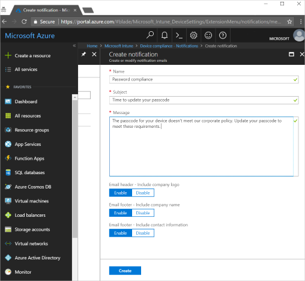

---
# required metadata

title: Actions for noncompliance with Intune
titleSuffix: "Intune on Azure"
description: "Learn how to create actions for noncompliance with Intune"
keywords:
author: vhorne
ms.author: victorh
manager: angrobe
ms.date: 01/05/2017
ms.topic: article
ms.prod:
ms.service: microsoft-intune
ms.technology:
ms.assetid: 6d0e0c4b-a562-44f3-82a4-80eb688d4733

# optional metadata

#ROBOTS:
#audience:
#ms.devlang:
ms.reviewer: muhosabe
ms.suite: ems
#ms.tgt_pltfrm:
ms.custom: intune-azure

---

# Automate actions for noncompliance

The **actions for non-compliance** allow you to configure a time-ordered sequence of actions that are applied to devices that don't meet the compliance policy criteria. By default, when a device is detected to not meet the compliance policy criteria, Intune immediately marks it as non-compliant, then Azure AD Conditional Access blocks the device. The **actions for non-compliance** give you more flexibility to decide what to do when a device is not compliant. For example, you can decide to not block the device immediately, then give the user a grace period to be compliant.

There are two types of actions:

-   **Notify end-users via e-mail**: You can customize your email notification before sending it to the end user. Intune provides customization of the recipients, subject, and message body, including company logo, and contact information.

-   **Mark device non-compliant**: You can determine a schedule in number of days after the device should be marked not compliant. This can be immediately, but you can also give the user a grace period to be compliant with your device compliance policies.

## Before you begin

You need to have at least one device compliance policy created to set up actions for non-compliance.

-   Learn how to create a device compliance policy for:

    -   [Android](compliance-policy-create-android.md)

    -   [Android for Work](compliance-policy-create-android-for-work.md)

    -   [iOS](compliance-policy-create-ios.md)
    
    -   [macOS](compliance-policy-create-mac-os.md)

    -   [Windows](compliance-policy-create-windows.md)

You need to have Azure AD conditional access set up ready when planning to use device compliance policies to block devices from using corporate resources.

- Learn [how to setup EMS conditional access](https://docs.microsoft.com/azure/active-directory/active-directory-conditional-access).

Additionally, you need to have a notification message template created. The notification message template is used later in the process of creating actions for non-compliance to send e-mail to your users.

### To create a notification message template

1. Go to the [Intune on Azure portal](https://portal.azure.com), and sign in with your Intune credentials.

2. Choose **More services** from the left menu, then type **Intune** in the text box filter.

3. Choose **Intune**

4. Choose **Device compliance**, then choose **Notifications** under the **Manage** section.

5. Choose **Create notification**, then enter the following:

    a.  Name

    b.  Subject

    c.  Message

    d.  E-mail header – Include company logo

    e.  E-mail footer – Include company name

    f.  E-mail footer – Include contact information

Once you're done adding the information, choose **Create**. The Notification message template is available for use.

> [!NOTE] 
> You can also edit a Notification template previously created.

## To create actions for non-compliance

> [!TIP]
> By default, Intune provides one action pre-defined in the actions for noncompliance section. This is the action to mark the device as not compliant after is detected to not meet your device compliance policy criteria. You can customize how long after the detection the device gets marked not compliant. This action cannot be removed.

You can add an action by the time you’re creating a new device compliance policy or by editing an existing device compliance policy.

1.  In the Intune workload, from the **Device compliance policies** blade, choose **Policies** under the **Manage** section.

2.  Choose a device compliance policy by clicking on it, then choose **Properties** under the **Manage** section.

3.  On the **device compliance policy properties** blade, choose **Actions for noncompliance**.

4.  On the **Actions for noncompliance** blade, choose **Add** to specify action parameters. You can choose the message template previously created, additional recipients, and the grace period schedule. You can specify the number of days (0 to 365) on the schedule, then you can enforce the conditional access policies. If you specify **0** number of days, this means conditional access must **immediately** block access to corporate resources once the devices are non-compliant with device compliance policies.
    > [!Important]    
    > Regardless of the actions that you choose, at a minimum, you must choose the **Block in AAD** action or the device might be compliant in Azure Active Directory, but non-compliant in Configuration Manager or Intune. 

5.  Once you're done adding your information, choose **Add**, then **OK**.

## Next steps

You can monitor the device compliance activity by running the reports available in the device compliance blade. Learn more [how to monitor device compliance with Intune](device-compliance-monitor.md)

