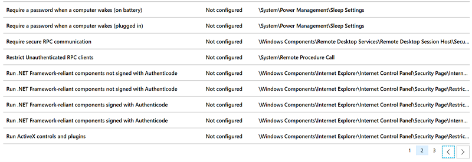
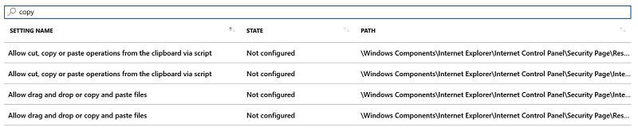

---
# required metadata

title: Use templates for Windows 10 devices in Microsoft Intune - Azure | Microsoft Docs
description: Use Administrative templates in Microsoft Intune to create groups of settings for Windows 10 devices. Use these settings in a device configuration profile to control Office programs, secure features in Internet Explorer, control access to OneDrive, use remote desktop features, enable AutoPlay, set power management settings, use HTTP printing, use different user logon options, and control the event log size.
keywords:
author: MandiOhlinger
ms.author: mandia
manager: dougeby
ms.date: 01/09/2019
ms.topic: article
ms.prod:
ms.service: microsoft-intune
ms.technology:

# optional metadata

#ROBOTS:
#audience:
#ms.devlang:
ms.reviewer:
ms.suite: ems
search.appverid: MET150
#ms.tgt_pltfrm:
ms.custom: intune-azure
ms.collection: M365-identity-device-management
---

# Use Windows 10 templates to configure group policy settings in Microsoft Intune

When managing devices in your organization, you want to create a group of settings that are applied to different device groups. For example, you have several device groups. For GroupA, you want to assign a specific set of settings. For GroupB, you want to assign a different set of settings. You also want a simple view of the settings you can configure.

You can complete this task using **Administrative Templates** in Microsoft Intune. The administrative templates include hundreds of settings that control features in Internet Explorer, Microsoft Office programs, remote desktop, access to OneDrive, use a picture password or PIN to sign in, and more. These templates are similar to group policy (GPO) settings in Active Directory (AD), and are [ADMX-backed settings](https://docs.microsoft.com/windows/client-management/mdm/understanding-admx-backed-policies) that use XML. But, the templates in Intune are 100% cloud-based. They offer a more simple and straight-forward way to configure the settings, and find the settings you want.

**Administrative Templates** are built in to Intune, and don't require any customizations, including using OMA-URI. As part of your mobile device management (MDM) solution, use these template settings as a one-stop shop to manage your Windows 10 devices.

This article lists the steps to create a template for Windows 10 devices, and shows how to filter all the available settings in Microsoft Intune. When you create the template, it creates a device configuration profile. You can then assign or deploy this profile to Windows 10 devices in your organization.

> [!NOTE]
> Administrative templates are supported for standalone devices. They are currently not supported for System Center Configuration Manager (SCCM) co-managed devices.

## Create a template

1. In the [Azure portal](https://portal.azure.com), select **All services** > filter on **Intune** > select **Intune**.
2. Select **Device configuration** > **Profiles** > **Create profile**.
3. Enter the following properties:

    - **Name**: Enter a name for the profile.
    - **Description**: Enter a description for the profile. This setting is optional, but recommended.
    - **Platform**: Select **Windows 10 and later**.
    - **Profile type**: Select **Administrative Templates (Preview)**.

4. Select **Create**. In the new window, select **Settings**. Every setting is listed, and you can use the before and next arrows to see more settings:

    

5. Select any setting. For example, select **Allow file downloads**. A detailed description of the setting is shown. Choose to **Enable**, **Disable**, or leave the setting as **Not configured** (default). The detailed description also explains what happens when you choose **Enable**, **Disable**, or **Not configured**.
6. Select **OK** to save your changes.

Continue to go through the list of settings, and configure the settings you want in your environment. Here are some examples:

- Use the **VBA Macro Notification Settings** setting to handle VBA macros in different Microsoft Office programs, including Word and Excel.
- Use the **Allow file downloads** setting to allow or prevent downloads from Internet Explorer.
- Use the **Require a password when a computer wakes (plugged in)** setting to prompt users for a password when the devices wakes from sleep mode.
- Use the **Download unsigned ActiveX controls** setting to block users from downloading unsigned ActiveX controls from Internet Explorer.
- Use the **Turn off System Restore** setting to allow or prevent users from running a system restore on the device.
- And much more...

## Find some settings

There are hundreds of settings available in these templates. To make it easier to find specific settings, use the built-in features:

- In your template, select the **Settings**, **State**, or **Path** columns to sort the list. For example, select the **Path** column to see all the settings in the `Microsoft Excel` path:

  

- In your template, use the **Search** box to find specific settings. For example, search for `copy`. All the settings with `copy` are shown:

  

  In another example, search for `microsoft word`. You see all the settings you can set for the Microsoft Word program. Search for `explorer` to see all the Internet Explorer settings you can add to your template.

## Next steps

The template is created, but it's not doing anything yet. Next, [assign the template, also called a profile](device-profile-assign.md) and [monitor its status](device-profile-monitor.md).
