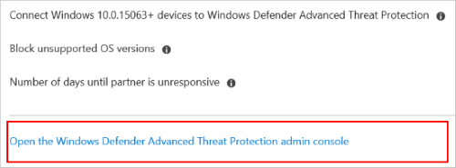

---
# required metadata

title: Use Advanced Threat Protection in Microsoft Intune - Azure | Microsoft Docs
description: See how to enable ATP (Advanced Threat Protection) in an end-to-end scenario, including turning on ATP in Intune and Windows Defender Security Center (ATP portal), onboard devices using an ATP configuration profile, create an Intune device compliance policy, create an Azure AD conditional access policy, and monitor device compliance.
keywords:
author: MandiOhlinger
ms.author: mandia
manager: dougeby
ms.date: 4/11/2018

ms.topic: article
ms.prod:
ms.service: microsoft-intune
ms.technology:
ms.reviewer: joglocke

# optional metadata

#ROBOTS:
#audience:
#ms.devlang:
ms.suite: ems
#ms.tgt_pltfrm:
ms.custom: intune-azure

---

# Enable ATP with conditional access in Intune

Windows Defender Advanced Threat Protection (ATP) and Microsoft Intune work together to help prevent security breaches, and help limit the impact of breaches within an organization.

This feature applies to: Windows 10 devices

For example, someone sends a Word attachment with embedded malicious code to a user within your organization. The user opens the attachment, and enables the content. An elevated privilege attack starts, and an attacker from a remote machine has admin rights to the victim’s device. The attacker then remotely accesses the user's other devices.

This security breach can impact the entire organization.

ATP can resolve security events like this scenario. The Windows Defender Security Center (ATP console) reports the devices as “high risk”, and includes a detailed report of suspicious activity. In our example, ATP detects that the device executed abnormal code, experienced a process privilege escalation, injected malicious code, and issued a suspicious remote shell. ATP then gives you options to mitigate the threat.

Using Intune, you can create a compliance policy that determines an acceptable level of risk. If a device exceeds this risk, then the device becomes non-compliant. When combined with Azure Active Directory (AD) Conditional Access, the user is blocked access from corporate resources.

This article shows you how to:
- Enable Intune in ATP, and enable ATP in Intune. These tasks create a service-to-service connection between Intune and ATP, and allow ATP to write the machine risk for your Intune devices.
- Create the compliance policy in Intune, and enable conditional access in Azure Active Directory (AD) on devices based on their threat level.

## Prerequisites

To use ATP with Intune, be sure you have the following configured, and ready to use:

- Licensed tenant for Enterprise Mobility + Security E5 and Windows E5 (or Microsoft 365 Enterprise E5)
- Microsoft Intune environment, with [managed Windows 10 devices](windows-enroll.md)
- [Windows Defender ATP](https://docs.microsoft.com/en-us/windows/security/threat-protection/windows-defender-atp/windows-defender-advanced-threat-protection) and access to the Windows Defender Security Center (ATP portal)

## Enable ATP in Intune

1. Sign in to the [Azure portal](https://portal.azure.com).
2. Select **All services**, filter on **Intune**, and select **Microsoft Intune**.
3. Select **Device compliance** > **Windows Defender ATP** > **Open the Windows Defender Advanced Threat Protection admin console**.

    

4. In the **Windows Defender Security Center**:
    1. Select **Settings** > **Advanced features**.
    2. For **Microsoft Intune connection**, choose **On**:

        

    3. Select **Save preferences**.

You typically do this task once. So if ATP is already enabled in your Intune resource, then you don't need to do it again.

## Onboard devices using a configuration profile

Windows Defender includes an onboard configuration package that is installed on devices. When installed, the package communicates with [Windows Defender ATP services](https://docs.microsoft.com/windows/security/threat-protection/windows-defender-atp/windows-defender-advanced-threat-protection) to scan files, detect threats, and report the risk to ATP. Using Intune, you can create a configuration profile that uses this configuration package. Then, assign this profile to devices you're onboarding for the first time.

Once you onboard a device using configuration package, then you don't need to do it again. This is typically a one-time task.

#### Download configuration package

1. In the [Windows Defender Security Center](https://securitycenter.windows.com), select **Settings** > **Onboarding**.
2. Enter the following settings:
  - **Operating system**: Windows 10
  - **Onboard a machine** > **Deployment method**: Mobile Device Management / Microsoft Intune
3. Select **Download package**, and save the **WindowsDefenderATPOnboardingPackage.zip** file. Extract the file.

This zip file includes **WindowsDefenderATP.onboarding**, which you need in the next steps.

#### Create the ATP configuration profile - ??? Need human-speak descriptions of the properties
This profile uses the onboarding package you downloaded in the previous steps.

1. In the [Azure portal](https://portal.azure.com), select **All services**, filter on **Intune**, and select **Microsoft Intune**.
2. Select **Device Configuration** > **Profiles** > **Create profile**.
3. Enter a **Name** and **Description**.
4. For **Platform**, select **Windows 10 and later**
5. For **Profile type**, select **Windows Defender ATP (Windows 10 Desktop)**.
6. Configure the settings:

  - **Onboard Configuration Package**: Browse and select the **WindowsDefenderATP.onboarding** file you downloaded.
  - **Sample sharing for all files**: Returns or sets the Windows Defender Advanced Threat Protection Sample Sharing configuration parameter.
  - **Expedite telemetry reporting frequency**: Expedite Windows Defender Advanced Threat Protection telemetry reporting frequency.
  - **Offboard Configuration Package**: If you want to remove, or "offload" ATP monitoring, you can download an Offload package in the [Windows Defender Security Center](https://securitycenter.windows.com), and add it. Otherwise, skip this property.

7. Select **OK**, and **Create** to save your changes, which creates the profile.

## Create the compliance policy
The compliance policy determines an acceptable level of risk on a device.

1. In the [Azure portal](https://portal.azure.com), select **All services**, filter on **Intune**, and select **Microsoft Intune**.
2. Select **Device compliance** > **Policies** > **Create policy**.
3. Enter a **Name** and **Description**.
4. In **Platform**, select **Windows 10 and later**.
5. In the **Device Health** settings, set **Require the device to be at or under the Device Threat Level** to your preferred level:

  - **Secured**: This level is the most secure. The device cannot have any existing threats and still access company resources. If any threats are found, the device is evaluated as noncompliant.
  - **Low**: The device is compliant if only low-level threats exist. Devices with medium or high threat levels are not compliant.
  - **Medium**: The device is compliant if the threats found on the device are low or medium. If high-level threats are detected, the device is determined as noncompliant.
  - **High**: This level is the least secure, and allows all threat levels. So devices that with high, medium or low threat levels are considered compliant.

6. Select **OK**, and **Create** to save your changes (and create the policy).

## Assign the policy

1. In the [Azure portal](https://portal.azure.com), select **All services**, filter on **Intune**, and select **Microsoft Intune**.
2. Select **Device compliance** > **Policies**> select your ATP compliance policy.
3. Select **Assignments**.
4. Include or exclude your Azure AD groups to assign them the policy.
5. To deploy the policy to the groups, select **Save**. The user devices targeted by the policy are evaluated for compliance.

## Create an Azure AD conditional access policy
The conditional access policy blocks access to resources *if* the device is noncompliant. So if a device exceeds the threat level, you can block access to corporate resources, such as SharePoint or Exchange Online.

1. In the [Azure portal](https://portal.azure.com), open **Azure Active Directory** > **Conditional access** > **New policy**.
2. Enter a policy **Name**, and select **Users and groups**. Use the Include or Exclude options to add your groups for the policy, and select **Done**.
3. Select **Cloud apps**, and choose which apps to protect. For example, choose **Select apps**, and select **Office 365 SharePoint Online** and **Office 365 Exchange Online**.

    Select **Done** to save your changes.

4. Select **Conditions** > **Client apps** to apply the policy to apps and browsers. For example, select **Yes**, and then enable **Browser** and **Mobile apps and desktop clients**.

    Select **Done** to save your changes.

5. Select **Grant** to apply conditional access based on device compliance. For example, select **Grant access** > **Require device to be marked as compliant**.

    Choose **Select** to save your changes.

6. Select **Enable policy**, and then **Create** to save your changes.

[What's conditional access?](conditional-access.md) is a good resource.

## Monitor device compliance
Next, monitor the state of devices that have the ATP compliance policy.

1. In the [Azure portal](https://portal.azure.com), select **All services**, filter on **Intune**, and select **Microsoft Intune**.
2. Select **Device compliance** > **Policy compliance**.
3. Find your ATP policy in the list, and see which devices are compliant or noncompliant.

## More good stuff
[Windows Defender ATP conditional access](https://docs.microsoft.com/windows/security/threat-protection/windows-defender-atp/conditional-access-windows-defender-advanced-threat-protection)  
[Windows Defender ATP risk dashboard](https://docs.microsoft.com/windows/security/threat-protection/windows-defender-atp/dashboard-windows-defender-advanced-threat-protection)  
[Get started with device compliance policies](device-compliance-get-started.md)  
[Conditional access in Azure AD](https://docs.microsoft.com/azure/active-directory/active-directory-conditional-access-azure-portal)