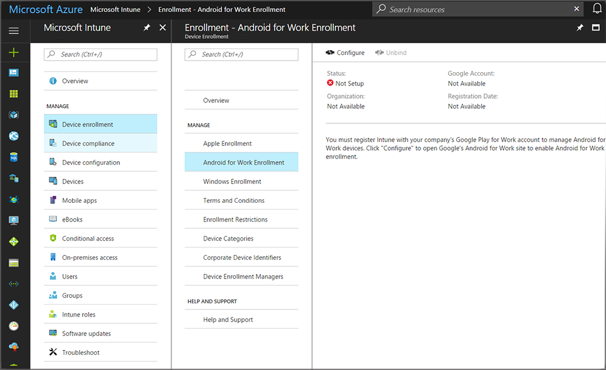

---
# required metadata

title: Enroll Android devices in Intune | Microsoft Docs
titlesuffix: "Azure portal"
description: Learn how to enroll Android devices in Intune."
keywords:
author: arob98
ms.author: angrobe
manager: angrobe
ms.date: 11/08/2017
ms.topic: article
ms.prod:
ms.service: microsoft-intune
ms.technology:
ms.assetid: f276d98c-b077-452a-8835-41919d674db5

# optional metadata

#ROBOTS:
#audience:
#ms.devlang:
ms.reviewer: chrisbal
ms.suite: ems
#ms.tgt_pltfrm:
ms.custom: intune-azure

---

# Enroll Android devices

[!INCLUDE[azure_portal](./includes/azure_portal.md)]

As an Intune administrator, Intune lets you manage Android devices, including Samsung Knox Standard devices. You can also manage the work profile on devices [Android for Work devices](#enable-enrollment-of-android-for-work-devices).

Devices that run Samsung KNOX Standard, are supported for multi-user management by Intune. This means that end users can sign in and out of the device with their Azure AD credentials, the device is centrally managed whether it’s in use or not. When end users sign-in, they have access to apps and additionally get any policies applied to them. When users sign out, all app data is cleared.

## Prerequisite

You must set the MDM authority to **Microsoft Intune** to prepare to manage mobile devices. See [Set the MDM authority](mdm-authority-set.md) for instructions. You set this item only once, when you are first setting up Intune for mobile device management.

## Set up Android enrollment

By default, Intune allows enrollment of Android and Samsung Knox Standard devices.

To block Android devices, or to block only personally owned Android devices from enrollment, see [Set device type restrictions](enrollment-restrictions-set.md).

To enable device management, your users must enroll their devices by downloading the Intune Company Portal app, which is available from Google Play, and then opening the app and following the prompts to enroll. Once Android devices are managed, you [assign compliance policies](compliance-policy-create-android.md), [manage apps](app-management.md), and more.

## Enable enrollment of Android for Work devices

To enable management of the work profile on devices that [support Android for Work](https://support.google.com/work/android/answer/6174145?hl=en&ref_topic=6151012), you must add an Android for Work binding to Intune. To enroll devices that support Android for Work but were previously enrolled as regular Android devices, the devices must be unenrolled and then re-enrolled.

If enrolling Android for Work devices with a [Device Enrollment Manager](device-enrollment-manager-enroll.md) account, there is a limit of ten devices that may be enrolled per account.

## Add Android for Work Binding for Intune

1. **Set up Intune MDM** 
If you haven’t already, prepare for mobile device management by  [setting the mobile device management authority](mdm-authority-set.md) as **Microsoft Intune**.
2. **Configure Android for Work binding** 
    As an Intune administrator, in the Azure portal, choose **More Services** > **Monitoring + Management** > **Intune**.

    1. On the **Intune** blade, choose **Device enrollment**, > **Android for Work Enrollment**, and click **Configure** to open Google Play's Android for Work website. This will open in a new tab in your browser.
  

    2. **Log in to Google** 
   On Google's sign-in page, enter the Google account that will be associated with all Android for Work management tasks for this tenant. This is the Google account shared among your organization's IT admins that used to manage and publish apps in the Play for Work console.

    3. **Provide organization details** 
   Provide your company's name for the **Organization name**. For **Enterprise mobility management (EMM) provider**, *Microsoft Intune* should be displayed. Agree to the Android for Work agreement, and then click **Confirm**. Your request will be processed.

## Specify Android for Work Enrollment Settings
   Android for Work is only supported on certain Android devices. See Google's [Android for Work requirements](https://support.google.com/work/android/answer/6174145?hl=en&ref_topic=6151012 style="target=new_window"). Any device that supports Android for Work will also support conventional Android management.  Intune lets you specify how devices that support Android for Work should be managed:

   - **Manage all devices as Android** - All Android devices, including devices that support Android for Work, will be enrolled as conventional Android devices.
   - **Manage supported devices as Android for Work** - All devices that support Android for Work are enrolled as Android for Work devices. Any Android device that does not support Android for Work is enrolled as a conventional Android device.
   - **Manage supported devices for users only in these user groups as Android for Work** - Lets you target Android for Work management to a limited set of users. Only members of the selected groups who enroll a device that supports Android for Work are enrolled as Android for Work devices. All others are enrolled as Android devices. This is useful during Android for Work pilots.

<!--  ## Next steps for Android for Work
After configuring the Android for Work binding and settings, you can do the following:
- [Deploy Android for Work apps](android-for-work-apps.md)
- [Add Android for Work configuration policies](android-for-work-policy-settings-in-microsoft-intune.md)  -->

## Tell your users how to enroll their devices to access company resources

You'll need to tell your end users to go to Google Play to download the Intune Company Portal app, and then open the app and follow the prompts to enroll their device. The app guides users through the enrollment process, explaining what users can expect and what IT administrators can and can't see on their devices.

You can also send them a link to online enrollment steps: [Enroll your Android device in Intune](https://docs.microsoft.com/intune-user-help/enroll-your-device-in-intune-android).

For information about other end-user tasks, see these articles:

- [Resources about the end-user experience with Microsoft Intune](end-user-educate.md)
- [Using your Android device with Intune](https://docs.microsoft.com/intune-user-help/using-your-android-device-with-intune)

## Unbinding your Android for Work administrative account

You can turn off Android for Work enrollment and management. Clicking **Unbind** in the Intune administration console removes all enrolled Android for Work devices from enrollment and removes the relationship between the Android for Work account and Intune.

### How to unbind an Android for Work account

1. **Unbind Android for Work binding** 
    As an Intune administrator, in the Azure portal, choose **More Services** > **Monitoring + Management** > **Intune**.  On the **Intune** blade, choose **Device enrollment**, > **Android for Work Enrollment**, and click **Unbind**.

2. **Agree to delete Android for Work binding** 
  Click **Yes** to delete the binding and unenroll all Android for Work devices from Intune.
