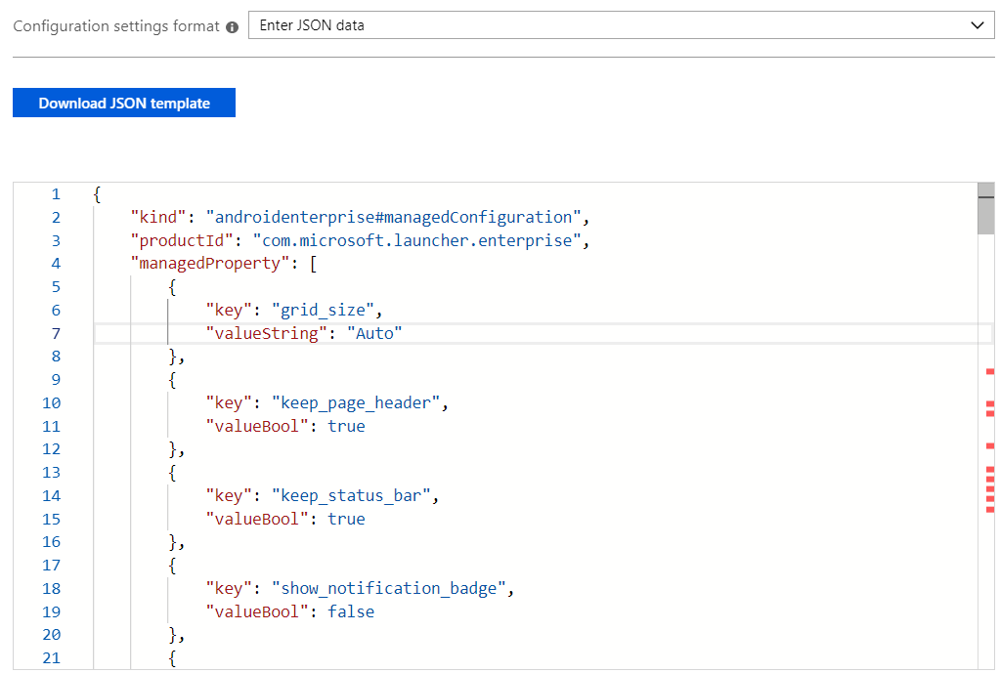

---
# required metadata

title: Configure the Microsoft Managed Home Screen app
titleSuffix: Microsoft Intune
description: Learn how to configure the Microsoft Managed Home Screen app.
keywords:
author: Erikre
ms.author: erikre
manager: dougeby
ms.date: 04/24/2019
ms.topic: conceptual
ms.prod:
ms.service: microsoft-intune
ms.localizationpriority: high
ms.technology:
ms.assetid: 865c7f03-f525-4dfa-b3a8-d088a9106502

# optional metadata 

#ROBOTS:
#audience:
#ms.devlang:
ms.reviewer: chmaguir
ms.suite: ems
search.appverid: MET150
#ms.tgt_pltfrm:
ms.custom: intune-azure
ms.collection: M365-identity-device-management
---

# Configure the Microsoft Managed Home Screen app for Android Enterprise

The Managed Home Screen is the application used for corporate-owned Android Enterprise dedicated devices enrolled via Intune and running in multi-app kiosk mode. For these devices, the Managed Home Screen acts as the launcher for other approved apps to run on top of it. Additionally, the Managed Home Screen provides IT admins the ability to customize and restrict the behavior of these devices and the capabilities that the end user can access. 

Some of the Managed Home Screen settings available are currently only surfaced in the **App configuration policies** blade in the Intune console. Use this document to learn how to configure the different settings either using the configuration designer or a JSON script. 

First, navigate to the Intune console in Azure portal and go to **Client apps** > **App configuration policies**. Add a configuration policy for **Managed devices** running **Android** and choose **Managed Home Screen** as the associated app. Click on **Configuration settings** to configure the different available Managed Home Screen settings. 

## Choosing a Configuration Settings Format

There are two methods that you can use to define configuration settings for Managed Home Screen:

- **Configuration designer** allows you to configure settings with an easy-to-use UI that lets you toggle features on or off and set values. In this method, there are a few disabled configuration keys with value type `BundleArray`. These can only be configured by entering JSON data. 
- **JSON data** allows you to define all possible configuration keys using a JSON script. 

If you add properties with Configuration Designer, you can automatically convert these to JSON by selecting **Enter JSON data** from the **Configuration settings format** dropdown.


## Using Configuration Designer

Configuration designer allows you to select pre-populated settings and their associated values. 


The following table lists the Managed Home Screen available configuration keys, value types, default values, and descriptions. The description provides the expected device behavior based on the selected values. Configuration keys that are disabled in Configuration Designer are not listed in the table.

| Configuration   Key | Value Type | Default Value | Description |
|---------------------------------------------------------------------------------------------------------------------------|-------------|------------------|---------------------------------------------------------------------------------------------------------------------------------------------------------------------------------------------------------------------------------------------------------------------------------------------------------------------------------------------------------------------------------------------------------------------------------------------------------------------------------|
| Set Grid Size | string | Auto | Allows you to set the grid size for apps to be positioned on   the managed home screen. You can set the number of app rows and columns to   define grid size in the following format (`rows;column`). If you define the   grid size, the maximum number of apps that will be shown in a row on the home   screen would be the number of rows you set and the maximum number of apps   that will be shown in a column in the home screen would be the number of   columns you set. |
| Enable Screen Header | bool | TRUE | Enables the top header for different views that the managed   home screen offers such as the feed or feed cards. If you enable this   setting, the device users will see the header. |
| -Enable device status bar | bool | TRUE | Enables the status bar in the home screen (top bar that   displays current connections such as wifi and etc.). If you enable this, the   end user will be able to see the icons displayed on the status bars that   represent connections and active apps. |
| Enable notifications badge | bool | FALSE | Enables the notification badge for app icons that shows the   no. of new notifications on the app. If you enable this setting, end users   will see notification badges on apps that have unread notifications. If you   keep this disabled, the end user will not see any notification badged to apps   that might have unread notifications. |
| Lock Home Screen | bool | TRUE | Removes the ability of the end user to move around app icons   on the home screen. If you enable this, the app icons on the home screen will   be locked and the end user would not be able to drag and drop to different   grid positions of the home screen. |
| Set device wall paper | string | Default | Allows you to set a wallpaper of your choice by entering the   URL of the image that you want to set as a wallpaper. |
| Set app icon size | integer | 2 | Allows you to set the icon size for apps displayed on the home   screen. You can choose the following values in this configuration for   different sizes - 0 (Smallest), 1 (Small), 2 (Regular), 3 (Large) and 4   (Largest). |
| Set app folder icon | integer | 0 | Allows you to define the appearance of app folders on the home   screen. You can choose the appearance from following values: Dark Square(0);   Dark Circle(1); Light Square(2); Light Circle(3). |
| Enable gestures | bool | FALSE | Enable the end user's ability to assign actions to different   gestures such as swipe up and swipe down. If you disable this, end users will   only be able to swipe right if there is a second page and back to the home   page. |
| Enable vertical scrolling | bool | FALSE | Enables vertical scrolling on the managed home screen. If you   enable this, the end user will only be able to navigate to different pages   vertically rather than by swiping horizontally. |
| Set home screen theme | string | Theme.Light.Blue | Allows you to choose the theme for the home screen from a   predefined set of themes with different colors. You can choose the following   themes by entering the string value in the following format.   Theme.Light.Green. Where light can be replaced with Dark for a dark theme and   Green can be replaced by Blue, Yellow, Pink, Red, Orange and Purple. |
| Enable dock | bool | FALSE | Enables the app dock section in at bottom of the home screen   with persistent apps displayed and entry point for all installed apps. If you   enable this, the end user will be able to access apps in the dock and also   access the all app section to go to the list of all installed apps on the   devices whether or not they have been whitelisted. |
| Set screen orientation | integer | 1 | Allows you to set the orientation of the home screen to   portrait mode, landscape mode or allow auto rotate. You can set the   orientation by entering values 1 (for portrait mode), 2 (for Landscape mode),   3 (for Autorotate). |
| Enable home screen feed | bool | FALSE | Enables the feed of the home screen which can be seen by   swiping left of the home screen. This feed displays different type of content   such as news, calendar, frequently user apps and Cortana voice assistant card   etc. If you enable this, the end user will be able to navigate to the feed by   swiping left on the home screen. |
| Enable overview mode | bool | FALSE | Enables the end users to add or remove different pages on the   home screen that can be accessed by swiping right from the default screen. If   you enable this, the end user will be able to add paged to the right of the   default page of the home screen, will also be able to change the default page   and will also be able to access the settings on the Managed Home Screen. |
| Enable device telemetry | bool | FALSE | Enables all the telemetry that is being captured for the   managed home screen. If you enable this, Microsoft will be able to capture device usage telemetry, such as the number of times a particular app is launched on this device. |
| Set whitelisted applications | bundleArray | FALSE | Allows you to define the set of apps visible on the home   screen from amongst the apps installed on the device. You can define the apps   by entering the app package name of the apps that you would like to make   visible, e.g. com.android.settings would make settings accessible on the home   screen. The apps that you whitelist in this section should already be   installed on the device in order to be visible on the home screen. |
| Set pinned web links | bundleArray | FALSE | Allows you to pin websites as quick launch icons on the home   screen. With this configuration you can define the URL and add it to the home   screen for the end user to launch in the browser with a single tap. |
| Enable search bar | bool | FALSE | Enables the search bar on home screen. If you enable this,   users of the device will see the search bar on the home screen where they   would be able to enter whatever they want to search on the web. |
| Disable settings app | bool | FALSE | Disables the settings page for the Managed Home Screen. If you   disable this, the end user of the device will not be able to get to the   settings of the Managed Home Screen. |
| Enable screen saver | bool | FALSE | To enable screensaver mode or not. If set to true, you can   configure **screen_saver_image**, **screen_saver_show_time**,   **inactive_time_to_show_screen_saver**, and   **media_detect_screen_saver**. |
| Screen saver image | string |   | Set the URL of the screensaver image. If no URL is set,   devices will show the default screen when screensaver is activated.  |
| Screen saver show time | integer | 0 | Gives option to set the amount of time in seconds the device   will display the screensaver during screensaver mode. If set to 0, the   screensaver will show on screensaver mode indefinitely until the device   becomes active.  |
| Inactive time to enable   screen saver | integer | 30 | The number of seconds the device is inactive before triggering   the screensaver. If set to 0, the device will never go into screensaver mode. |
| Media detect before showing screen saver | bool | TRUE | Choose whether the device screen should show   screensaver if audio/video is playing on device. If set to true, the   device will not play audio/video, regardless of the value in **inactive_time_to_show_scree_saver**. If set to false, device  screen will show screensaver according to value set in   **inactive_time_to_show_screen_saver**.   |
| Enable virtual home button | bool | FALSE | Enable virtual home button |
| Type of virtual home button | string | Swipe_up | Type of virtual home button. Use **swipe_up** to access home   button with a swipe up gesture. Use **float** the home button is always present   on the screen. |
| Battery and Signal Strength   indicator bar | bool | True  | Battery and Signal Strength indicator bar |
| Exit lock task mode password | string |   | Exit lock task mode password |
| Show Wi-Fi setting | bool | FALSE | Show Wi-Fi setting |
| Show Bluetooth setting | bool | FALSE | Show Bluetooth setting |

## Enter JSON Data

Enter JSON data to configure all available settings for Managed Home Screen, as well as the settings disabled in **Configuration Designer**.



In addition to the list of configurable settings listed in the **Configuration Designer** table (above), the following table provides the configuration keys you can only configure via JSON data.

|    Configuration Key    |    Value Type    |    Default Value    |    Description    |
|------------------------------------|-------------------|--------------------------------------------------------------------------------------------------------------------------------------------------------------------------------------------------------------------------------------------------------------------------------------------------------------|--------------------------------------------------------------------------------------------------------------------------------------------------------------------------------------------------------------------------------------------------------------------------------------------------------------------------------------------------------------------------------------------------------------------------------------------------------|
|    Set whitelisted applications    |    bundleArray    |    {        "key":   "applications",        "valueBundleArray":   [        {                                    "managedProperty":   [   {         "key":   "package",         "valueString": STRING_VALUE   }   ]        }        ]   },    |    Allows you to define the set of apps visible on the home screen from   amongst the apps installed on the device. You can define the apps by entering   the app package name of the apps that you would like to make visible, e.g.   com.android.settings would make settings accessible on the home screen. The   apps that you whitelist in this section should already be installed on the   device in order to be visible on the home screen.    |
|    Set pinned web links    |    bundleArray    |    {        "key":   "weblinks",        "valueBundleArray":   [         {               "managedProperty":   [     {          "key":   "link",          "valueString": STRING_VALUE      },      {           "key": "label",           "valueString": STRING_VALUE      }      ]         }         ]   },    |    Allows you to pin websites as quick launch icons on the home screen.   With this configuration you can define the URL and add it to the home screen   for the end user to launch in the browser with a single tap.    |

The following is an example JSON script with all the available configuration keys included:

```json
{
    "kind": "androidenterprise#managedConfiguration",
    "productId": "com.microsoft.launcher.enterprise",
    "managedProperty": [
        {
            "key": "grid_size",
            "valueString": "Auto"
        },
        {
            "key": "keep_page_header",
            "valueBool": true
        },
        {
            "key": "keep_status_bar",
            "valueBool": true
        },
        {
            "key": "show_notification_badge",
            "valueBool": false
        },
        {
            "key": "lock_home_screen",
            "valueBool": true
        },
        {
            "key": "wallpaper",
            "valueString": "default"
        },
        {
            "key": "icon_size",
            "valueInteger": 2
        },
        {
            "key": "app_folder_icon",
            "valueInteger": 0
        },
        {
            "key": "gesture_on",
            "valueBool": false
        },
        {
            "key": "vertical_scrolling",
            "valueBool": false
        },
        {
            "key": "theme",
            "valueString": "Theme.Light.Blue"
        },
        {
            "key": "dock_enable",
            "valueBool": false
        },
        {
            "key": "screen_orientation",
            "valueInteger": 1
        },
        {
            "key": "feed_enable",
            "valueBool": false
        },
        {
            "key": "allow_overview_mode",
            "valueBool": false
        },
        {
            "key": "enable_telemetry",
            "valueBool": false
        },
        {
            "key": "applications",
            "valueBundleArray": [
                {
                    "managedProperty": [
                        {
                            "key": "package",
                            "valueString": STRING_VALUE
                        }
                    ]
                }
            ]
        },
        {
            "key": "weblinks",
            "valueBundleArray": [
                {
                    "managedProperty": [
                        {
                            "key": "link",
                            "valueString": STRING_VALUE
                        },
                        {
                            "key": "label",
                            "valueString": STRING_VALUE
                        }
                    ]
                }
            ]
        },
        {
            "key": "search_bar",
            "valueBool": false
        },
        {
            "key": "hide_settings",
            "valueBool": false
        },
        {
            "key": "show_virtual_home",
            "valueBool": false
        },
        {
            "key": "virtual_home_type",
            "valueString": "swipe_up"
        },
        {
            "key": "show_virtual_status_bar",
            "valueBool": true
        },
        {
            "key": "exit_lock_task_mode_code",
            "valueString": ""
        },
        {
            "key": "show_wifi_setting",
            "valueBool": false
        },
        {
            "key": "show_bluetooth_setting",
            "valueBool": false
        }
    ]
}
```
## Next steps

- For more information about Android Enterprise dedicated devices, see [Set up Intune enrollment of Android Enterprise dedicated devices](android-kiosk-enroll.md).
