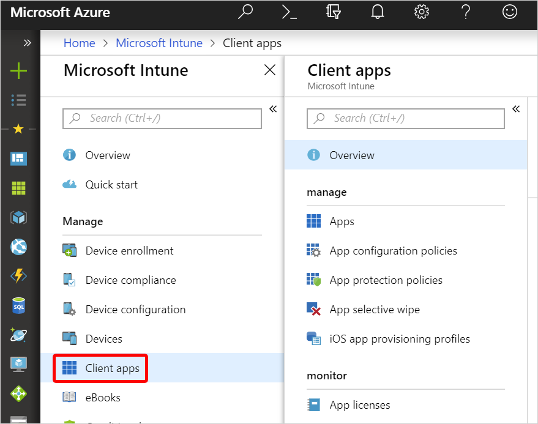

---
# required metadata

title: What is app management in Microsoft Intune?
titlesuffix:
description: Learn the basics of app management with Microsoft Intune.
keywords:
author: Erikre
ms.author: erikre
manager: dougeby
ms.date: 05/15/2018
ms.topic: get-started-article
ms.prod:
ms.service: microsoft-intune
ms.technology:
ms.assetid: 1975a2dc-3a14-4cb9-9afb-e2ba01a1c51b

# optional metadata

#ROBOTS:
#audience:
#ms.devlang:
ms.reviewer: mghadial
ms.suite: ems
#ms.tgt_pltfrm:
ms.custom: intune-azure

---

# What is Microsoft Intune app management?

[!INCLUDE [azure_portal](./includes/azure_portal.md)]

As an IT admin, you can use Microsoft Intune to manage the mobile apps that your company's workforce uses. This functionality is in addition to managing devices and protecting data. One of an admin's priorities is to ensure that end users have access to the apps they need to do their work. This goal can be a challenge because:
- There are a wide range of device platforms and app types.
- You might need to manage apps on both company devices and users' personal devices.
- You must ensure that your network and your data remain secure.

Additionally, you might want to assign and manage apps on devices that are not enrolled with Intune.

Intune offers a range of capabilities to help you get the apps you need on the devices you want to run them on. The following table provides a summary of app management capabilities: 

## App management capabilities by platform

||||||
|-|-|-|-|-|
| |Android|iOS|Windows Phone 8.1|Windows 10|
|Add and assign apps to devices and users|Yes|Yes|Yes|Yes|
|Assign apps to devices not enrolled with Intune|Yes|Yes|No|No|
|Use app configuration policies to control the startup behavior of apps|No|Yes|No|No|
|Use mobile app provisioning policies to renew expired apps|No|Yes|No|No|
|Protect company data in apps with app protection policies|Yes|Yes|No|No1|
|Remove only corporate data from an installed app (app selective wipe)|Yes|Yes|Yes|Yes|
|Monitor app assignments|Yes|Yes|Yes|Yes|
|Assign and track volume-purchased apps from an app store|No|No|No|Yes|
|Mandatory install of apps on devices (required)2|Yes|Yes|Yes|Yes|
|Optional installation on devices from the Company Portal (available installation)|Yes|Yes|Yes|Yes|
|Install shortcut to an app on the web (web link)|Yes|Yes|Yes|Yes|
|In-house (line-of-business) apps|Yes|Yes|No|Yes|
|Apps from a store|Yes|Yes|Yes|Yes|
|Update apps|Yes|Yes|Yes|Yes|

1 Consider using [Windows Information Protection](windows-information-protection-configure.md) to protect apps on devices that run Windows 10.

2 Applies to devices managed by Intune only.

## Get started

You can find most app-related information in the **Mobile Apps** workload, which you can access by doing the following:

1. Sign in to the [Azure portal](https://portal.azure.com).
2. Select **All services** > **Intune**.  
    Intune is located in the **Monitoring + Management** section.
3. In the **Microsoft Intune** pane, select **Mobile apps**.

    

The next four sections describe the options available in the **Mobile apps** pane.

### Manage
- **Apps**: Select this option to add, view, assign, and monitor the apps that your workforce uses. For more information, see:
    - [Add apps](apps-add.md).
    - [Assign apps](apps-deploy.md).
    - [Monitor apps](apps-monitor.md).
- **App configuration policies**: Select this option to supply settings that might be required when a user runs an app. For more information, see:
    - [App configuration policies for Intune](app-configuration-policies-overview.md).
        - [iOS app configuration policies](app-configuration-policies-use-ios.md).
        - [Android app configuration policies](app-configuration-policies-use-android.md).
- **App protection policies**: Select this option to associate settings with an app and help protect the company data it uses. For example, you might restrict the capabilities of an app to communicate with other apps, or you might require the user to enter a PIN to access a company app. For more information, see:
    - [App protection policies](app-protection-policies.md).
- **App selective wipe**: Select this option to remove only corporate data from a selected user's device. For more information, see:
    - [App selective wipe](apps-selective-wipe.md).
- **iOS app provisioning profiles**: iOS apps include a provisioning profile and code that is signed by a certificate. When the certificate expires, the app can no longer be run. Intune gives you the tools to proactively assign a new provisioning profile policy to devices that have apps that are nearing expiration. For more information, see:
    - [iOS app provisioning profiles](app-provisioning-profile-ios.md).

For more information about this section, see [Manage apps](app-management.md).

### Monitor
- **App licenses**: View, assign, and monitor volume-purchased apps from the app stores. For more information, see:
    - [iOS volume-purchased program (VPP) apps](vpp-apps-ios.md).
    - [Microsoft Store for Business volume-purchased apps](windows-store-for-business.md).
- **Discovered Apps**: View all apps that were assigned by Intune and installed on a device.
- **App Install Status**: View the status of an app assignment that you created.
- **App protection status**: View the status of an app protection policy for a user that you select.
- **Audit logs**: View the Intune app-related activity of all IT admins.

For more information about this section, see [Monitor apps](apps-monitor.md).

### Set up
- **iOS VPP tokens**: Apply and view your iOS Volume Purchase Program (VPP) licenses. For more information, see:
    - [iOS volume-purchased apps](vpp-apps-ios.md)
- **Windows enterprise certificate**: Apply or view the status of a code-signing certificate that's used to distribute line-of-business apps to your managed Windows devices.
- **Windows Symantec certificate**: Apply or view the status of a Symantec code-signing certificate, which is needed to distribute XAP and WP8.x appx files to Windows 10 Mobile devices.
- **Microsoft Store for Business**: Set up integration to the Microsoft Store for Business. Afterward, you can synchronize purchased applications to Intune, assign them, and track your license usage. For more information, see:
    - [Microsoft Store for Business volume-purchased apps](windows-store-for-business.md).
- **Windows side loading keys**: Add a Windows side-loading key that can be used to install an app directly to devices rather than publishing and downloading the app from the Windows store. For more information, see:
    - [Side-load a Windows app](app-sideload-windows.md).
- **Company Portal branding**: Customize the Company Portal to give it your company branding. For more information, see:
    - [Company Portal configuration](company-portal-app.md).
- **App categories**: Add, pin, and delete app category names.
- **Android for Work**: Approve and sync the apps that you have approved for your enterprise. For more information, see:
    - [Android for Work apps](apps-add-android-for-work.md).

### Help and support
- **Help and support**: Troubleshoot, request support, or view Intune status. For more information, see:
    - [Troubleshoot problems](help-desk-operators.md).

## Next steps

- [Add an app to Microsoft Intune](apps-add.md)
