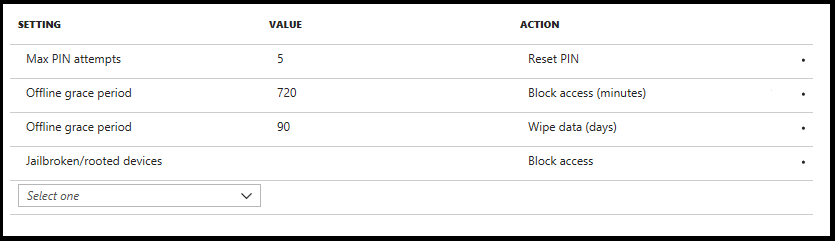

---
# required metadata

title: Wipe data using app protection policy conditional launch actions
titleSuffix: Microsoft Intune
description: Learn how to selectively wipe data using app protection policy conditional launch actions in Microsoft Intune.
keywords:
author: Erikre
ms.author: erikre
manager: dougeby
ms.date: 08/27/2019
ms.topic: conceptual
ms.service: microsoft-intune
ms.localizationpriority: high
ms.technology:
ms.assetid: f5ca557e-a8e1-4720-b06e-837c4f0bc3ca

# optional metadata

#ROBOTS:
#audience:
#ms.devlang:
ms.reviewer: aanavath
ms.suite: ems
search.appverid: MET150
#ms.tgt_pltfrm:
ms.custom: seodec18
ms.collection: M365-identity-device-management
---

# Selectively wipe data using app protection policy conditional launch actions in Intune

Using Intune app protection policies, you can configure settings to block end users from accessing a corporate app or account. These settings target data relocation and access requirements set by your organization for things like jail-broken devices and minimum OS versions.
 
You can explicitly choose to wipe your company’s corporate data from the end user’s device as an action to take for non-compliance by using these settings. For some settings, you will be able to configure multiple actions, such as block access and wipe data based on different specified values.

## Create an app protection policy using conditional launch actions

1. Sign in to [Intune](https://go.microsoft.com/fwlink/?linkid=2090973).
3. In the **Intune** pane, select **Client apps** > **App protection Policies**.
4. Click **Add a policy** (You can also edit an existing policy). 
5. Click **Configure required settings** to see the list of settings available to be configured for the policy. 
6. By scrolling down in the Settings pane, you will see a section titled **Conditional launch** with an editable table.

    

7. Select a **Setting** and enter the **Value** that users must meet to sign in to your company app. 
8. Select the **Action** you want to take if users do not meet your requirements. In some cases, multiple actions can be configured for a single setting. For more information, see [How to create and assign app protection policies](app-protection-policies.md).

>[!NOTE]
> To use the **Device model(s) or Device manufacturer(s)** setting, input a semi-colon separated list of device model identifiers (iOS) or device manufacturers (Android). Avoid spaces in lists of multiple values. These values are not case sensitive. 

## Policy settings 

The app protection policy settings table has columns for **Setting**, **Value**, and **Action**.

### iOS policy settings
For iOS, you will be able to configure actions for the following settings using the **Setting** dropdown:
- Max PIN attempts
- Offline grace period
- Jailbroken/rooted devices
- Min OS version
- Min app version
- Min SDK version
- Device model(s)

To use the **Device model(s)** setting, input a semi-colon separated list of iOS model identifiers. You can find an iOS model identifier under the Device Type column in [HockeyApp's support documentation](https://support.hockeyapp.net/kb/client-integration-ios-mac-os-x-tvos/ios-device-types). 
Example input: *iPhone5,2;iPhone5,3*

On end-user devices, the Intune client would take action based on a simple matching of device model strings specified in Intune for Application Protection Policies. Matching depends entirely on what the device reports. You (the IT administrator) are encouraged to ensure that the intended behavior occurs by testing this setting based on a variety of device manufacturers and models, and targeted to a small user group. The default value is **Not configured**. 
Set one of the following actions: 
- Allow specified (Block non-specified)
- Allow specified (Wipe non-specified)

**What happens if the IT admin inputs a different list of iOS model identifier(s) between policies targeted to the same apps for the same Intune user?** 
When conflicts arise between two app protection policies for configured values, Intune typically takes the most restrictive approach. Thus, the resultant policy sent down to the targeted app being opened by the targeted Intune user would be an intersection of the listed iOS model identifier(s) in *Policy A* and *Policy B* targeted to the same app/user combination. For example, *Policy A* specifies "iPhone5,2;iPhone5,3", while *Policy B* specifies "iPhone5,3", the resultant policy that the Intune user targeted by both *Policy A* and *Policy B* will be "iPhone5,3". 

### Android policy settings

For Android, you will be able to configure actions for the following settings using the **Setting** dropdown:
- Max PIN attempts
- Offline grace period
- Jailbroken/rooted devices
- Min OS version
- Min app version
- Min patch version
- Device manufacturer(s)
- SafetyNet device attestation
- Threat scan on apps

To use the **Device manufacturer(s)** setting, input a semi-colon separated list of Android manufacturers. You can find the Android manufacturer of a device under the device settings. 
Example input: *Manufacturer A;Manufacturer B* 

>[!NOTE]
> These are some common manufacturers reported from devices using Intune, and can be used as input: Asus;Blackberry;Bq;Gionee;Google;Hmd global;Htc;Huawei;Infinix;Kyocera;Lemobile;Lenovo;Lge;Motorola;Oneplus;Oppo;Samsung;Sharp;Sony;Tecno;Vivo;Vodafone;Xiaomi;Zte;Zuk

On end-user devices, the Intune client would take action based on a simple matching of device model strings specified in Intune for Application Protection Policies. Matching depends entirely on what the device reports. You (the IT administrator) are encouraged ensure that the intended behavior occurs by testing this setting based on a variety of device manufacturers and models, and targeted to a small user group. The default value is **Not configured**. 
Set one of the following actions: 
- Allow specified (Block on non-specified)
- Allow specified (Wipe on non-specified)

**What happens if the IT admin inputs a different list of Android manufacturer(s) between policies targeted to the same apps for the same Intune user?** 
When conflicts arise between two app protection policies for configured values, Intune typically takes the most restrictive approach. Thus, the resultant policy sent down to the targeted app being opened by the targeted Intune user would be an intersection of the listed Android manufacturers in *Policy A* and *Policy B* targeted to the same app/user combination. For example, *Policy A* specifies "Google;Samsung", while *Policy B* specifies "Google", the resultant policy that the Intune user targeted by both *Policy A* and *Policy B* will be "Google". 

### Additional settings and actions 

By default, the table will have populated rows as settings configured for **Offline grace period**, and **Max PIN attempts**, if the **Require PIN for access** setting is set to **Yes**.
 
To configure a setting, select a setting from the dropdown under the **Setting** column. Once a setting is selected, the editable text box will become enabled under the **Value** column in the same row, if a value is required to be set. Also, the dropdown will become enabled under the **Action** column with the set of conditional launch actions applicable to the setting. 

The following list provides the common list of actions:
- **Block access** – Block the end user from accessing the corporate app.
- **Wipe data** – Wipe the corporate data from the end user’s device.
- **Warn** – Provide dialog to end user as a warning message.

In some cases, such as the **Min OS version** setting, you can configure the setting to perform all applicable actions based on different version numbers. 

Once a setting is fully configured, the row will appear in a read-only view and be available to be edited at any time. In addition, the row will appear to have a dropdown available for selection in the **Setting** column. Settings that have already been configured and do not allow multiple actions will not be available for selection in the dropdown.

## Next steps

Learn more information on Intune app protection policies, see:
- [How to create and assign app protection policies](app-protection-policies.md)
- [iOS app protection policy settings](app-protection-policy-settings-ios.md)
- [Android app protection policy settings in Microsoft Intune](app-protection-policy-settings-android.md) 
