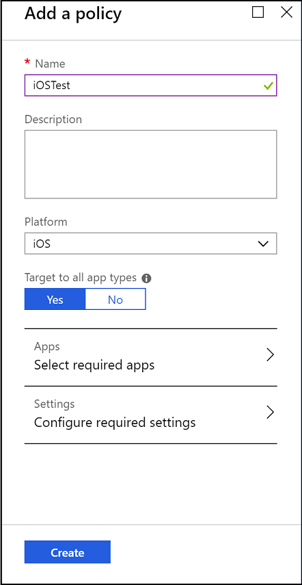
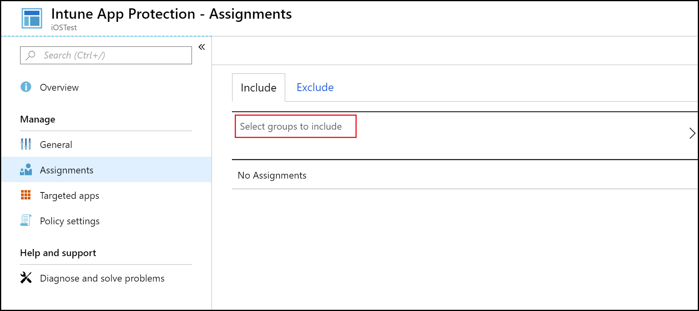
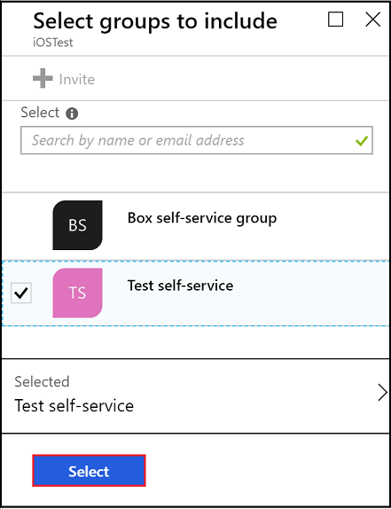

---
# required metadata

title: Create and deploy app protection policies 
titleSuffix: "Azure portal"
description:  Learn how Intune app protection policies can help protect company data used by apps you manage."
keywords:
author: erikre
ms.author: erikre
manager: dougeby
ms.date: 02/22/2018
ms.topic: article
ms.prod:
ms.service: microsoft-intune
ms.technology:
ms.assetid: f31b2964-e932-4cee-95c4-8d5506966c85

# optional metadata

#ROBOTS:
#audience:
#ms.devlang:
ms.reviewer: joglocke
ms.suite: ems
#ms.tgt_pltfrm:
ms.custom: intune-azure
---

# How to create and assign app protection policies

[!INCLUDE[azure_portal](./includes/azure_portal.md)]

## Before you begin

If you're looking for instructions in the Intune classic portal, see [how to create app protection policies](https://docs.microsoft.com/intune-classic/deploy-use/create-and-deploy-mobile-app-management-policies-with-microsoft-intune).

App protection policies can be applied to apps running on devices that may or may not be managed by Intune. For a more detailed description of how app protection policies work and the scenarios supported by Intune app protection policies, see [What is Microsoft Intune app protection policies](app-protection-policy.md).

If you're looking for a list of MAM supported apps, see [MAM apps list](https://www.microsoft.com/cloud-platform/microsoft-intune-apps).

##  Create an app protection policy
1. Sign into the [Azure portal](https://portal.azure.com).
2. Choose **All services** > **Intune**. Intune is located in the **Monitoring + Management** section.
1. Choose **Mobile apps**, then choose **Manage** > **App protection policies**.

2.  This action opens the **App protection policies** pane, where you create new policies and edit existing policies. Choose **Add a policy**.

    

3.  Type a name for the policy, add a brief description, and select the platform type to create a policy for iOS or Android. You can create more than one policy for each platform.

4.  Choose **Apps** to open the **Apps pane**, where a list of available apps is displayed. Select one or more apps from the list that you want to associate with the policy that you are creating. Once you have selected the apps, choose **Select** at the bottom of the **Apps** pane to save your selection.

    > [!IMPORTANT]
    > You must select at least one app to create a policy.

5.  On the **Add a policy pane**, choose **Configure required settings** to open the policy settings pane.

    There are two categories of policy settings, **Data relocation** and **Access**.  Data relocation policies are applicable to data movement in and out of the apps, while the access polices determine how the end user accesses the apps in a work context.
    To get you started, the policy settings have default values. You do not have to make any changes if the default values meet your requirements.

    > [!TIP]
    > These policy settings are enforced only when using apps in the work context.  When the end user uses the app to do a personal task, they are not affected by these policies.

6.  Choose **OK** to save this configuration. You are now back in the **Add a policy** pane. Choose **Create** to create the policy and save your settings.

When you finish creating a policy as described in the previous procedure, it is not deployed to any users. To deploy a policy, see the following section, "Deploy a policy to users."

## Deploy a policy to users

1. In the **App protection policies** pane, select a policy.

1. In the **Policy** pane, choose  **Assignments**, which opens the **Intune App Protection - Assignments** pane. Choose **Select groups to include** in the **Assignments** pane to open the **Select groups to include** pane.

   

2.  A list of user groups is displayed on the **Add user group** pane. This list shows all the security groups in your **Azure Active Directory**. Select the user groups you want this policy to apply to, and then choose **Select**. Choosing **Select**, deploys the policy to users.
  
    

You have now created a policy and deployed it to users.

Only users with Microsoft Intune licenses assigned to them are affected by the policy. Users who are in the security group that you selected who don’t have a Microsoft Intune license assigned to them are not affected.

>[!IMPORTANT]
> If you are using Intune with Configuration Manager to manage your iOS and Android devices, the policy is only applied to the users directly in the group that you selected. Members of child groups nested within the group you selected are not affected.

End users can download the apps from the App store or Google Play. For more information, see:
* [What to expect when your Android app is managed by app protection policies](app-protection-enabled-apps-android.md)
* [What to expect when your iOS app is managed by app protection policies](app-protection-enabled-apps-ios.md)

##  Change existing policies
You can edit an existing policy and apply it to the targeted users. However, when you change existing policies,  users who are already signed  in to the apps won’t see the changes for an 8-hour period.

To see the effect of the changes immediately, the end user must log out of the app, and sign back in.

### To change the list of apps associated with the policy

1.  In  the **App protection policies** pane, choose the policy you want to change to open a pane specific to the policy you just selected.

2.  In the policy pane, choose **Targeted apps** to open the list of apps.

3.  Remove or add apps from the list and choose the **Save** icon to save your changes.

### To change the list of user groups

1.  In  the **App protection policies** pane, choose the policy you want to change to open the pane specific to the policy you selected.

2.  In the policy pane, choose **Assignments** to open the **Intune App Protection - Assignments** pane that shows the list of current user groups who have this policy.

3.  To add a new user group to the policy, on the **Include** tab choose **Select groups to include**, and select the user group. Choose **Select** to deploy the policy to the group you selected.

4.  To delete a user group, on the **Exclude** tab choose **Select groups to exclude**, and select the user group. Choose **Select** to remove the user group.

### To change policy settings

1.  In the **App protection policies** pane, choose the policy you want to change to open a pane specific to the policy you just selected.

2.  Choose **Policy settings** to open the **Policy settings** pane.

3.  Change the settings, and choose the **Save** icon to save your changes.

## Policy settings
To see a full list of the policy settings for iOS and Android, select one of the following:

- [iOS policies](app-protection-policy-settings-ios.md)
- [Android policies](app-protection-policy-settings-android.md)

## Next steps
[Monitor compliance and user status](app-protection-policies-monitor.md)

### See also
* [What to expect when your Android app is managed by app protection policies](app-protection-enabled-apps-android.md)
* [What to expect when your iOS app is managed by app protection policies](app-protection-enabled-apps-ios.md)
