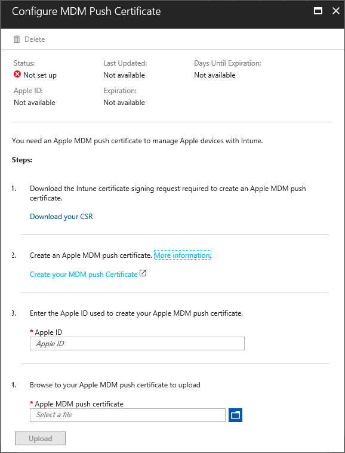

---
# required metadata

title: Get an Apple MDM Push certificate
titlesuffix: "Azure portal"
description: Learn the steps for getting an Apple MDM Push certificate to manage iOS devices with Intune."
keywords:
author: ErikjeMS 
ms.author: erikje
manager: angrobe
ms.date: 1/16/2018
ms.topic: article
ms.prod:
ms.service: microsoft-intune
ms.technology:
ms.assetid: 6f67fcd2-5682-4f9c-8d74-d4ab69dc978c

# optional metadata

#ROBOTS:
#audience:
#ms.devlang:
ms.reviewer: dagerrit
ms.suite: ems
#ms.tgt_pltfrm:
ms.custom: intune-azure

---

# Get an Apple MDM push certificate

[!INCLUDE[azure_portal](./includes/azure_portal.md)]

Intune enables mobile device management (MDM) of iPads, iPhones, and Mac computers and gives users access to company email and apps. An MDM Push certificate is required for Intune to manage iOS and Mac devices. After you add the certificate to Intune, your users can install the Company Portal app to enroll their devices. You can also set up corporate-owned iOS device management with Apple's Device Enrollment Program or enroll devices using Apple Configurator, for example. For more information about enrollment options, see [Choose how to enroll iOS devices](enrollment-method-choose-ios.md).

## Steps to get your certificate
In the Azure portal, choose **Device enrollment** > **Apple Enrollment** **Apple MDM Push Certificate**, and then follow the following steps in the Azure portal.

**Step 1. Download the Intune certificate signing request required to create an Apple MDM push certificate.** 
Select **Download your CSR** to download and save the request file locally. The file is used to request a trust relationship certificate from the Apple Push Certificates Portal.

  

**Step 2. Create an Apple MDM push certificate.** 
Select **Create your MDM push Certificate** to go to the Apple Push Certificates Portal. Sign in with your company Apple ID, and then click **Create a Certificate**. Select **Choose File** and browse to the certificate signing request file, and then choose **Upload**. On the Confirmation page, choose **Download** to the download the certificate (.pem)  file, and save the file locally.

> [!NOTE]
> The certificate is associated with the Apple ID used to create it. As a best practice, use a company Apple ID for management tasks. Never use a personal Apple ID.

**Step 3. Enter the Apple ID used to create your Apple MDM push certificate.** 
Record this ID as a reminder for when you need to renew this certificate.

**Step 4. Browse to your Apple MDM push certificate to upload.** 
Go to the certificate (.pem) file, choose **Open**, and then choose **Upload**. With the push certificate, Intune can enroll and manage Apple devices.

## Renew Apple MDM push certificate
The Apple MDM push certificate is valid for one year and must be renewed annually to maintain iOS and macOS device management. If your certificate expires, enrolled Apple devices cannot be contacted.

The certificate is associated with the Apple ID used to create it. Renew the MDM push certificate with the same Apple ID used to create it.

1. In the Azure portal, choose **Device enrollment** > **Apple Enrollment**, and then choose **Apple MDM Push Certificate**.
2. Choose **Download your CSR** to download and save the request file locally. The file is used to request a trust relationship certificate from the Apple Push Certificates Portal.
3. Find the certificate you want to renew and select **Renew**.
4. On the **Renew Push Certificate** screen, provide notes to help you identify the certificate in the future, select **Choose File** to browse to the new requet file you downloaded, and choose **Upload**.
   > [!TIP]
   > A Certificate can be identified by its UID. Examine the **Subject ID** in the certificate details to find the GUID portion of the UID. 
 
6. On the **Confirmation** screen, select **Download** and save the .pem file locally.
7. In the Azure portal, select the **Apple MDM push certificate** browse icon, select the .pem file downloaded from Apple, and choose **Upload**.

Your Apple MDM push certificate appears **Active** and has 365 days until expiration.
