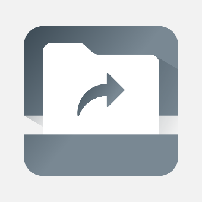
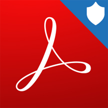

# Microsoft Intune protected apps  

Intune-managed apps are enabled with a rich set of mobile application protection policies. Managed apps allow you to:
- Restrict copy-and-paste and save-as functions
- Configure web links to open inside the secure Microsoft browser
- Enable multi-identity use and app-level conditional access
- Intune-managed apps give you the choice to apply data loss prevention policies without managing the user's device. Enable app protection without requiring enrollment, or on devices managed with 3rd party EMM tools. 

Incorporate mobile app management in your mobile and line-of-business apps using the Intune App software development kit and app wrapping tool. 

The following tables provide a lists of support partner and Microsoft apps that are commonly used with Microsoft Intune. 

## Partner apps 

| App   title                        | App description                                                                                                                                                                                                                                                                                                                                                                                                                                          | App store links for supported   platform(s) | Additional information |
|------------------------------------|----------------------------------------------------------------------------------------------------------------------------------------------------------------------------------------------------------------------------------------------------------------------------------------------------------------------------------------------------------------------------------------------------------------------------------------------------------|---------------------------------------------|------------------------|
| **Egress Secure Mail for Intune**
 | Send and receive encrypted   emails and files from your mobile device. Egress Secure Email provides   user-friendly tools to secure sensitive data, with end-to-end encryption,   access revocation and message restrictions to empower users to stay in   control of the information they share.
The Egress Secure Email app   requires you to be a licensed user of the Egress platform, with a valid   subscription and appropriate infrastructure. | [Android store link](https://play.google.com/store/apps/details?id=com.egress.switchdroid.intune)  
   |
| **Speaking Email**
   | Get more time in your day by having your email read to you on the move. Voice commands and simple gestures designed to be safe to use while driving give you the ability to archive, flag or even reply on the move.
Smart content detection skips over disclaimers, reply headers, and email signatures to speak only the content without the clutter.
Employees can sign in via Intune to access Office 365 Exchange email. | [iOS store link](https://itunes.apple.com/app/apple-store/id991406423?ct=intune)                 | <!-- info -->   |
| **Workspace ONE Send**
 | Workspace ONE Send provides seamless editing and sending capabilities for customers using Microsoft Intune to manage Office 365 apps using VMware productivity apps. | [Android store link](https://play.google.com/store/apps/details?id=com.airwatch.vmsend), [iOS store link](https://itunes.apple.com/us/app/vmware-workspace-one-send/id1336333505?mt=8) | <!-- info --> |                        |                     
| **Microsoft Stream**
 | Microsoft Stream is your central destination for enterprise video content with built-in intelligence features, deep integration across Office 365, and IT management and security capabilities that businesses of all sizes require.
With the Microsoft Stream mobile app you can:<ul><li>Find and engage with videos you need fast with smart search tools</li><li>Watch videos at your own convenience by saving content for offline viewing</li><li>Enjoy the best experience for consuming Stream videos by deep-linking into the app</li><li>Get the enterprise-level security and compliance features you expect from Office 365</li></ul>
This app requires an appropriate commercial Office 365 subscription. If you are not sure about your organization’s subscription or the services you have access to, please contact your IT department. To learn more about managing Microsoft Stream with Intune, visit aka.ms/streamintune.
By downloading this app, you agree to the license terms (see aka.ms/eulastreamios) and privacy terms (see aka.ms/privacy).
To learn more, please visit aka.ms/microsoftstreamdocs. For support or feedback, email us at streamiosstore@microsoft.com.  | [Android store link](https://play.google.com/store/apps/details?id=com.microsoft.stream), [iOS store link](https://itunes.apple.com/us/app/microsoft-stream/id1401013624?mt=8) | This app supports the following scenarios:<ul><li>Mobile application management with mobile device management for iOS and Android</li><li>Mobile application management without enrollment for iOS and Android</li></ul> |                        |                     | **Acronis Access**
 | Safely access your business files from anywhere and any device with Acronis Access. Easily share documents with colleagues, customers, and vendors while keeping files and data secure and private, where only you and your organization can touch them. The app is designed for extreme ease of use with unparalleled security, privacy, and management capabilities. | [iOS store link](https://itunes.apple.com/us/app/acronis-access/id429704844?mt=8) | This app supports the following scenarios:<ul><li>Mobile application management with mobile device management for iOS and Android</li><li>Mobile application management without enrollment for iOS and Android</li></ul> |                        |                     
| **Adobe Acrobat Reader for Microsoft Intune**
 | Open, view, and work with PDFs in a Microsoft Intune managed environment with Adobe Acrobat Reader for Intune. Available for iOS and Android. | [Android store link](https://play.google.com/store/apps/details?id=com.adobe.reader.intune), [iOS store link](https://geo.itunes.apple.com/us/app/adobe-acrobat-reader-for-microsoft/id1051980424?mt=8) | This app supports the following scenarios:<ul><li>Mobile application management with mobile device management for iOS and Android</li></ul> |                        |                     
| **Blackberry Enterprise BRIDGE**
 | BlackBerry Enterprise BRIDGE allows you to securely view, edit, and save documents using Intune-managed Microsoft apps, such as Microsoft Word, Microsoft PowerPoint, and Microsoft Excel from BlackBerry Dynamics. You can share your documents as email attachments and maintain data encryption during the document-sharing process between BlackBerry Dynamics and Intune-managed mobile apps. | [Android store link](https://play.google.com/store/apps/details?id=com.blackberry.intune.bridge), [iOS store link](https://itunes.apple.com/us/app/blackberry-enterprise-bridge/id1305494864?mt=8) | This app supports the following scenarios:<ul><li>Mobile application management with mobile device management for iOS and Android</li><li>Mobile application management without enrollment for iOS and Android</li></ul> |                        |                     
| **Box for EMM**
 | Keep your employees connected and collaborative while you centrally manage security, policy, and provisioning across any mobile device using Box for EMM. | [iOS store link](https://itunes.apple.com/us/app/box-for-emm/id882085676?mt=8) | This app supports the following scenarios:<ul><li>Mobile application management with mobile device management for iOS and Android</li><li>Mobile application management without enrollment for iOS and Android</li></ul> |                        |                     
| **Citrix Secure Mail**
 | Citrix Secure Mail is a containerized email, calendar, and contacts app with a rich user experience. | [Android store link](https://play.google.com/store/apps/details?id=com.citrix.mail.droid), [iOS store link](https://itunes.apple.com/us/app/citrix-secure-mail/id1155203964?mt=8) | This app supports the following scenarios:<ul><li>Mobile application management with mobile device management for iOS and Android</li><li>Mobile application management without enrollment for iOS and Android</li></ul> |                        |                     
| **Citrix ShareFile for Intune**
| Protect corporate data while accessing and sharing files from ShareFile. It directly integrates with Microsoft Word, Excel, and PowerPoint, to allow access to files from ShareFile without ever leaving your office application. | [Android store link](https://play.google.com/store/apps/details?id=com.citrix.sharefile.intune), [iOS store link](https://itunes.apple.com/us/app/citrix-sharefile-for-intune/id1056495502?mt=8) | This app supports the following scenarios:<ul><li>Mobile application management with mobile device management for iOS and Android</li><li>Mobile application management without enrollment for iOS and Android</li></ul> |                        |                     
| **iBabs for Intune**
| Make your meetings simpler, more substantive, and more environmentally friendly. | [iOS store link](https://itunes.apple.com/us/app/ibabs-for-intune/id1130847428?mt=8) | This app supports the following scenario:<ul><li>Mobile application management without enrollment for iOS</li></ul> |                        |                     
| **Nine Work for Intune**
 | Nine is a full-fledged email application for Android based on Direct Push technology to synchronize with Microsoft Exchange Server using Microsoft Exchange ActiveSync, and also designed for entrepreneurs or ordinary people who want to have efficient communication with their colleagues, friends, ‎and family members at anytime, anywhere. | [Android store link](https://play.google.com/store/apps/details?id=com.ninefolders.hd3.work.intune) | This app supports the following scenario:<ul><li>Mobile application management with mobile device management for Android</li></ul> |                        |                     
| **PrinterOn for Microsoft**
 | PrinterOn’s wireless mobile printing solutions enable users to remotely print from anywhere at any time over a secure network. | [Android store link](https://play.google.com/store/apps/details?id=com.printeron.droid.phone), [iOS store link](https://itunes.apple.com/us/app/printeron-for-microsoft/id1258715414?mt=8) | This app supports the following scenarios:<ul><li>Mobile application management with mobile device management for iOS and Android</li><li>Mobile application management without enrollment for iOS and Android</li></ul> |                        |                     
| **SAP Fiori**
 | Increase your daily productivity by tackling your most common business tasks anywhere and anytime with the SAP Fiori Client mobile app for iPhone and iPad. Deliver a next-level mobile experience with enhanced attachment handling and full-screen operations using this enhanced mobile runtime for the Web version of over 750 SAP Fiori app. Plus, access custom SAP Fiori mobile apps—built by customers using SAP Fiori mobile service—that are ready to support Intune mobile app  | [iOS store link](https://itunes.apple.com/us/app/sap-fiori-client/id824997258?mt=8)
 | <!-- info --> |                        |                     
| **Synergi Life**
 | Synergi Life Mobile App, an extension of Synergi Life, lets users easily create observations and incident reports anytime and from anywhere, using their phones to take a snapshot and make a voice recording.
Synergi Life (previously named Synergi) is a complete business solution for risk and QHSE management, managing all non-conformances, incidents, risk, risk analyses, audits, assessments and improvement suggestions.
The Synergi Life Mobile App requires you to be a licensed user of the Synergi Life risk and QHSE management system, and have the necessary back-end licensed software and services. | [Android store link](https://play.google.com/store/apps/details?id=com.dnv.mobilesolutions.synergimobile.uibase) | This app supports the following scenarios:<ul><li>Mobile application management with mobile device management for iOS and Android</li><li>Mobile application management without enrollment for iOS and Android</li></ul> |                        |                     
| **Vera for Intune**
 | Encrypt, track, and revoke access to files and email attachments directly from your mobile device with Vera for Intune. Protect your most valuable information, no matter what apps you use: Microsoft, Box, Google, Dropbox, and more. | [iOS store link](https://itunes.apple.com/us/app/vera-for-intune/id1235182010?mt=8) | This app supports the following scenario:<ul><li>Mobile application management without enrollment for iOS</li></ul> |                        |                     
| **VMware Workspace ONE**
 | The VMware Workspace ONE app makes it easy to access your digital workspace from any location. Use your company credentials once to setup and get single sign-on access to your apps. | [Android store link](https://itunes.apple.com/us/app/vmware-workspace-one/id1031603080?mt=8), [iOS store link](https://play.google.com/store/apps/details?id=com.airwatch.vmworkspace) | This app supports the following scenarios:<ul><li>Mobile application management with mobile device management for iOS and Android</li><li>Mobile application management without enrollment for iOS and Android</li></ul> |                        |                     
| **VMware Workspace ONE Send**
 | Workspace ONE Send provides seamless editing and sending capabilities for customers using Microsoft Intune to manage Office 365 apps using VMware productivity apps. | [Android store link](https://play.google.com/store/apps/details?id=com.airwatch.vmsend), [iOS store link](https://itunes.apple.com/us/app/vmware-workspace-one-send/id1336333505?mt=8) | This app supports the following scenarios:<ul><li>Mobile application management with mobile device management for iOS and Android</li><li>Mobile application management without enrollment for iOS and Android</li></ul> |                        |                     

## Microsoft apps

| App   title                        | App description                                                                                                                                                                                                                                                                                                                                                                                                                                          | App store links for supported   platform(s) | Additional information |
|------------------------------------|----------------------------------------------------------------------------------------------------------------------------------------------------------------------------------------------------------------------------------------------------------------------------------------------------------------------------------------------------------------------------------------------------------------------------------------------------------|---------------------------------------------|------------------------|
| **Microsoft Azure Information Protection Viewer**
 | Securely collaborate with others using the AIP Viewer App. View protected files (rights protected email messages, PDF files, pictures, text files) that someone has shared with you. | [Android store link](https://play.google.com/store/apps/details?id=com.egress.switchdroid.intune), [iOS store link](https://itunes.apple.com/us/app/rms-sharing/id689516635?mt=8) | This app supports the following scenarios:
<ul><li>Mobile application management with mobile device management for iOS and Android</li><li>Mobile application management without enrollment for Android</li></ul> |                        |                     
| **Microsoft Bookings**
 | Microsoft Bookings is an appointment scheduling app that helps you keep track of your bookings, your staff, and your customers. You’ll never miss an appointment, and you’ll have fewer no-shows.
With the Bookings app you can: <ul><li>View and manage your calendar</li><li>Create bookings or make changes to existing ones on-the-go</li><li>See real time availability of your staff members</li><li>Respond to customers quickly and easily</li><li>Quickly get directions to where your next booking is</li><li>Manage your customer list</li></ul> | [Android store link](https://play.google.com/store/apps/details?id=com.microsoft.exchange.bookings), [iOS store link](https://itunes.apple.com/us/app/microsoft-bookings/id1065657468?mt=8) | This app supports the following scenarios:<ul><li>Mobile application management with mobile device management for iOS and Android</li><li>Mobile application management without enrollment for iOS and Android</li></ul> |                        |                     
| **Microsoft Connections**
 | Microsoft Connections helps small businesses attract and retain customers with simple to use email marketing tools. Easily create professional-looking email marketing campaigns with pre-designed templates for announcements, newsletters and referrals. | [iOS store link](https://itunes.apple.com/us/app/microsoft-connections/id1172261641?mt=8) | This app supports the following scenarios:<ul><li>Mobile application management with mobile device management for iOS</li><li>Mobile application management without enrollment for iOS</li></ul> |                        |                     
| **Microsoft Dynamics CRM**
 | Engage your customers while staying productive at work and on the go with Microsoft Dynamics CRM. Arrive prepared for every appointment and update notes, tasks, contacts, accounts, cases, and leads while the details are still fresh. Allows salespeople to manage their sales data, guided by contextual business process, while on the go. Gives agents and supervisors freedom of mobility with the full scope of case management. Get a seamless user experience in a ‘configure once, deploy everywhere’ model. Available for iOS and Android. | [Android store link](https://play.google.com/store/apps/details?id=com.microsoft.crm.crmphone), [iOS store link](https://itunes.apple.com/app/microsoft-dynamics-crm/id678800460?mt=8) | This app supports the following scenarios:<ul><li>Mobile application management with mobile device management for iOS and Android</li><li>Mobile application management without enrollment for iOS</li></ul> |                        |                     
| **Microsoft Edge**
 | Microsoft Edge creates one continuous browsing experience for Windows 10 users across their devices. Content and data sync seamlessly in the background, so users can browse across devices, without skipping a beat. Familiar Microsoft Edge features like the Hub allow users to organize the web in a way that cuts through the clutter, making it easier to find, view and manage their content on-the-go. Microsoft Edge is designed for Windows 10 users to browse the web how they need to, wherever they are, without disrupting their flow. | [Android store link](https://play.google.com/store/apps/details?id=com.microsoft.emmx&hl=en_US), [iOS store link](https://itunes.apple.com/us/app/microsoft-edge/id1288723196?mt=8) | This app supports the following scenarios:<ul><li>Mobile application management with mobile device management for iOS and Android</li><li>Mobile application management without enrollment for iOS and Android</li></ul> |                        |                     
| **title**
 | description | link | <!-- info --> |                        |                     

## Next steps

To learn how to add apps for each platform to Intune, see:

- [Android store apps](store-apps-android.md)
- [Android LOB apps](lob-apps-android.md)
- [iOS store apps](store-apps-ios.md)
- [iOS LOB apps](lob-apps-ios.md)
- [Web apps (for all platforms)](web-app.md)
- [Windows Phone 8.1 store apps](store-apps-windows-phone-8-1.md)
- [Windows Phone LOB apps](lob-apps-windows-phone.md)
- [Microsoft store apps](store-apps-windows.md)
- [Windows LOB app](lob-apps-windows.md)
- [Office 365 apps for Windows 10](apps-add-office365.md)
- [Office 365 apps for macOS](apps-add-office365-macos.md)
- [Built-in apps](apps-add-built-in.md)
- [Win32 apps](apps-win32-app-management.md) 
