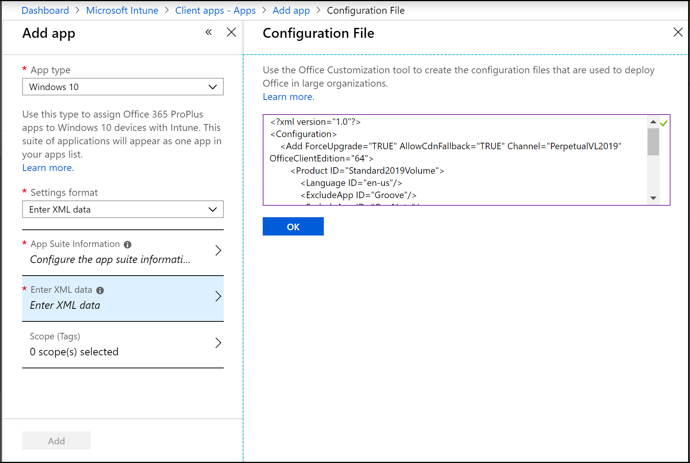

---
# required metadata

title: Assign Office 365 apps to Windows 10 devices using Microsoft Intune
titleSuffix: 
description: Learn how you can use Microsoft Intune to install Office 365 apps on Windows 10 devices.
keywords:
author: Erikre
ms.author: erikre
manager: dougeby
ms.date: 08/15/2019
ms.topic: conceptual
ms.service: microsoft-intune
ms.localizationpriority: high
ms.technology:
ms.assetid: 3292671a-5f5a-429e-90f7-b20019787d22

# optional metadata

#ROBOTS:
#audience:
#ms.devlang:
ms.reviewer: craigma
ms.suite: ems
search.appverid: MET150
#ms.tgt_pltfrm:
ms.custom: intune-azure, seoapril2019
ms.collection: M365-identity-device-management
---

# Assign Office 365 apps to Windows 10 devices with Microsoft Intune

Before you can assign, monitor, configure, or protect apps, you must add them to Intune. One of the available [app types](apps-add.md#app-types-in-microsoft-intune) is Office 365 apps for Windows 10 devices. By selecting this app type in Intune, you can assign and install Office 365 apps to devices you manage that run Windows 10. You can also assign and install apps for the Microsoft Project Online desktop client and Microsoft Visio Online Plan 2, if you own licenses for them. The available Office 365 apps are displayed as a single entry in the list of apps in the Intune console within Azure.

> [!NOTE]
> You must use Office 365 ProPlus licenses to activate Office 365 ProPlus apps deployed through Microsoft Intune. Currently, Office 365 Business edition is not supported by Intune.

## Before you start

> [!IMPORTANT]
> If there are .msi Office apps on the end-user device, you must use the **Remove MSI** feature to safely uninstall these apps. Otherwise, the Intune delivered Office 365 apps will fail to install.

- Devices to which you deploy these apps must be running the Windows 10 Creators Update or later.
- Intune supports adding Office apps from the Office 365 suite only.
- If any Office apps are open when Intune installs the app suite, the installation might fail, and users might lose data from unsaved files.
- This installation method is not supported on Windows Home, Windows Team, Windows Holographic, or Windows Holographic for Business devices.
- Intune does not support installing Office 365 desktop apps from the Microsoft Store (known as Office Centennial apps) on a device to which you have already deployed Office 365 apps with Intune. If you install this configuration, it might cause data loss or corruption.
- Multiple required or available app assignments are not additive. A later app assignment will overwrite pre-existing installed app assignments. For example, if the first set of Office apps contains Word, and the later one does not, Word will be uninstalled. This condition does not apply to any Visio or Project applications.
- Mutiple Office 365 deployments are not currently supported. Only one deployment will be delivered to the device
- **Office version** - Choose whether you want to assign the 32-bit or 64-bit version of Office. You can install the 32-bit version on both 32-bit and 64-bit devices, but you can install the 64-bit version on 64-bit devices only.
- **Remove MSI from end-user devices** - Choose whether you want to remove pre-existing Office .MSI apps from end-user devices. The installation won’t succeed if there are pre-existing .MSI apps on end-user devices. The apps to be uninstalled are not limited to the apps selected for installation in **Configure App Suite**, as it will remove all Office (MSI) apps from the end user device. For more information, see [Remove existing MSI versions of Office when upgrading to Office 365 ProPlus](https://docs.microsoft.com/deployoffice/upgrade-from-msi-version). When Intune reinstalls Office on your end user's machines, end users will automatically get the same language packs that they had with previous .MSI Office installations.

## Get started

1. Sign in to [Intune](https://go.microsoft.com/fwlink/?linkid=2090973).
3. In the **Intune** pane, select **Client apps**.
4. In the **Client apps** workload pane, under **Manage**, select **Apps**.
5. Select **Add**.
6. In the **Add apps** pane, in the **App type** list, under **Office 365 Suite**, select **Windows 10**.

## Select settings format

You can choose a method for configuring app setting by selecting a **Settings format**. Setting format options include:
- Configuration designer
- Enter XML data

When you choose **Configuration designer** the **Add app** blade will change to offer two additional settings options:
- Configure App Suite
- App Suite Settings

When you choose **Enter XML data** the **Add app** blade with display the **Enter XML data** option. Select this to display the **Configuration File** blade. 

    
For more information about the **Enter XML data** option, see [Enter XML data](apps-add-office365.md#enter-xml-format) below.

## Configure app suite information

In this step, you provide information about the app suite. This information helps you to identify the app suite in Intune, and it helps users to find the app suite in the company portal.

1. In the **Add App** pane, select **App Suite Information**.
2. In the **App Suite Information** pane, do the following:
    - **Suite Name**: Enter the name of the app suite as it is displayed in the company portal. Make sure that all suite names that you use are unique. If the same app suite name exists twice, only one of the apps is displayed to users in the company portal.
    - **Suite Description**: Enter a description for the app suite. For example, you could list the apps you've selected to include.
    - **Publisher**: Microsoft appears as the publisher.
    - **Category**: Optionally, select one or more of the built-in app categories or a category that you created. This setting makes it easier for users to find the app suite when they browse the company portal.
    - **Display this as a featured app in the Company Portal**: Select this option to display the app suite prominently on the main page of the company portal when users browse for apps.
    - **Information URL**: Optionally, enter the URL of a website that contains information about this app. The URL is displayed to users in the company portal.
    - **Privacy URL**: Optionally, enter the URL of a website that contains privacy information for this app. The URL is displayed to users in the company portal.
    - **Developer**: Microsoft appears as the developer.
    - **Owner**: Microsoft appears as the owner.
    - **Notes**: Enter any notes that you want to associate with this app.
    - **Logo**: The Office 365 logo is displayed with the app when users browse the company portal.
3. Select **OK**.

## Configure app suite

If you selected the **Configuration designer** option under the **Setting format** dropdown box, you'll see the **Configure App Suite** option in the **Add app** blade. Select the Office apps that you want to assign to devices.

1. In the **Add App** pane, select **Configure App Suite**.
2. In the **Configure App Suite** pane, select the standard Office apps that you want to assign to devices.  
    Additionally, you can install apps for the Microsoft Project Online desktop client and Microsoft Visio Online Plan 2, if you own licenses for them.
3. Select **OK**.

## Configure app suite settings

If you selected the **Configuration designer** option under the **Setting format** dropdown box, you'll see the **App Suite Settings** option in the **Add app** blade. In this step, configure installation options for the app suite. The settings apply to all apps that you added to the suite.

1. In the **Add App** pane, select **App Suite Settings**.
2. In the **App Suite Settings** pane, do the following:
    - **Office version**: Choose whether you want to assign the 32-bit or 64-bit version of Office. You can install the 32-bit version on both 32-bit and 64-bit devices, but you can install the 64-bit version on 64-bit devices only.
    - **Update Channel**: Choose how Office is updated on devices. For information about the various update channels, see [Overview of update channels for Office 365 ProPlus](https://docs.microsoft.com/DeployOffice/overview-of-update-channels-for-office-365-proplus). Choose from:
        - **Monthly**
        - **Monthly (Targeted)**
        - **Semi-Annual**
        - **Semi-Annual (Targeted)**

        After you choose a channel, you can optionally select **Specific** to install a specific version of Office for the selected channel on end user devices. Then, select the **Specific version** of Office to use.
        
        The available versions will change over time. Therefore, when creating a new deployment, the versions available may be newer and not have certain older versions available. Current deployments will continue to deploy the older version, but the version list will be continually updated per channel.
        
        For devices that update their pinned version (or update any other properties) and are deployed as available, the reporting status will show as Installed if they installed the previous version until the device check-in occurs. When the device check-in happens, the status will temporarily change to Unknown, however it will not be shown to the user. When the user initiates the install for the newer available version, the user will see the status changed to Installed.
        
        For more information, see [Overview of update channels for Office 365 ProPlus](https://docs.microsoft.com/DeployOffice/overview-of-update-channels-for-office-365-proplus).

    - **Remove MSI from end-user devices** - Choose whether you want to remove pre-existing Office .MSI apps from end-user devices. The installation won’t succeed if there are pre-existing .MSI apps on end-user devices. The apps to be uninstalled are not limited to the apps selected for installation in **Configure App Suite**, as it will remove all Office (MSI) apps from the end user device. For more information, see [Remove existing MSI versions of Office when upgrading to Office 365 ProPlus](https://docs.microsoft.com/deployoffice/upgrade-from-msi-version). When Intune reinstalls Office on your end user's machines, end users will automatically get the same language packs that they had with previous .MSI Office installations. 
    - **Automatically accept the app end user license agreement**: Select this option if you don't require end users to accept the license agreement. Intune then automatically accepts the agreement.
    - **Use shared computer activation**: Select this option when multiple users share a computer. For more information, see [Overview of shared computer activation for Office 365](https://docs.microsoft.com/DeployOffice/overview-of-shared-computer-activation-for-office-365-proplus).
    - **Languages**: Office is automatically installed in any of the supported languages that are installed with Windows on the end-user's device. Select this option if you want to install additional languages with the app suite. 

    You can deploy additional languages for Office 365 Pro Plus apps managed through Intune. The list of available languages includes the **Type** of language pack (core, partial, and proofing). In the Azure portal, select **Microsoft Intune** > **Client apps** > **Apps** > **Add**. In the **App type** list of the **Add app** blade, select **Windows 10** under **Office 365 Suite**. Select **Languages** in the **App Suite Settings** blade. For additional information, see [Overview of deploying languages in Office 365 ProPlus](https://docs.microsoft.com/deployoffice/overview-of-deploying-languages-in-office-365-proplus).

## Select scope tags (optional)
You can use scope tags to determine who can see client app information in Intune. For full details about scope tags, see [Use role-based access control and scope tags for distributed IT](../fundamentals/scope-tags.md).

1. Select **Scope (Tags)** > **Add**.
2. Use the **Select** box to search for scope tags.
3. Select the check box next to the scope tags you want to assign to this app.
4. Choose **Select** > **OK**.

## Enter XML format

If you selected the **Enter XML data** option under the **Setting format** dropdown box, you'll see the **Enter XML format** option in the **Add app** blade. For more information, see [Configuration options for the Office Deployment Tool](https://docs.microsoft.com/DeployOffice/configuration-options-for-the-office-2016-deployment-tool).

## Finish up

When you're done, in the **Add App** pane, select **Add**. The app you've created is displayed in the apps list.

## Troubleshooting
Intune uses the [Office Deployment Tool](https://docs.microsoft.com/DeployOffice/overview-of-the-office-2016-deployment-tool) to download and deploy Office 365 ProPlus to your client computers using the [Office 365 CDN](https://docs.microsoft.com/office365/enterprise/content-delivery-networks). Reference the best practices outlined in [Managing Office 365 endpoints](https://docs.microsoft.com/office365/enterprise/managing-office-365-endpoints) to ensure that your network configuration permits clients to access the CDN directly rather than routing CDN traffic through central proxies to avoid introducing unnecessary latency.

Run the [Microsoft Support and Recovery Assistant for Office 365](https://diagnostics.office.com) on a targeted device if you encounter installation or run-time issues.

## Errors during installation of the app suite

See [How to enable Office 365 ProPlus ULS logging](https://blogs.technet.microsoft.com/odsupport/2018/06/18/how-to-enable-office-365-proplus-uls-logging) for information on how to view verbose installation logs.

The following tables list common error codes you might encounter and their meaning.

### Status for Office CSP

| Status | Phase | Description |
|--------------------------------------------------|--------------------|------------------------------------------------------------------------------------------------------------------------------------------------------------------------------------------------|
| 1460 (ERROR_TIMEOUT) | Download | Failed to download the Office Deployment Tool |
| 13 (ERROR_INVALID_DATA) | - | Cannot verify the signature of the downloaded Office Deployment Tool |
| Error code from CertVerifyCertificateChainPolicy | - | Failed certification check for the downloaded Office Deployment Tool |
| 997 | WIP | Installing |
| 0 | After installation | Installation succeeded |
| 1603 (ERROR_INSTALL_FAILURE) | - | Failed any prerequisite check, such as:SxS (Tried to install when 2016 MSI is installed)Version mismatchOthers |
| 0x8000ffff (E_UNEXPECTED) | - | Tried to uninstall when there is no Click-to-Run Office on the machine |
| 17002 | - | Failed to complete the scenario (install). Possible reasons:Installation canceled by userInstallation canceled by another installationOut of disk space during installationUnknown language ID |
| 17004 | - | Unknown SKUs |

### Office Deployment Tool error codes

| Scenario | Return code | UI | Note |
|------------------------------------------------------------------------------------------------------------------|---------------------------------------|----------------------------------------------------|------------------------------------|
| Uninstall effort when there is no active Click-to-Run installation | -2147418113, 0x8000ffff or 2147549183 | Error Code: 30088-1008Error Code: 30125-1011 (404) | Office Deployment Tool |
| Install when there is MSI version installed | 1603 | - | Office Deployment Tool |
| Installation canceled by user, or by another installation | 17002 | - | Click-to-Run |
| Try to install 64-bit on a device that has 32-bit installed. | 1603 | - | Office Deployment Tool return code |
| Try to install an unknown SKU (not a legitimate use case for Office CSP since we should only pass in valid SKUs) | 17004 | - | Click-to-Run |
| Lack of space | 17002 | - | Click-to-Run |
| The Click-to-Run client failed to start (unexpected) | 17000 | - | Click-to-Run |
| The Click-to-Run client failed to queue scenario (unexpected) | 17001 | - | Click-to-Run |

## Next steps

- To assign the apps to the groups you choose, see [Assign apps to groups](/intune-azure/manage-apps/deploy-apps).
