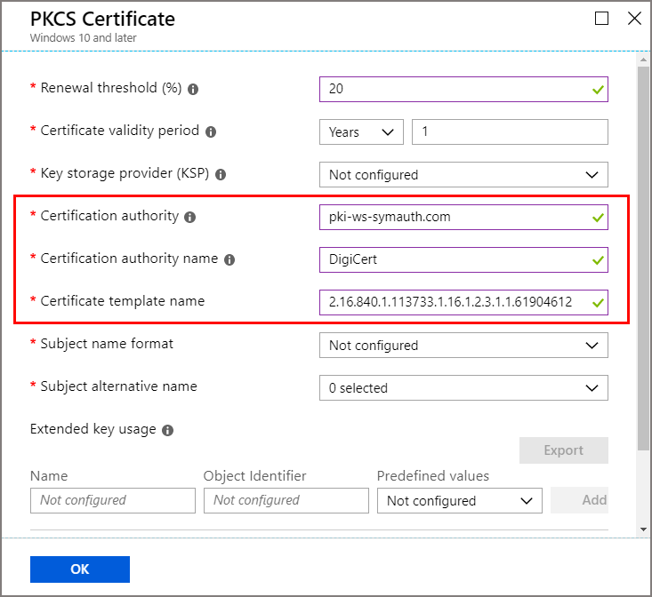

# Set up Intune Certificate Connector for DigiCert PKI Platform - Web Service Integration  

[!INCLUDE [azure_portal](./includes/azure_portal.md)]

Use the Intune Certificate Connector to issue PKCS Certificates from a DigiCert PKI Platform - Web Service Integration to Intune managed devices. The connector can be used with only a DigiCert Certification Authority CA, or with both a DigiCert and a Microsoft CA.  
> [!TIP]  
> DigiCert was formerly known as Symantec. For more information about this change, see [https://support.symantec.com/en_US/article.INFO4722.html](https://support.symantec.com/en_US/article.INFO4722.html).  

The DigiCert PKI Platform – Web Service Integration is referred as DigiCert CA throughout this article.

If you already use the Intune Certificate Connector to issue certificates from a Microsoft Certification Authority (CA) using PKCS or SCEP, you can use that same connector to configure and issue PKCS Certificates from a DigiCert CA. After completing the additional configuration to support DigiCert CA, the Intune Certificate Connector can issue the following certificates:

* PKCS Certificates from a Microsoft CA
* PKCS Certificates from a DigiCert CA
* SCEP Certificates from a Microsoft CA

If you don't have the connector installed, but plan to use it for both a Microsoft CA and a DigiCert CA, complete the connector configuration for the Microsoft CA first. Then, return to this article to configure it to also support DigiCert. For more information about certificate profiles and the connector, see [Configure a certificate profile for your devices in Microsoft Intune](certificates-configure.md).  

If you will use the connector with only the DigiCert CA, you can use the instructions in this article to install and then configure the connector. 

## Prerequisites  
- **An active subscription at the DigiCert CA** - The subscription is required to get a Registration Authorization (RA) certificate from the DigiCert CA.

## Install the DigiCert Registration Authorization Certificate  
 
You must have an active subscription at the DigiCert CA to get the Registration Authorization (RA) certificate.

1. Save the following code snippet as in a file named **certreq.ini** and update as required (For example: *Subject name in CN format*).

   ```
    [Version] 
    Signature="$Windows NT$" 

    [NewRequest] 
    ;Change to your,country code, company name and common name 
    Subject = "Subject Name in CN format"

    KeySpec = 1 
    KeyLength = 2048 
    Exportable = TRUE 
    MachineKeySet = TRUE 
    SMIME = False 
    PrivateKeyArchive = FALSE 
    UserProtected = FALSE 
    UseExistingKeySet = FALSE 
    ProviderName = "Microsoft RSA SChannel Cryptographic Provider" 
    ProviderType = 12 
    RequestType = PKCS10 
    KeyUsage = 0xa0 

    [EnhancedKeyUsageExtension] 
    OID=1.3.6.1.5.5.7.3.2 ; Client Authentication  // Uncomment if you need a mutual TLS authentication

    ;----------------------------------------------- 
   ```

2. Open an elevated command prompt and generate a certificate signing request (CSR) using the following command:

   `Certreq.exe -new certreq.ini request.csr`

3. Open the request.csr file in Notepad and copy the CSR content that is in the following format:

    ```
    -----BEGIN NEW CERTIFICATE REQUEST-----
    MIID8TCCAtkCAQAwbTEMMAoGA1UEBhMDVVNBMQswCQYDVQQIDAJXQTEQMA4GA1UE
    …
    …
    fzpeAWo=
    -----END NEW CERTIFICATE REQUEST-----
    ```

4. Sign in to the DigiCert CA and navigate to **Get an RA Cert** from the tasks.  
   1. In the text box, provide the CSR content from step 3.  
   2. Provide a friendly name for the certificate.  
   3. Select **Continue**.  
   4. Use the link that is provided to download the RA certificate to your local computer.

5. Import the RA Certificate into the Windows Certificate store: 
   1. Open an MMC console.
   2. Select **File** > **Add or Remove Snap-ins** > **Certificate** > then Select **Add**.  
   3. Select **Computer Account** > **Next**.  
   4. Select **Local Computer** > **Finish**.  
   5. Select **OK** on the **Add or Remove Snap-ins** window. Expand **Certificates (Local Computer)** > **Personal** > **Certificates**.  
   6. Right-click the **Certificates** node and select **All Tasks** > **Import**.  
   7. Select the location of the RA Certificate that you downloaded from the DigiCert CA, and then select **Next**.  
   8. Select **Personal Certificate Store**, and then select **Next**.  
   9. Select **Finish** to import the RA Certificate and its private key into the Local Machine-Personal store.  

6. Export and import the private key certificate: 
   1. Expand **Certificates (Local Machine)** > **Personal** > **Certificates**.  
   2. Select the certificate that was imported in the previous step.  
   3. Right-click the certificate and choose **All Tasks** > **Export**.  
   4. Select **Next**, and then enter the password.  
   5. Select the location to export to and select **Finish**.  
   6. Use the procedure from step 5 to import the private key certificate into the Local Computer-Personal store.  
   7. Record a copy the RA Certificate thumbprint without any spaces. The following is an example of the thumbprint: 
      ```
      RA Cert Thumbprint: “EA7A4E0CD1A4F81CF0740527C31A57F6020C17C5”
      ```  
    > [!NOTE]
    > For assistance in getting the RA Certificate from the DigiCert CA, contact [DigiCert Customer Support](mailto:enterprise-pkisupport@digicert.com).  

## Prepare to install Intune Certificate Connector
> [!TIP]  
> This section applies if you will use the Intune Certificate Connector with only a DigiCert CA. If you use the Intune Certificate Connector with a Microsoft CA and want to add DigiCert CA support, skip ahead to [Configure the connector to support DigiCert](#configure-the-connector-to-support-digicert).  

1. Choose one of the Windows Operating System versions from the following list and install it on a computer:
   * Windows Server 2012 R2 Datacenter
   * Windows Server 2012 R2 Standard
   * Windows Server 2016 Datacenter
   * Windows Server 2016 Standard

2. Create a user with administrative privileges and use it to complete the following steps.

3. Update for latest Windows Updates and install them if available. After installing Windows Updates, restart the computer.

4. Install .NET Framework 3.5:  
   1. Open **Control Panel** > **Programs and Features** > **Turn Windows features on or off**.  
   2. Select **.NET Framework 3.5** and install it.  

## Install Intune Certificate Connector for use with DigiCert  

> [!TIP]  
> If you use the Intune Certificate Connector with a Microsoft CA and want to add DigiCert CA support, skip ahead to [Configure the connector to support DigiCert](#configure-the-connector-to-support-digicert).  

Download the latest Intune Certificate Connector from the Intune administration portal and follow these instructions.

1. Sign in to [Intune](https://go.microsoft.com/fwlink/?linkid=20909).  

2. Select **Device configuration** > **Certificate Connectors** > **+ Add**.  

3. Select **Download the certificate connector software** and save the download to a location where you can access it from the server where you're going to install it.  

   
   
4. On the server where you want to install the connector, run *NDESConnectorSetup.exe* with elevated privileges. 

5. On the **Installation Options** screen, select **PFX Distribution**.  
   
   

   > [!IMPORTANT]
   > If you'll use the Intune Certificate Connector to issue certificates from a Microsoft CA and a Symantec CA, select **SCEP and PFX Profile Distribution**. 

6. Use the default selections to complete setup of the connector.

## Configure the connector to support DigiCert

By default, the Intune Certificate Connector installs to `%ProgramFiles%\Microsoft Intune\NDESConnectorSvc`.

1. In the NDESConnectorSvc folder, open the *NDESConnector.exe.config* file in Notepad.  
   1. Update the RACertThumbprint key value with the certificate thumbprint value you copied in the previous section.  For example:

      ```
      <add key="RACertThumbprint"
      value="EA7A4E0CD1A4F81CF0740527C31A57F6020C17C5"/>
      ```
   2. Save and close the file.

2. Open services.msc:  
   1. Select **Intune Connector Service**.
   2. Stop the service and then start the service.  
   3. Close the Services window.

## Set up the Intune administrator account  

> [!TIP]  
> If you use the Intune Certificate Connector with a Microsoft CA and want to add DigiCert CA support, skip ahead to [Create a Trusted Certificate Profile](#create-a-trusted-certificate-profile).   
 
1. Start the *NDES Connector* user interface from ` %ProgramFiles%\Microsoft Intune\NDESConnectorUI\NDESConnectorUI.exe `  

2. On the **Enrollment** tab, select **Sign In**.

3. Provide your Intune tenant admin credentials.

4. Select **Sign In**, and then select **OK** to confirm a successful enrollment. You can then close the *NDES Connector* user interface.
   
   


## Create a Trusted Certificate Profile

The PKCS certificates you'll deploy for Intune managed devices must be chained with a Trusted Root Certificate. To establish this chain, create an Intune Trusted Certificate Profile with the root certificate from the DigiCert CA.

1. Get a Trusted Root Certificate from the DigiCert CA:  
    a. Sign in to the DigiCert CA Admin portal.  
    b. Select **Manage CAs** from Tasks.  
    c. Select the appropriate CA from CAs list.  
    d. Select **Download root certificate** to download the Trusted Root Certificate.

2. Create a Trusted Certificate Profile in the Intune portal:
   1. Sign in to [Intune](https://go.microsoft.com/fwlink/?linkid=20909). 
   2. Select **Device configuration** > **Manage** > **Profiles** > **Create profile**.  
   3. Enter a **Name and Description** for the trusted certificate profile.   
   4. From the **Platform** drop-down list, select the device platform for this trusted certificate.  
   5. From the **Profile type** drop-down list, choose **Trusted certificate**.
   6. Browse to the trusted root CA certificate .cer file you obtained from DigiCert CA in the previous step, and then select **OK**.
   7. For Windows 8.1 and Windows 10 devices only, select the **Destination Store** for the trusted certificate from:    
       - **Computer certificate store - Root**  
       - **Computer certificate store - Intermediate**  
       - **User certificate store - Intermediate**  
   8. When you're done, select **OK**, go back to the **Create profile** pane, and select **Create**.  
 
   The profile appears in the list of profiles on the *Device configuration – Profiles* view pane, with a profile type of **Trusted certificate**.  Be sure to assign this profile to devices that will receive certificates. To assign the profile to groups, see [assign device profiles](device-profile-assign.md).


## Get the Certificate Profile OID  

The Certificate Profile OID is associated with a Certificate Profile template in the DigiCert CA.  To create a PKCS certificate profile in Intune, the certificate template name must be in the form of a Certificate Profile OID that is associated with a certificate template in the DigiCert CA.

1. Sign in to the DigiCert CA Admin portal.
2. select **Manage Certificate Profiles**.
3. Select the Certificate Profile that you want to use.
4. Copy the Certificate Profile OID. It looks similar to the following example:

   ```
   Certificate Profile OID = 2.16.840.1.113733.1.16.1.2.3.1.1.47196109 
   ```

> [!NOTE]
> If you need help to get the Certificate Profile OID, contact [DigiCert Customer Support](mailto:enterprise-pkisupport@digicert.com).

## Create a PKCS certificate Profile

1. 1. Sign in to [Intune](https://go.microsoft.com/fwlink/?linkid=20909).  

2. Go to **Device configuration** >  **Profiles** > and select **Create profile**.

3. Enter a **Name** and **Description** for the PKCS certificate profile.  

4. From the **Platform** drop-down list, select a supported device platform.

5. From the **Profile type** drop-down list, select **PKCS certificate**.
 
6. On the PKCS Certificate pane, the following parameters must be configured with the values from the following table. These values are required to issue PKCS certificates from a DigiCert CA, through the Intune Certificate Connector. 

   |PKCS certificate parameter | Value | Description |
   | --- | --- | --- |
   | Certificate authority | pki-ws.symauth.com | This value must be DigiCert CA base service FQDN without trailing slashes.  If you aren't sure whether this is the correct base service FQDN for your DigiCert CA subscription, contact DigiCert Customer support. <br><br>*With the change from Symantec to DigiCert, this URL remains unchanged*. <br><br> If this FQDN is incorrect, Intune Certificate Connector won't issue PKCS Certificates from the DigiCert CA.| 
   | Certificate authority name | DigiCert | This value must be the string **DigiCert**. <br><br> If there's any change to this value, Intune Certificate Connector won't issue PKCS Certificates from the DigiCert CA.|
   | Certificate template name | Certificate Profile OID from DigiCert CA. <br><br> Ex: `2.16.840.1.113733.1.16.1.2.3.1.1.61904612`| This value must be a Certificate Profile OID [obtained in the previous section](#get-the-certificate-profile-oid) from the DigiCert CA Certificate Profile template. <br><br> If Intune Certificate Connector can't find a certificate template associated with this Certificate Profile OID in the DigiCert CA, it won't issue PKCS certificates from the DigiCert CA.|  

     

   > [!NOTE]
   > The PKCS Certificate profiles for Windows platforms doesn’t need to associate with a Trusted Certificate profile. But it is required for non-Windows platform profiles such as Android.
7. Complete the configuration of the profile to meet your business needs, and then select **OK** to save the profile. 

8. Select **Assignments** and configure an appropriate group that will receive this profile. At least one user or device must be part of the assigned group.
 
After completing the previous steps, Intune Certificate Connector will issue PKCS certificates from the DigiCert CA to Intune managed devices in the assigned group. These certificates will be available in the Personal store of the Current User certificate store on the Intune managed device.

### PKCS Certificate Profile supported attributes

|Attribute | Intune supported formats | DigiCert Cloud CA supported formats | result |
| --- | --- | --- | --- |
| Subject Name |Intune supports the subject name in following three formats only: <br><br> 1. Common Name <br> 2. Common Name includes email <br> 3. Common Name as email <br><br> For example: <br><br> `CN = IWUser0 <br><br> E = IWUser0@samplendes.onmicrosoft.com` | DigiCert CA supports additional attributes.  If you want to select additional attributes, they must be defined with fixed values in the DigiCert Certificate Profile template.| We use Common Name or email from the PKCS Certificate request. <br><br> Any mismatch in attributes selection between the Intune Certificate Profile and the DigiCert Certificate Profile template results in no certificates issued from the DigiCert CA.|
| SAN | Intune supports only the following SAN field values: <br><br> AltNameTypeEmail <br><br> AltNameTypeUpn <br><br> AltNameTypeOtherName (encoded value) | The DigiCert Cloud CA also supports these parameters. If you want to select additional attributes, they must be defined with fixed values in the DigiCert Certificate Profile template. <br><br> AltNameTypeEmail: If this type isn't found in SAN, it uses the value from AltNameTypeUpn.  If AltNameTypeUpn is also not found in SAN, then it uses the value from Subject Name if it’s in email format.  If still not found, Intune Certificate Connector fails to issue the certificates. <br><br> Ex: `RFC822 Name=IWUser0@ndesvenkatb.onmicrosoft.com`  <br><br> AltNameTypeUpn: If this type is not found in SAN, it uses the value from AltNameTypeEmail. If AltNameTypeEmail is also not found in SAN, then uses the value from Subject Name if it’s in email format.  If still not found, Intune Certificate Connector fails to issue the certificates.  <br><br> Ex: `Other Name: Principal Name=IWUser0@ndesvenkatb.onmicrosoft.com` <br><br> AltNameTypeOtherName: If this type isn't found in SAN, Intune Certificate Connector fails to issue the certificates. <br><br> Ex: `Other Name: DS Object Guid=04 12 b8 ba 65 41 f2 d4 07 41 a9 f7 47 08 f3 e4 28 5c ef 2c` <br><br>  **Important Note:** The value of this field is supported only in encoded format (hexadecimal value) by the DigiCert CA. So, for any value in this field, Intune Certificate Connector converts it to base 64 encoded before it submits the certificate request. **Intune Certificate Connector doesn’t validate whether this value is already encoded or not.** | None |

## Troubleshooting

Intune Certificate Connector Service logs are available in `%ProgramFiles%\Microsoft Intune\NDESConnectorSvc\Logs\Logs` on the NDES Connector machine. Open the logs in the [SvcTraceViewer](https://docs.microsoft.com/dotnet/framework/wcf/service-trace-viewer-tool-svctraceviewer-exe) and search for exception or error messages.

| Issue/Error Message | Resolution steps |
| --- | --- |
| Unable to sign in with Intune the tenant admin account on NDES Connector UI | This can happen when the on-premises Certificate Connector isn't enabled in the Intune administration portal. To resolve this issue, use the following steps: <br><br> From Silver Light UI: <br> 1. Sign in to the [Intune admin portal](https://admin.manage.microsoft.com) <br> 2. Click ADMIN <br> 3. Select Mobile Device Management > Certificate Connector <br> 4. Click **Configure On-premises Certificate Connector** <br> 5. Select the **Enable Certificate Connector** checkbox <br> 6. Click **OK**. <br><br>Or <br><br> From the Azure portal UI: <br> 1. Sign in to the [Azure portal](https://portal.azure.com) <br> 2. Go to Microsoft Intune <br> 3. Select **Device Configuration** > **Certificate Authority** <br> 4. Click **Enable**. <br><br> After you complete the previous steps from either the Silver Light UI or the Azure portal, try to sign in with the same Intune tenant admin account in the NDES Connector UI. |
| NDES Connector certificate could not be found. <br><br> System.ArgumentNullException: Value can't be null. | Intune Certificate Connector shows this error if the Intune tenant administrator account has never signed in to the NDES Connector UI. <br><br> If this error persists, restart the Intune Service Connector. <br><br> 1. Open services.msc <br> 2. Select **Intune Connector Service**. <br> 3. Right-click and select **Restart**.|
| NDES Connector - IssuePfx -Generic Exception: <br> System.NullReferenceException: Object reference not set to an instance of an object. | This error is transient. Restart the Intune Service Connector. <br><br> 1. Open services.msc <br> 2. Select **Intune Connector Service** <br> 3. Right-click and select **Restart**. |
| DigiCert Provider - Failed to get DigiCert policy “The operation has timed out” | Intune Certificate Connector received operation time-out error while communicating with the DigiCert CA. If this error continues to occur, increase the connection timeout value and try again. <br><br> To increase the connection timeout: <br> 1. Goto the NDES Connector computer. <br>2. Open the `%ProgramFiles%\Microsoft Intune\NDESConnectorSvc\NDESConnector.exe.config` file in Notepad. <br> 3. Increase the timeout value for the following parameter: <br><br> `CloudCAConnTimeoutInMilliseconds` <br><br> 4. Restart the Intune Connector Service. <br><br> If the issue persists, contact DigiCert customer support. |
| DigiCert Provider - Failed to get client certificate | Intune Certificate Connector failed to retrieve the Resource Authorization Certificate from Local Machine-Personal certificate store. To resolve this issue, make sure to install the Resource Authorization Certificate in the Local Machine-Personal certificate store along with its private key. <br><br> **Note:** The Resource Authorization certificate must be obtained from the DigiCert CA. For more details, contact SymaDigiCertntec customer support. | 
| DigiCert Provider - Failed to get DigiCert policy “The request was aborted: Could not create SSL/TLS secure channel.” | This error occurs under the following scenarios: <br><br> 1. Intune Certificate Connector service doesn’t have enough permissions to read the Resource Authorization certificate along with its private key from the Local Machine-Personal certificate store. To resolve this issue, check the Connector service running context account in services.msc. The Connector service must run under NT AUTHORITY\SYSTEM context. <br><br> 2. The PKCS Certificate profile in the Intune admin portal may be configured with an invalid DigiCert CA base service FQDN. The FQDN is similar to `pki-ws.symauth.com`. To resolve this issue, check with DigiCert customer support whether the URL is correct for your subscription. <br><br> 3. Intune Certificate Connector fails to authenticate with DigiCert CA using the Resource Authorization certificate because it is to unable to retrieve its private key. To resolve this issue, make sure to install the Resource Authorization certificate along with its private key in the Local Machine-Personal certificate store. <br><br> If the issue persists, contact DigiCert customer support. |
| DigiCert Provider - Failed to get DigiCert policy “A request element is not understood.” | Intune Certificate Connector failed to get the DigiCert Certificate Profile template, because the Client Profile OID does not match the Intune Certificate Profile. In another case, Intune Certificate Connector is unable to find the certificate profile template that is associated with the given Client Profile OID in DigiCert CA. <br><br> To resolve this issue, make sure to obtain the correct Client Profile OID from the DigiCert Certificate template in the DigiCert CA. Then update the PKCS Certificate profile in the Intune admin portal. <br><br> Obtain Client Profile OID from DigiCert CA: <br> 1. Sign in DigiCert CA admin portal. <br> 2. Click on Manage Certificate Profiles <br> 3. Select the Certificate Profile that you intend to use. <br> 4. Obtain the Certificate Profile OID. It looks similar to the following example: <br> `Certificate Profile OID = 2.16.840.1.113733.1.16.1.2.3.1.1.47196109` <br><br> Update the PKCS Certificate profile with correct Certificate Profile OID: <br>1. Sign in Intune admin portal <br> 2. Go to the PKCS Certificate Profile and click **Edit**. <br> 3. Update the Certificate Profile OID in update in Certificate Template name field. <br> 4. Save the PKCS Certificate Profile. |
| DigiCert Provider - Policy Verification failed. <br><br> Attribute does not fall under DigiCert supported Certificate template attributes list | The DigiCert CA shows this message when there is discrepancy between the DigiCert Certificate Profile template and the Intune Certificate Profile. This issue likely happened due to attribute mismatch in SubjectName or SubjectAltName. <br><br> To resolve this issue, make sure to select Intune supported attributes for SubjectName and SubjectAltName in the DigiCert Certificate Profile template. For more information, see the Intune Supported attributes in the Certificate Parameters section. |
| Some User devices are not receiving PKCS certificates from DigiCert CA. | This issue happens when User UPN contains special characters like underscore (Example: `global_admin@intune.onmicrosoft.com`). <br><br> The DigiCert CA doesn’t support special characters in mail_firstname and mail_lastname. <br><br> The following steps help resolve this issue: <br><br> 1.	Sign in DigiCert CA admin portal. <br> 2.	Goto the Manage Certificate Profiles. <br> 3.	Click the Certificate Profile used for Intune. <br> 4.	Click the Customize options link. <br> 5.	Click the Advanced options button. <br> 6.	Under Certificate fields – Subject DN, add Common Name (CN) field and delete existing Common Name (CN) field. Add and delete must be performed together. <br> 7.	Click Save. <br><br> With the preceding change, the DigiCert Certificate profile requests “CN=<upn>” instead of mail_firstname and mail_lastname. |
| User manually deleted already deployed certificate from the device. | Intune redeploys the same certificate during next check-in or policy enforcement. In this case, NDES Connector doesn’t receive a PKCS Certificate request. |

## Next steps

Use the information provided in this article in addition to the information in [What are Microsoft Intune device profiles?](device-profiles.md) to manage your organization's devices and the certificates on them.

