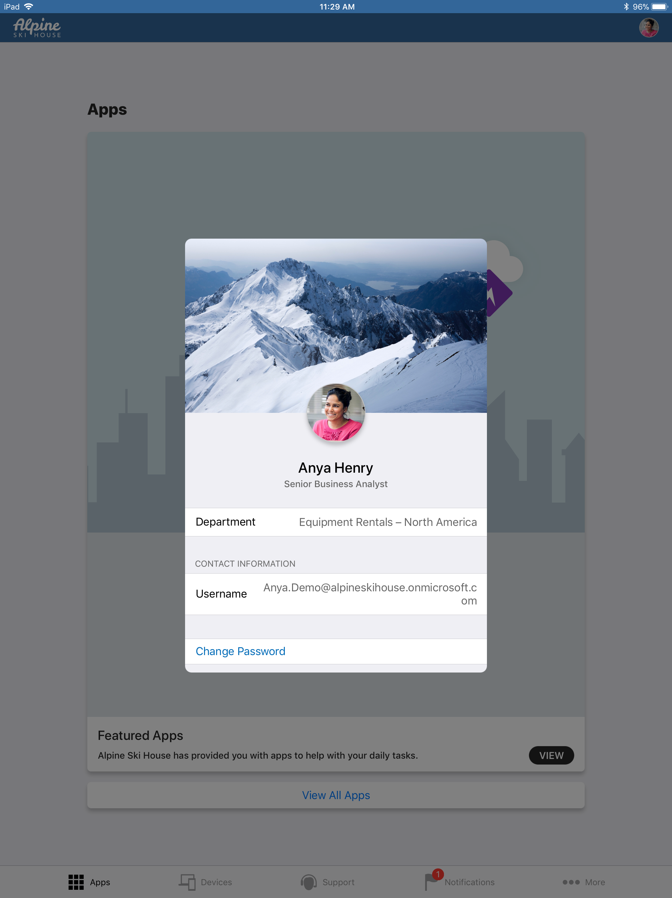
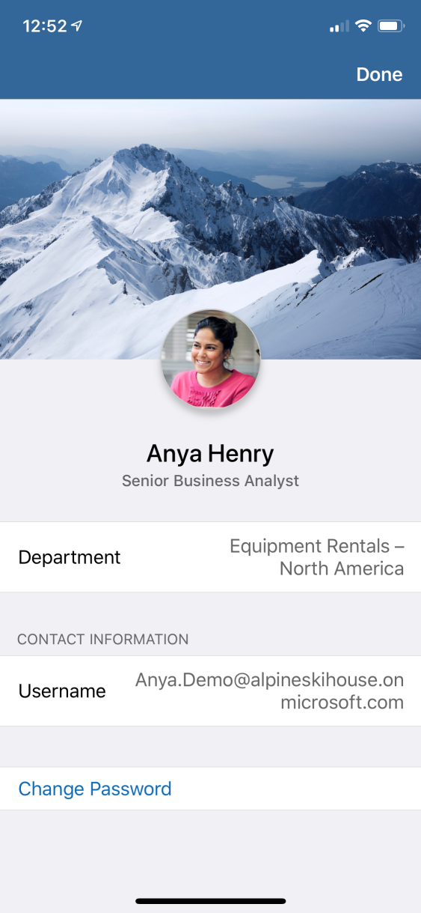

---
# required metadata

title: How to configure the Company Portal app
titleSuffix: Microsoft Intune
description: Learn how you can apply company specific branding to the Intune Company Portal app.
keywords:
author: Erikre
ms.author: erikre
manager: dougeby
ms.date: 07/18/2019
ms.topic: conceptual
ms.service: microsoft-intune
ms.localizationpriority: high
ms.technology:
ms.assetid: dec6f258-ee1b-4824-bf66-29053051a1ae

# optional metadata

#ROBOTS:
#audience:
#ms.devlang:
ms.reviewer: mghadial
ms.suite: ems
search.appverid: MET150
#ms.tgt_pltfrm:
ms.custom: intune-azure
ms.collection: M365-identity-device-management
---

# How to configure the Microsoft Intune Company Portal app

[!INCLUDE [azure_portal](./includes/azure_portal.md)]

The Microsoft Intune company portal is where users access company data and can do common tasks like enrolling devices, installing apps, and locating information for assistance from your IT department. Additionally, the company portal app allows user to securely access company resources. The company portal app provides several different pages, such as Home, Apps, App details, Devices, and Device details. 

> [!IMPORTANT]
> To support Google’s Firebase Cloud Messaging (FCM), you must update your Android Company Portal app to the latest version. For more information, see What's New - [Update your Android Company Portal app to the latest version](whats-new.md#update-your-android-company-portal-app-to-the-latest-version-).

> [!Tip]
> When you customize the Company Portal, the configurations apply to both the Company Portal website and Company Portal apps. Note that users must have an Intune license assigned to access the Company Portal website.

By customizing the Company Portal, you will help provide a familiar and helpful experience for your end users. To do this, in the Intune portal, select **Client apps** > **Branding and customization**, and then configure the required settings.

When a user is installing an iOS application from the Company Portal they will receive a prompt. This occurs when the iOS app is linked to the app store, linked to a volume-purchase program (VPP), or linked to a line-of-business (LOB) app. The prompt allows the users to accept the action or allow management of the app. The prompt will display your company name, or when your company name is unavailable, **Company Portal** will be displayed. 

> [!Note]
> If you are using Azure Government, app logs are offered to the end user to decide how they will share when they initiate the process to get help with an issue. However, if you are not using Azure Government, the Company Portal for Windows 10 will send app logs directly to Microsoft when the user initiates the process to get help with an issue. Sending the app logs to Microsoft will make it easier to troubleshoot and resolve issues. 

## Company information and privacy statement
The company name is displayed as the Company Portal title. The privacy statement is displayed when a user clicks on the privacy link.

Fields marked with an asterisk (*) are mandatory.

| Field name | Max length | More information |
|---|---|---|
|**Company name**| 40 | This name is displayed as the title of the Company Portal and appears as text throughout the Intune user experience. |
| **Privacy statement URL** |     79     | You can specify your own company privacy statement that appears when users click the privacy links from the Company Portal. You must enter a valid URL in the format `<https://www.contoso.com>`. |

## Support information
Enter your company's support information to provide your employee with a contact for Intune-related questions.

|Field name|Max length|More information|
|---|---|---|
|**Contact name** | 40 | This name is displayed on the **Contact IT** page. |
|**Phone number** | 20 | This contact number is displayed on the **Contact IT** page to enable employees to contact you for support. |
|**Email address**| 40 | This contact address is displayed on the **Contact IT** page. You must enter a valid email address in the format `alias@domainname.com`. |
|**Website name**| 40 | This name is the friendly name that is displayed for the URL to the support website. If you specify a support website URL and no friendly name, then Go to IT website is displayed on the **Contact IT** page in the Company Portal. |
|**Website URL**| 150 | If you have a support website that you want your users to use, specify the URL here. The URL must be in the format `https://www.contoso.com`. If you don't specify a URL, nothing is displayed for the support website on the **Contact IT** page in the Company Portal. |
| **Additional information**| 120 | Displayed on the **Contact IT** page. |

## Company identity branding customization
You can customize your Company Portal with your company logo, company name, theme color and background.

### Theme color and logo in the Company Portal
Apply a theme color to the Company Portal. Select a standard color or enter a six-digit hex code for a custom color.

|Field name|More information|
|---|---|
|**Select a standard color or enter a six-digit hex code**| Choose **Standard** to visually select a color. Choose **Custom** to select a specific color based on a hex code value.|
|**Choose theme color**| Select a theme color to apply to the Company Portal. You can choose from a standard color, or enter a specific hex code. |
|**Display**| Select whether to display the **Company logo and name**, the **Company logo only**, or the **Company name only**. |
|**Upload your company logo**|You can upload your company logo to show in your Company Portal. Note the text color is automatically chosen to provide the highest level of contrast. For the best appearance, upload a logo with a transparent background.
<ul><li>Max image size: 400px x 400px</li><li>Maximum file size: 750KB</li><li>File type: PNG, JPG, or JPEG</li></ul>|

After you upload the logo, the preview area will show the logo with the theme color. If you chose to display your company name, it will be shown in black or white in the Company Portal, and it will be chosen automatically to provide the highest level of contrast based on your theme color. The preview area on the screen will not show your company’s name. 

### Logo to use on white or light backgrounds
Choose a logo that will look best on white or light backgrounds.

|Field name|More information|
|---|---|
|**Upload your logo**| This option is available if you have chosen to show the company logo. For the best appearance, upload a logo with a transparent background.
<ul><li>Max image size: 400px x 400px</li><li>Maximum file size: 750KB</li><li>File type: PNG, JPG, or JPEG</li></ul>|

### Brand image for Company Portal

Display a brand image that reflects your company brand. After you save your changes, you can choose **Preview your settings** in the Intune Web Portal at the top of the blade to see how your configurations will look. Note that you will only be able to preview brand image on an iOS device and not the Intune Web Portal. 

|Field name|More information|
|---|---|
|**Upload your brand image**| This option allows you to display a brand image. On the iOS Company Portal, it shows as a background image on the user's profile page.
<ul><li>Recommended image width: Greater than 1125px (required to be at least 650 px)</li><li>Max image size: 1.3 MB</li><li>File type: PNG, JPG, or JPEG</li></ul>|

The right brand image can enhance the user’s trust in Company Portal by presenting a strong sense of your company’s brand. Here are some tips you may want to consider for acquiring, choosing, and optimizing the image for Company Portal. 

- Reach out to your marketing or art department. They may already have an approved set of brand images. They may also be able to help you optimize images as needed. 

- Consider both landscape and portrait composition. The image should have sufficient background surrounding the focal point. The image may be cropped differently based on device size, orientation, and platform. 

- Avoid using a generic, stock image. The image should reflect your company’s brand and feel familiar to users. If you don’t have one, it’s better to not use one than use a generic one that has no meaning to your user. 

- Remove unnecessary metadata. Image file can come with metadata such as camera profile, geo location, title, caption, and so on. Use an image optimization tool to strip out this information to maintain quality while meeting file size limit. 

After a brand image is added or changed in Intune, the end user may not see the change on iOS devices until the Company Portal has recognized the change on start up, and then has been restarted to display the brand image. 

### Brand image examples

The following image shows an example iPad branding image:

The following image shows an example iPhone branding image:

## Windows Company Portal keyboard shortcuts

End users can trigger navigation, app, and device actions in the Windows Company Portal using keyboard shortcuts (accelerators).

The following keyboard shortcuts are available in the Windows Company Portal app.

| Area | Description | Keyboard shortcut |
|:------------------:|:--------------:|:-----------------:|
| Navigation menu | Navigation | Alt+M |
|  | Home | Alt+H |
|  | All apps | Alt+A |
|  | Installed apps | Alt+I |
|  | Send feedback | Alt+F |
|  | My profile | Alt+U |
|  | Settings | Alt+T |
| Home - Device tile | Rename | F2 |
|  | Remove | Ctrl+D or Delete |
|  | Check access | Ctrl+M or F9 |
| Device details | Rename | F2 |
|  | Remove | Ctrl+D or Delete |
|  | Check access | Ctrl+M or F9 |
| App details | Install | Ctrl+I |
| Devices | Available | Ctrl+D |

End users will also be able to see the available shortcuts in the Windows Company Portal app.

## Next steps

- [Manually add the Windows 10 Company Portal app by using Microsoft Intune](store-apps-company-portal-app.md)
