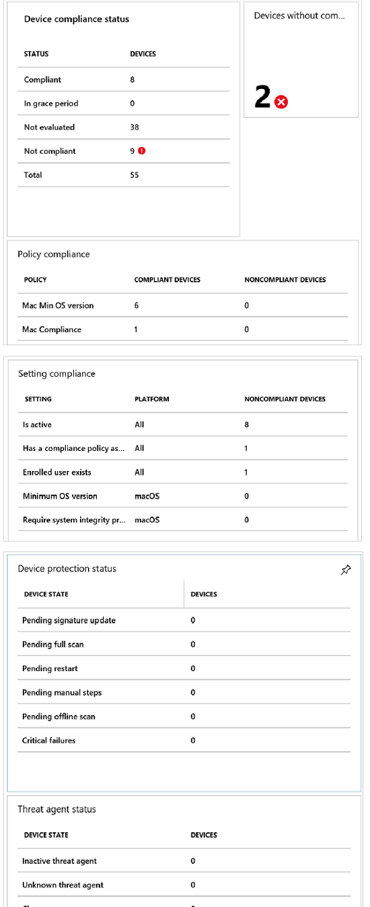
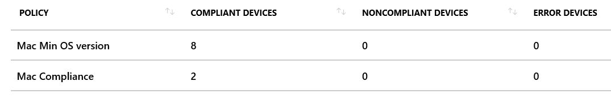
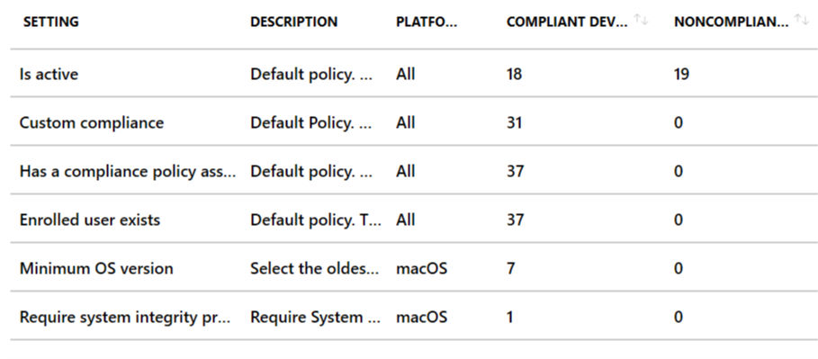

---
# required metadata

title: Monitor device compliance policies in Microsoft Intune - Azure | Microsoft Docs
description: Use the device compliance dashboard to monitor overall device compliance, view reports, and view per-policy and per-setting device compliance.
keywords:
author: MandiOhlinger
ms.author: mandia
manager: dougeby
ms.date: 08/20/2019
ms.topic: conceptual
ms.service: microsoft-intune
ms.localizationpriority: high
ms.technology:

# optional metadata

#ROBOTS:
#audience:
#ms.devlang:
ms.suite: ems
search.appverid: MET150
#ms.tgt_pltfrm:
ms.custom: intune-azure
ms.collection: M365-identity-device-management
---
# Monitor Intune Device compliance policies

Compliance reports help you review device compliance, and troubleshoot compliance-related issues in your organization. Using these reports, you can view information on:

- The overall compliance states of devices
- The compliance status for an individual setting
- The compliance status for an individual policy
- Drill down into individual devices to view specific settings and policies that affect the device

## Open the compliance dashboard

Open the **Intune Device compliance dashboard**:

1. Sign in to [Intune](https://go.microsoft.com/fwlink/?linkid=2090973).

2. Select **Device compliance** > **Overview**. The **Device compliance dashboard** opens.

> [!IMPORTANT]
> Devices must be enrolled into Intune to receive device compliance policies.

## Dashboard overview

When the dashboard opens, you get an overview with all the compliance reports. In these reports, you can see and check for:

- Overall device compliance
- Per-policy device compliance
- Per-setting device compliance
- Device protection status
- Threat agent status

As you dig in to this reporting, you can also see any specific compliance policies and settings that apply to a specific device, including the compliance state for each setting.

### Device compliance status report

The chart shows the compliance states for all Intune enrolled devices. The device compliance states are kept in two different databases: Intune and Azure Active Directory. 

> [!IMPORTANT]
> Intune follows the device check-in schedule for all compliance evaluations on the device. [Learn more about the device check-in schedule](device-profile-troubleshoot.md#how-long-does-it-take-for-devices-to-get-a-policy-profile-or-app-after-they-are-assigned).

Descriptions of the different device compliance policy states:

- **Compliant**: The device successfully applied one or more device compliance policy settings.

- **In-grace period:** The device is targeted with one or more device compliance policy settings. But, the user hasn’t applied the policies yet. This means the device is not-compliant, but it’s in the grace-period defined by the admin.

  - Learn more about [Actions for noncompliant devices](actions-for-noncompliance.md).

- **Not evaluated**: An initial state for newly enrolled devices. Other possible reasons for this state include:

  - Devices that aren't assigned a compliance policy and don't have a trigger to check for compliance
  - Devices that haven't checked in since the compliance policy was last updated
  - Devices not associated to a specific user, such as:
    - iOS devices purchased through Apple's Device Enrollment Program (DEP) that don't have user affinity
    - Android kiosk or Android Enterprise dedicated devices
  - Devices enrolled with a device enrollment manager (DEM) account

- **Not-compliant:** The device failed to apply one or more device compliance policy settings. Or, the user hasn’t complied with the policies.

- **Device not synced:** The device failed to report its device compliance policy status because one of the following reasons:

  - **Unknown**: The device is offline or failed to communicate with Intune or Azure AD for other reasons.

  - **Error**: The device failed to communicate with Intune and Azure AD, and received an error message with the reason.

> [!IMPORTANT]
> Devices that are enrolled into Intune, but not targeted by any device compliance policies are included in this report under the **Compliant** bucket.

#### Drill down for more details

In the **Device compliance status** chart, select a status. For example, select the **Not compliant** status:

It shows you more details on the devices in that state, including operating system platform, last check-in date, and more. 

If you want to see all the devices owned by a specific user, you can also filter the chart report by typing the user’s e-mail.

#### Filter and columns

When you select the **Filter** button, the filter fly-out opens with more options, including the compliance state, jailbroken devices, and more. **Apply** the filter to update the results.

Use the **Columns** property to add or remove columns from the chart output. For example, **User principal name** may show the email address registered on the device. **Apply** the columns to update the results.

#### Device details

In the chart, select a specific device, and then select **Device compliance**:

It provides more details on the device compliance policy settings applied on that device. When you select the specific policy, it shows all the settings in the policy.

### Devices without compliance policy
In **Device compliance** > **Overview**, the report also identifies devices that don't have any compliance policies assigned:

When you select the tile, it shows all devices without a compliance policy. It also shows the user of the device, the policy deployment status, and the device model.

#### What you need to know

- With the **Mark devices with no compliance policy assigned as** security setting, it's important to identify devices without a compliance policy. Then you can assign at least one compliance policy to them.

  The security setting is configurable in the Intune portal. Select **Device compliance** > **Compliance policy settings**. Then, set **Mark devices with no compliance policy assigned as** to **Compliant** or **Not compliant**. 

  Read more about this [security enhancement in the Intune service](https://blogs.technet.microsoft.com/intunesupport/2018/02/09/updated-upcoming-security-enhancements-in-the-intune-service/).

- Users who are assigned a compliance policy of any type aren't shown in the report, regardless of device platform. For example, if you've assigned a Windows compliance policy to a user with an Android device, the device doesn't show up in the report. However, Intune considers that Android device not compliant. To avoid issues, we recommend that you create policies for each device platform and deploy them to all users.

### Per-policy device compliance report

The **Device compliance** > **Policy compliance** report shows you the policies, and how many devices are compliant and noncompliant. 

When you select a specific policy, you can see the **compliance status**, **user’s email alias**, **device model**, and **location** for each device targeted by that compliance policy.

## Setting compliance report

The **Device compliance** > **Setting compliance** report shows you, per compliance setting, the total number of devices in each compliance state. It shows all device compliance policy settings from all compliance policies, the platforms the policy settings are applied, and the number of noncompliant devices.

When you select a specific setting, you can see the **compliance status**, **user’s email alias**, **device model**, and **location** for each device targeted by that setting.

> [!NOTE]
> A policy can be assigned to a device, and a user on that same device. In some scenarios, a device may sync before the user signs in, such as when the device reboots. Compliance may evaluate this user, and show the device as non compliant. This behavior may also show the System Account as a non-compliant user.
>
> This is a known issue with multi-user Windows 10 devices. Any changes or updates on this behavior are announced in [in development](in-development.md) and/or [what's new](whats-new.md).

## View status of device policies

You can check the different states of your policies, by platform. For example, you have a macOS compliance policy. You want to see the devices that are impacted by this policy, and know if there are conflicts or failures.

This feature is included in the device status reporting:

1. Select **Device compliance** > **Policies**. A list of policies is shown, including the platform, if the policy is assigned, and more details.
2. Select a policy > **Overview**. In this view, the policy assignment includes the following statuses:

    - Succeeded: Policy is applied
    - Error: The policy failed to apply. The message typically displays with an error code that links to an explanation. 
    - Conflict: Two settings are applied to the same device, and Intune can't sort out the conflict. An administrator should review.
    - Pending: The device hasn’t checked in with Intune to receive the policy yet. 
    - Not applicable: The device can't receive the policy. For example, the policy updates a setting specific to iOS 11.1, but the device is using iOS 10. 

3. To see details on the devices using this policy, select one of the statuses. For example, select **Succeeded**. In the next window, specific device details, including the device name and deployment status are listed.

## How Intune resolves policy conflicts
Policy conflicts can occur when multiple Intune policies are applied to a device. If the policy settings overlap, Intune resolves any conflicts by using the following rules:

- If the conflicting settings are from an Intune configuration policy and a compliance policy, the settings in the compliance policy take precedence over the settings in the configuration policy. This happens even if the settings in the configuration policy are more secure.

- If you have deployed multiple compliance policies, Intune uses the most secure of these policies.
