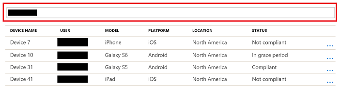

---
# required metadata

title: Monitor device compliance policies in Microsoft Intune - Azure | Microsoft Docs
description: Use the device compliance dashboard to monitor overall device compliance, view reports, and view per-policy and per-setting device compliance.
keywords:
author: MandiOhlinger
ms.author: mandia
manager: dougeby
ms.date: 8/28/2018
ms.topic: article
ms.prod:
ms.service: microsoft-intune
ms.technology:

# optional metadata

#ROBOTS:
#audience:
#ms.devlang:
ms.suite: ems
#ms.tgt_pltfrm:
ms.custom: intune-azure

---
# Monitor Intune Device compliance policies

Compliance reports help admins to analyze the compliance posture of devices in their organization, and quickly troubleshoot compliance-related issues encountered by users inside their organization. You can view information about the overall compliance state of devices, compliance state for an individual setting, compliance state for an individual policy and drill down into individual devices to view specific settings and policies that affect the device.

## Before you begin

Follow these steps to find the **Intune Device compliance dashboard** in the Azure portal:

1. In the [Azure portal](https://portal.azure.com), select **All services**, filter on **Intune**, and select **Microsoft Intune**.

2. Select **Device compliance** > **Overview**. The **Device compliance dashboard** opens.

> [!IMPORTANT]
> Devices must be enrolled into Intune to receive device compliance policies.

## Device compliance dashboard

In the **Device compliance dashboard**, you can monitor the compliance of different devices, their protection status, and more. You can view the following reports:

- Overall device compliance aggregate
- Per-policy device compliance
- Per-setting device compliance
- Device protection status
- Threat agent status

You can also view the specific compliance policies and settings that apply to an individual device, and the final compliance state for each of those settings on the device.

### Overall device compliance aggregate report

The chart shows the aggregate compliance state for all Intune enrolled devices. The device compliance states are kept in two different databases, Intune and Azure Active Directory. Here’s more details about the device compliance policy states:

- **Compliant**: The device successfully applied one or more device compliance policy settings targeted by the admin.

- **In-grace period:** The device was targeted by the admin with one or more device compliance policy settings, but the user hasn’t applied the policies yet, which means the device is not-compliant, but it’s in the grace-period defined by the admin.

  - Learn more about Actions for noncompliant devices.

- **Not evaluated**: NEED A DESCRIPTION

- **Not-compliant:** The device failed to apply one or more device compliance policy settings targeted by the admin or the user hasn’t complied with the policies targeted by the admin.

- **Device not synced:** The device failed to report its device compliance policy status because one of the following reasons:

  - **Unknown**: The device is offline or failed to communicate with Intune or Azure AD for other reasons.

  - **Error**: The device failed to communicate with Intune and Azure AD, and received an error message with the reason.

> [!IMPORTANT]
> Devices that are enrolled into Intune, but not targeted by any device compliance policies are included in this report under the **Compliant** bucket.

#### Drill-down option

In the **Device compliance status** chart, select a status. For example, select the **Not compliant** status:

It drills down, and shows you more details on the devices in that state, including operating system platform, last check-in date, and more. 

  > [!TIP]
  > Use the **Columns** property to add or remove columns. 

If you want to see all the devices owned by a specific user, you can filter the chart report by typing the user’s e-mail:

#### Filter

When you select the **Filter button**, the filter fly-out opens with more options, including the compliance state, jailbroken devices, and more. 

When you **Apply** the filter, the fly out closes, and the results update using the filter criteria you chose.

##### Device details

Selecting a device opens **Devices** with the device selected. It provides more details on the device compliance policy setting applied for that device.

When you select on the device policy setting itself, you can see the device compliance policy name originated that device compliance setting targeted by the admin.

### Devices without compliance policy
In **Device compliance** > **Overview**, the report also identifies devices that don't have any compliance policies assigned to them:

When you select the tile, it shows all devices without a compliance policy, the user of the device, the policy deployment status, and the device model.

With the introduction of the security setting that marks all devices without compliance policies as "not compliant," it's important to be able to identify these devices. Then you can assign at least one compliance policy to them.

#### What you need to know

- The security setting is configurable in the Intune portal. Select **Device compliance**, and under **Setup**, choose **Compliance policy settings**. Then use the toggle to set **Mark devices with no compliance policy assigned as** to either **Compliant** or **Not compliant**. Read more about this [security enhancement in the Intune service](https://blogs.technet.microsoft.com/intunesupport/2018/02/09/updated-upcoming-security-enhancements-in-the-intune-service/).

- Users who are assigned a compliance policy of any type aren't shown in the report, regardless of device platform. For example, if you have unintentionally assigned a Windows compliance policy to a user with an Android device, the device doesn't show up in the report. However, Intune considers that Android device not compliant. To avoid issues, we recommend that you create policies for each device platform and deploy them to all users.

### Per-policy device compliance report

This report provides you per compliance policy view and the total number of devices in each compliance state. The **Policy compliance** title is available from the **Device compliance dashboard**, and it shows all policies previously created by the admin, the platforms the policy is applied, number of compliant devices and number of noncompliant devices.

When you click on the Policy compliance tile, then click on one of the device compliance policies, you can see the **compliance status**, **user’s email alias**, **device model**, and **location** for each device that was targeted by that device compliance policy.

## Setting compliance report

This report allows you to view, per compliance setting, the total number of devices in each compliance state. The **Settings compliance** title is available from the **Device compliance dashboard**, and it shows all device compliance policy settings from all device compliance policies created by the admin, the platforms to which the policy settings were applied, and the number of noncompliant devices.

When you click on the Setting compliance tile, then click on one of the device compliance policy settings, you can see the **compliance status**, **user’s email alias**, **device model**, and **location** for each device that was targeted by that device compliance policy setting.

## View status of device policies

You can check the different states of your policies, by platform. For example, you have a macOS compliance policy. You want to see the devices that are impacted by this policy, and know if there are conflicts or failures.

This feature is included in the device status reporting:

1. Select **Device compliance** > **Policies**. A list of policies is shown, including the platform, if the policy is assigned, and more details.
2. Select a policy > **Overview**. In this view, the policy assignment includes the following statuses:

  - Succeeded: Policy is applied
  - Error: The policy failed to apply. This typically displays with an error code that links to an explanation. 
  - Conflict: Two settings are applied to the same device, and Intune can't sort out the conflict. An administrator should review.
  - Pending: The device hasn’t checked in with Intune to receive the policy yet. 
  - Not applicable: The device can't receive the policy. For example, the policy updates a setting specific to iOS 11.1, but the device is using iOS 10. 

3. To see details on the devices using this policy, select one of the statuses. For example, select **Succeeded**. In the next window, specific device details, including the device name and deployment status are listed.

## How Intune resolves policy conflicts
Policy conflicts can occur when multiple Intune policies are applied to a device. If the policy settings overlap, Intune resolves any conflicts by using the following rules:

- If the conflicting settings are from an Intune configuration policy and a compliance policy, the settings in the compliance policy take precedence over the settings in the configuration policy. This happens even if the settings in the configuration policy are more secure.

- If you have deployed multiple compliance policies, Intune uses the most secure of these policies.
