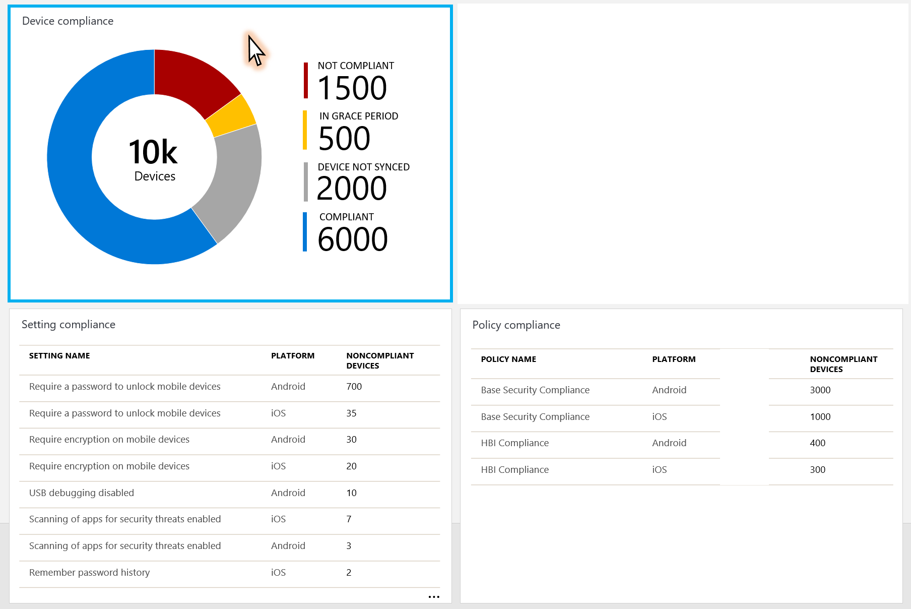
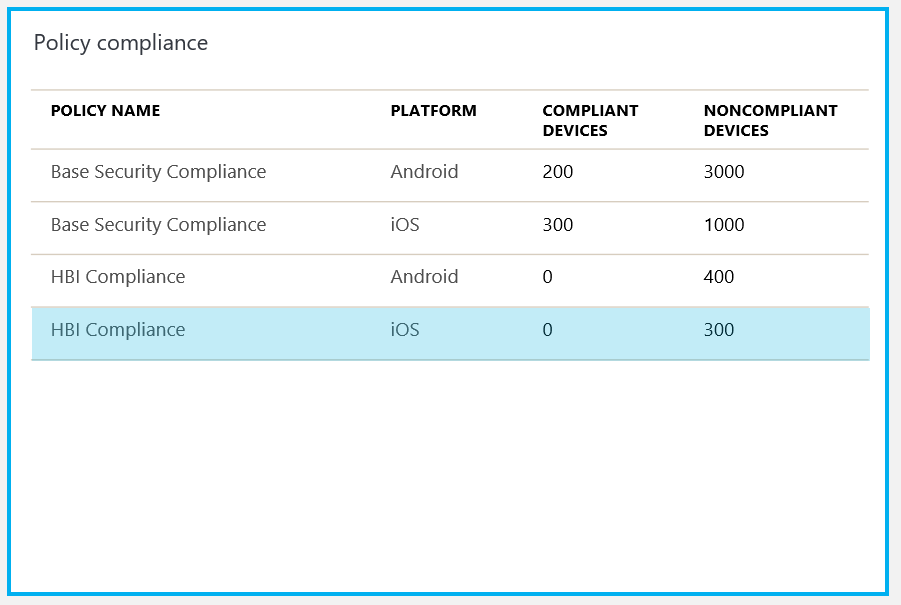
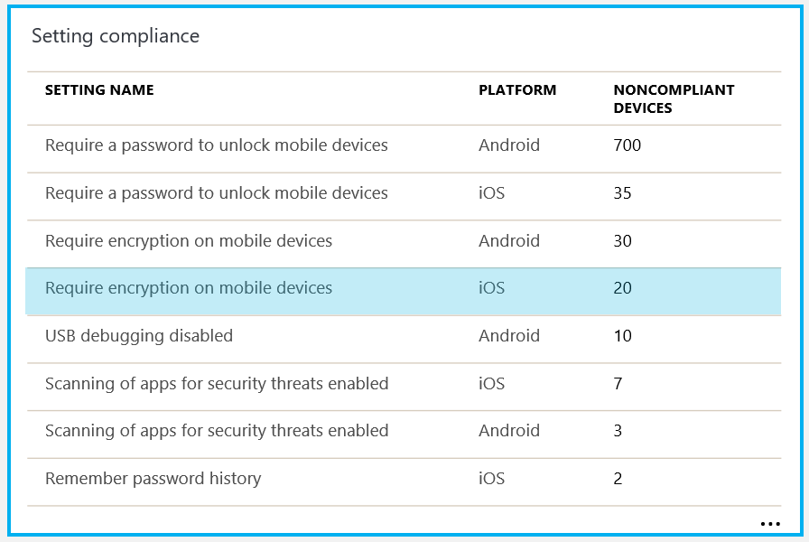

---
# required metadata

title: Monitor Intune device compliance policies
titlesuffix: "Azure portal"
description: Learn how to monitor device compliance policies
keywords:
author: andredm7
ms.author: andredm
manager: dougeby
ms.date: 2/22/2018
ms.topic: article
ms.prod:
ms.service: microsoft-intune
ms.technology:

# optional metadata

#ROBOTS:
#audience:
#ms.devlang:
ms.suite: ems
#ms.tgt_pltfrm:
ms.custom: intune-azure

---
# Monitor Intune Device compliance policies

Compliance reports help admins to analyze the compliance posture of devices in their organization, and quickly troubleshoot compliance-related issues encountered by users inside their organization. You can view information about the overall compliance state of devices, compliance state for an individual setting, compliance state for an individual policy and drill down into individual devices to view specific settings and policies that affect the device.

## Before you begin

Use the following steps to find the **Intune Device compliance dashboard** in the Azure portal:

1.  Go to the [Azure portal](https://portal.azure.com), and sign in with your Intune credentials.

2.  Choose **More services** from the left menu, then type **Intune** in the text box filter.

3.  Choose **Intune** &gt; **Device compliance** &gt; **Overview**, then the **Device compliance dashboard** opens.

> [!IMPORTANT] 
> Devices must be enrolled into Intune to receive device compliance policies.

## Device compliance dashboard

In the **Device compliance dashboard**, you can monitor the Device compliance policy states, which provide different reports within different tiles that give you the compliance posture of devices in your organization. You can view the following reports:

-   Overall device compliance aggregate

-   Per-policy device compliance

-   Per-setting device compliance

You can also view the specific compliance policies and settings that apply to an individual device, and the final compliance state for each of those settings on the device.

### Overall device compliance aggregate report

It’s a donut chart showing the aggregate compliance state for all Intune enrolled devices. The device compliance states are kept in two different databases, Intune and Azure Active Directory. Here’s more details about the device compliance policy states:

-   **Compliant**: The device successfully applied one or more device compliance policy settings targeted by the admin.

-   **Not-compliant:** The device failed to apply one or more device compliance policy settings targeted by the admin or the user hasn’t complied with the policies targeted by the admin.

-   **In-grace period:** The device was targeted by the admin with one or more device compliance policy settings, but the user hasn’t applied the policies yet, which means the device is not-compliant, but it’s in the grace-period defined by the admin.

    -   Learn more about Actions for noncompliant devices.

-   **Device not synced:** The device failed to report its device compliance policy status because one of the reasons:

    -   **Unknown**: The device is offline or failed to communicate with Intune or Azure AD for other reasons.

    -   **Error**: The device failed to communicate with Intune and Azure AD, and received an error message with the reason.

> [!IMPORTANT] 
> Devices that are enrolled into Intune, but not targeted by any device compliance policies is included in this report under the **Compliant** bucket.

#### Drill-down option

From the **Device compliance dashboard**, If you click on the Device compliance tile, you can drill down into a specific **compliance status**, **user’s email alias**, **device model**, and **location** for each device that was targeted by the device compliance policies.

If you need more details about a specific user, you can filter the Device compliance chart report by typing the user’s e-mail alias.

You can also click the different compliance status on the Device compliance chart to see more details about the user’s devices compliance policy statuses.

#### Filter

If you click on **Filter button**, the filter fly-out opens with the following options:

-   Model

    -   Textbox accepting free search string
  
-   Platform

    -   Android

    -   iOS

    -   Mac OS

    -   Windows

    -   Windows Phone

-   Status

    -   Compliant

    -   Not Compliant

    -   In Grace period

    -   Unknown

    -   Error

If clicking the **Update button**, the fly out should close and the results should update as per the selected filter criteria.

##### Device details

Clicking on a device, opens the **Devices Blade** with the device selected. This provides more details on the device compliance policy setting applied for that device.

When you click on the device policy setting itself, you can see the device compliance policy name originated that device compliance setting targeted by the admin.

## Policy compliance report

This report provides you per compliance policy view and the total number of devices in each compliance state. The **Policy compliance** title is available from the **Device compliance dashboard**, and it shows all policies previously created by the admin, the platforms the policy is applied, number of compliant devices and number of noncompliant devices.

When you click on the Policy compliance tile, then click on one of the device compliance policies, you can see the **compliance status**, **user’s email alias**, **device model**, and **location** for each device that was targeted by that device compliance policy.

## Setting compliance report

This report allows you to view, per compliance setting, the total number of devices in each compliance state. The **Settings compliance** title is available from the **Device compliance dashboard**, and it shows all device compliance policy settings from all device compliance policies created by the admin, the platforms that the policy settings are applied, and the number of noncompliant devices.

When you click on the Setting compliance tile, then click on one of the device compliance policy settings, you can see the **compliance status**, **user’s email alias**, **device model**, and **location** for each device that was targeted by that device compliance policy setting.

## Threat agent status report

This report allows you to view the status and health of the Windows Defender agent. Using a status roll-up report in  **Device Compliance**, you can see devices that need any of the following actions:
- signature update
- restart
- manual intervention
- full scan
- other agent states requiring intervention

A drill-in report for each status category lists the individual PCs that need attention, and the PCs that report as **Clean**.