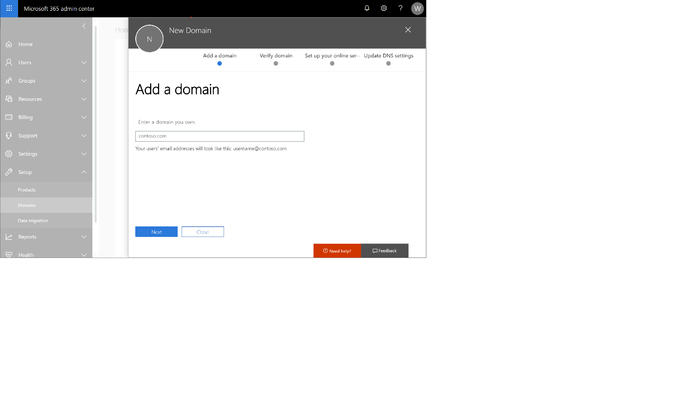

---
# required metadata

title: Configure a custom domain name
description: Add a custom domain name for your Intune subscription
keywords:
author: nathbarn
ms.author: nathbarn
manager: angrobe
ms.date: 07/07/2017
ms.topic: get-started-article
ms.prod:
ms.service: microsoft-intune
ms.technology:
ms.assetid: 2382f36f-13d8-4a32-81ad-6cfa604889c3

# optional metadata

#ROBOTS:
#audience:
#ms.devlang:
ms.reviewer: angerobe
ms.suite: ems
#ms.tgt_pltfrm:
ms.custom: intune-classic

---

# Configure a custom domain name

[!INCLUDE[both-portals](./includes/note-for-both-portals.md)]

This topic tells administrators how they can create a DNS CNAME to simplify and customize their logon experience.

When your organization signs up for a Microsoft cloud-based service like Intune, you're given an initial domain name hosted in Azure Active Directory (AD) that looks like the following: **yourdomain.onmicrosoft.com**. In this example, **yourdomain** is the domain name that you chose when you signed up, and **onmicrosoft.com** is the suffix assigned to the accounts you add to your subscription. When your organization owns a custom domain, you can configure your instance of Intune to use that domain instead of the domain name provided with your subscription.

Before you create user accounts or synchronize your on-premises Active Directory, we strongly recommend that you decide whether to use only the .onmicrosoft.com domain or to add one or more of your custom domain names. Configuring a custom domain before adding users can help simplify the management of user identities for your subscription by enabling users to sign in with the credentials they use to access other domain resources.

When you subscribe to a cloud-based service from Microsoft, your instance of that service becomes a Microsoft  [Azure AD tenant](http://technet.microsoft.com/library/jj573650.aspx#BKMK_WhatIsAnAzureADTenant), which provides identity and directory services for your cloud-based service. And, because the tasks to configure Intune to use your organizations custom domain name are the same as for other Azure AD tenants, you can use the information and procedures found in [Add your domain](https://azure.microsoft.com/documentation/articles/active-directory-add-domain/).

> [!TIP]
> For more information about using your custom domain with a cloud-based service from Microsoft, see [Conceptual overview of custom domain names in Azure Active Directory](https://azure.microsoft.com/documentation/articles/active-directory-add-domain-concepts/).

You cannot rename or remove that initial domain name. However, you can add, verify or remove your own custom domain names to use with Intune, which is helpful if you want to keep your business identity.

## To add and verify your custom domain

1. Go to [Office 365 management portal](https://portal.office.com/Admin/Default.aspx) and sign into your administrator account.

2. In the navigation pane, choose **Settings** &gt; **Domains**.

3. Choose **Add domain**, and type your custom domain name.
   
4. The **Verify domain** dialog box opens giving you the values to create the TXT record in your DNS hosting provider.
	- **GoDaddy users**: Office 365 Management portal redirects you to GoDaddy's login page. After you enter your credentials and accept the domain change permission agreement, the TXT record is created automatically. You can alternatively [create the TXT record](https://support.office.com/article/Create-DNS-records-at-GoDaddy-for-Office-365-f40a9185-b6d5-4a80-bb31-aa3bb0cab48a).
	- **Register.com users**: Follow the [step-by-step instructions](https://support.office.com/article/Create-DNS-records-at-Register-com-for-Office-365-55bd8c38-3316-48ae-a368-4959b2c1684e#BKMK_verify) to create the TXT record.

The steps to add and verify a custom domain can also be [performed in Azure Active Directory](https://azure.microsoft.com/documentation/articles/active-directory-add-domain/).

You can learn more [about your initial onmicrosoft.com domain in Office 365](https://support.office.com/article/About-your-initial-onmicrosoft-com-domain-in-Office-365-B9FC3018-8844-43F3-8DB1-1B3A8E9CFD5A)
