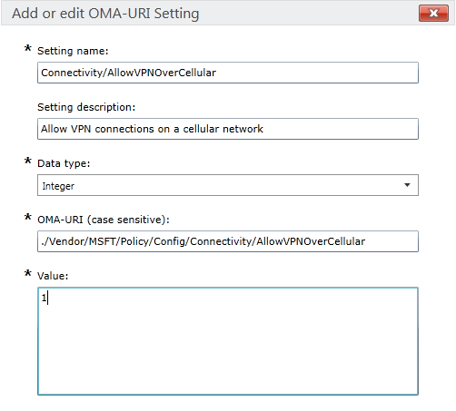

---
# required metadata

title: Intune custom settings for Windows 10 devices
titlesuffix: "Azure portal"
description: Learn about the settings you can use in a Windows 10 custom profile."
keywords:
author: vhorne
ms.author: victorh
manager: dougeby
ms.date: 02/23/2018
ms.topic: article
ms.prod:
ms.service: microsoft-intune
ms.technology:
ms.assetid: 7bcea136-7260-4042-b21b-c7dab86b380d

# optional metadata

#ROBOTS:
#audience:
#ms.devlang:
ms.reviewer: heenamac
ms.suite: ems
#ms.tgt_pltfrm:
ms.custom: intune-azure

---

# Custom device settings for Windows 10 devices in Microsoft Intune

[!INCLUDE[azure_portal](./includes/azure_portal.md)]

 Use the Microsoft Intune **custom** profile for Windows 10 and Windows 10 Mobile to deploy OMA-URI (Open Mobile Alliance Uniform Resource Identifier) settings that can be used to control features on devices. Windows 10 makes many CSP settings available, for example, the [Policy Configuration Service Provider (Policy CSP)](https://technet.microsoft.com/itpro/windows/manage/how-it-pros-can-use-configuration-service-providers).
If you are looking for a particular setting, remember that the [Windows 10 device restriction profile](device-restrictions-windows-10.md) contains many settings that are built-in to Intune and do not require you to specify custom values.

1. Use the instructions in [How to configure custom device settings in Microsoft Intune](custom-settings-configure.md) to get started.
1. On the **Custom OMA-URI Settings** pane, click **Add** to add a new value. You can also click **Export** to create a list of all the values you configured in a comma-separated values (.csv) file.
1. For each OMA-URI setting you want to add, enter the following information. Use the list in this topic to learn about the settings you can use:
	- **Name** - Enter a unique name for the OMA-URI setting to help you identify it in the list of settings.
	- **Description** - Optionally, enter a description for the setting.
	- **OMA-URI (case sensitive)** - Specify the OMA-URI you want to supply a setting for.
	- **Data type** - Choose from:
		- **String**
		- **String (XML)**
		- **Date and time**
		- **Integer**
		- **Floating point**
		- **Boolean**
		- **Base64**
	- **Value** - Specify the value or file to associate with the OMA-URI you entered.
1. When you're done, select **OK**, go back to the **Create profile** pane, and select **Create**.
The profile is created and appears on the profiles list pane.

## Example
In the following screenshot, the setting **Connectivity/AllowVPNOverCellular** has been enabled. This lets a Windows 10 device open a VPN connection when on a cellular network.

> 

## How to find the policies you can configure

You’ll find a complete list of all configuration service providers (CSPs) that Windows 10 supports in the [Configuration service provider reference](https://msdn.microsoft.com/windows/hardware/commercialize/customize/mdm/configuration-service-provider-reference) in the Windows documentation library.

Not all settings are compatible with all Windows 10 versions. The table in the Windows topic tells you which versions are supported for each CSP.

Additionally, Intune does not support all of the settings listed in the topic. To find out if Intune supports the setting you want, open the topic for that setting. Each setting page shows it’s supported operation. To work with Intune, the setting must support the **Add** or **Replace** operations.

