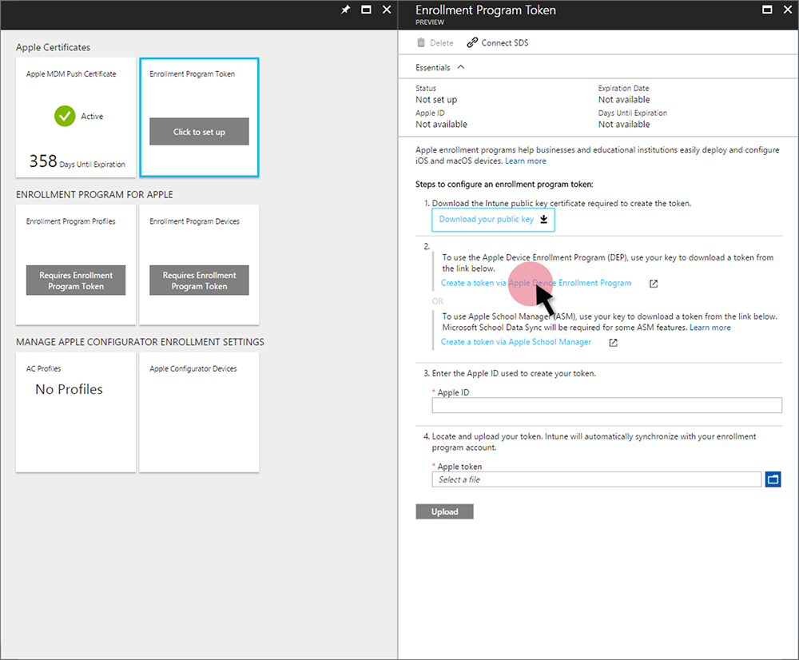
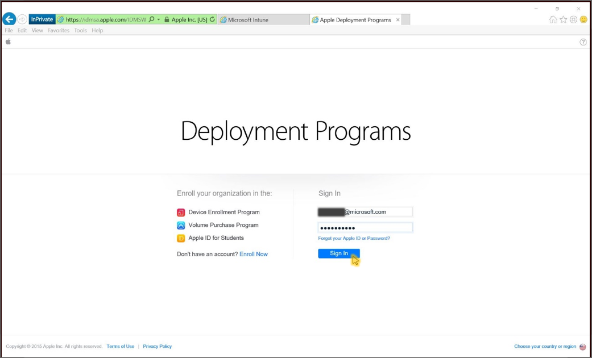
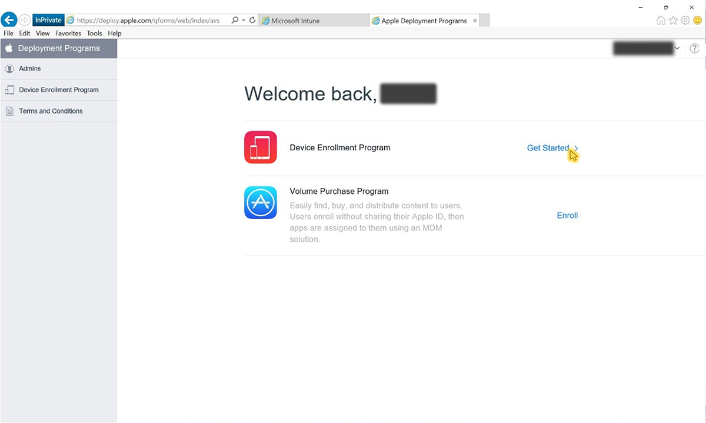
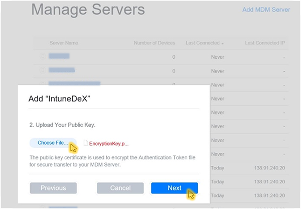
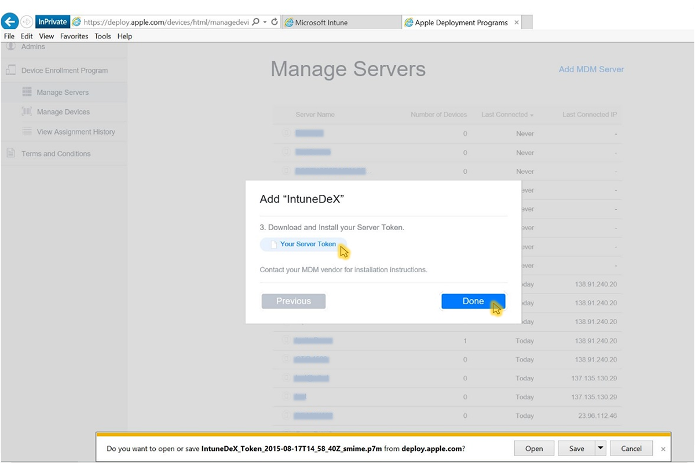

---
# required metadata

title: Enroll iOS devices - Device Enrollment Program
titleSuffix: "Intune on Azure"
description: Learn how to enroll corporate-owned iOS devices using the Device Enrollment Program."
keywords:
author: nathbarn
ms.author: nathbarn
manager: angrobe
ms.date: 06/08/2017
ms.topic: article
ms.prod:
ms.service: microsoft-intune
ms.technology:
ms.assetid: 7981a9c0-168e-4c54-9afd-ac51e895042c

# optional metadata

#ROBOTS:
#audience:
#ms.devlang:
ms.reviewer: dagerrit
ms.suite: ems
#ms.tgt_pltfrm:
ms.custom: intune-azure

---

# Set up iOS device enrollment with Device Enrollment Program

[!INCLUDE[azure_portal](./includes/azure_portal.md)]

This topic helps IT admins enable iOS device enrollment for devices purchased through Apple's [Device Enrollment Program (DEP)](https://deploy.apple.com). Microsoft Intune can deploy an enrollment profile “over the air” to devices purchased through DEP. The administrator never has to touch each managed device. A DEP profile contains management settings that are applied to devices during enrollment including Setup Assistant options.

To enable DEP enrollment, you use both the Intune and Apple DEP portals. You must also import a comma-separated value (.csv) file containing the serial numbers of iOS managed devices.

>[!NOTE]
>DEP enrollment can't be used with the [device enrollment manager](device-enrollment-manager-enroll.md).

**DEP Enrollment steps**
1. [Get an Apple DEP token and assign devices](#get-the-apple-dep-certificate)
2. [Create an enrollment profile](#create-anapple-enrollment-profile)
3. [Synchronize DEP-managed devices](#sync-dep-managed-devices)
4. [Assign DEP profile to devices](#assign-a-dep-profile-to-devices)
5. [Distribute devices to users](#distribute-devices-to-users)

## Get the Apple DEP token

Before you can enroll corporate-owned iOS devices with Apple's Device Enrollment Program (DEP), you need a DEP token (.p7m) file from Apple. This token lets Intune sync information about DEP-participating devices that your corporation owns. It also permits Intune to perform enrollment profile uploads to Apple and to assign devices to those profiles.

> [!NOTE]
> If your Intune tenant was migrated from the Intune classic console to the Azure portal and you deleted an Apple DEP token from the Intune administration console during the migration period, that the DEP token might have been restored to your Intune account. You can delete the DEP token again from the Azure portal.

**Prerequisites**
- [Apple MDM Push certificate](apple-mdm-push-certificate-get.md)
- Signed up for [Apple's Device Enrollment Program](http://deploy.apple.com)

**Step 1. Download an Intune public key certificate required to create an Apple DEP token.** 
1. In the Intune portal, choose **Device enrollment**, and then choose **Apple enrollment**, choose **Enrollment Program Token**.

2. Select **Download your public key** to download and save the encryption key (.pem) file locally. The .pem file is used to request a trust-relationship certificate from the Apple Device Enrollment Program portal.

**Step 2. Create and download an Apple DEP token.** 
Select **Create a token via Apple's Device Enrollment Program** to open Apple's Deployment Program portal, and sign in with your company Apple ID. You can use this Apple ID to renew your DEP token.
  

  
   1.  In Apple's [Deployment Programs portal](https://deploy.apple.com), select **Get Started** for **Device Enrollment Program**.
   
   2. On the **Manage Servers** page, choose **Add MDM Server**.
   2.  Enter the **MDM Server Name**, and then choose **Next**. The server name is for your reference to identify the mobile device management (MDM) server. It is not the name or URL of the Microsoft Intune server.
   
   3.  The **Add &lt;ServerName&gt;** dialog box opens, stating **Upload Your Public Key**. Choose **Choose File…** to upload the .pem file, and then choose **Next**.
   
   4.  The **Add &lt;ServerName&gt;** dialog box shows a **Your Server Token** link. Download the server token (.p7m) file to your computer, and then choose **Done**.
   
   5. Go to  **Deployment Programs** &gt; **Device Enrollment Program** &gt; **Manage Devices**.
   6. Under **Choose Devices By**, specify details by device **Serial Number**.
   
   7. For **Choose Action**, select **Assign to Server**, select the &lt;ServerName&gt; specified for Microsoft Intune, and then choose **OK**. The Apple portal displays **Assignment Complete**.

**Step 3. Enter the Apple ID used to create your Apple DEP token.** In the Intune portal, provide the Apple ID for future reference. Use this ID to renew your Apple DEP token to avoid needing to re-enroll all your devices.

**Step 4. Browse to your Apple DEP token to upload.** 
Go to the certificate (.pem) file, choose **Open**, and then choose **Upload**. With the push certificate, Intune can enroll and manage iOS devices by pushing policy to enrolled mobile devices. Intune will automatically synchronize with your DEP account.

## Create an Apple enrollment profile

A device enrollment profile defines the settings applied to a group of devices during enrollment.

1. In the Intune portal, choose **Device enrollment**, and then choose **Apple Enrollment**.
3. Under **Enrollment Program**, select **Enrollment Program Profiles**.
4. On the **Enrollment Program Profiles** blade, select **Create**.
5. On the **Create Enrollment Profile** blade, enter a name and description for the profile.
6. For **User Affinity** choose whether devices with this profile will enroll with or without user affinity.

 - **Enroll with user affinity** - The device must be affiliated with a user during initial setup and can then be permitted to access company data and email. Choose user affinity for DEP-managed devices that belong to users and that need to use the company portal for services like installing apps. Note that Multifactor authentication (MFA) doesn't work during enrollment on DEP devices with user affinity. After enrollment, MFA works as expected on these devices. New users who are required to change their password when they first sign in cannot be prompted during enrollment on DEP devices. Additionally, users whose passwords have expired won't be prompted to reset their password during DEP enrollment and must reset the password from a different device.

	>[!NOTE]
	>DEP with user affinity requires [WS-Trust 1.3 Username/Mixed endpoint](https://technet.microsoft.com/en-us/library/adfs2-help-endpoints) to be enabled to request user token. [Learn more about WS-Trust 1.3](https://technet.microsoft.com/itpro/powershell/windows/adfs/get-adfsendpoint).

 - **Enroll without user affinity** - The device is not affiliated with a user. Use this affiliation for devices that perform tasks without accessing local user data. Apps requiring user affiliation (including the Company Portal app used for installing line-of-business apps) won’t work.

7. Select **Device Management Settings**, configure the following profile settings, and then select **Save**:

	- **Supervised** - a management mode that enables more management options and disabled Activation Lock by default. If you leave the check box blank, you have limited management capabilities.

	- **Locked enrollment** - (Requires Management Mode = Supervised) Disables iOS settings that could allow removal of the management profile. If you leave the check box blank, it allows the management profile to be removed from the Settings menu. This item is set during activation and cannot be changed without a factory reset.

	- **Allow Pairing** - specifies whether iOS devices can sync with computers. If you choose **Allow Apple Configurator by certificate**, you must choose a certificate under **Apple Configurator Certificates**.

	- **Apple Configurator Certificates** - If you chose **Allow Apple Configurator by certificate** under **Allow Pairing**, select an Apple Configurator Certificate to import.

8. Select **Setup Assistant Settings**, configure the following profile settings, and then select **Save**:

	- **Department Name** - Appears when users tap **About Configuration** during activation.

	- **Department Phone** - Appears when the user clicks the Need Help button during activation.
    - **Setup Assistant Options** - These optional settings can be set up later in the iOS **Settings** menu.
        - **Passcode** - Prompt for passcode during activation. Always require a passcode unless the device will be secured or have access controlled in some other manner (that is, kiosk mode that restricts the device to one app).
        - **Location Services** - If enabled, Setup Assistant prompts for the service during activation
        - **Restore** - If enabled, Setup Assistant prompts for iCloud backup during activation
        - **Apple ID** - If enabled, iOS will prompt users for an Apple ID when Intune attempts to install an app without an ID. An Apple ID is required to download iOS App Store apps, including those installed by Intune.
        - **Terms and Conditions** - If enabled, Setup Assistant prompts users to accept Apple's terms and conditions during activation
        - **Touch ID** - If enabled, Setup Assistant prompts for this service during activation
        - **Apple Pay** - If enabled, Setup Assistant prompts for this service during activation
        - **Zoom** - If enabled, Setup Assistant prompts for this service during activation
        - **Siri** - If enabled, Setup Assistant prompts for this service during activation
        - **Diagnostic Data** - If enabled, Setup Assistant prompts for this service during activation

9. To save the profile settings, select **Create** on the **Create Enrollment Profile** blade.

## Sync DEP managed devices
Now that Intune has been assigned permission to manage your DEP devices, you can synchronize Intune with the DEP service to see your managed devices in the Intune portal.

1. In the Intune portal, choose **Device enrollment**, and then choose **Apple Enrollment**.
2. Under **Manage Enrollment Program Settings**, select **Serial Numbers**.
3. On the **Apple DEP Serial Numbers** blade, select **Sync**.
4. On the **Sync** blade, select **Request Sync**. The progress bar shows the amount of time you must wait before requesting Sync again.

    To comply with Apple’s terms for acceptable DEP traffic, Intune imposes the following restrictions:
     -	A full DEP sync can run no more than once every seven days. During a full sync, Intune refreshes every serial number that Apple has assigned to Intune whether the serial has previously been synced or not. If a full sync is attempted within seven days of the previous full sync, Intune only refreshes serial numbers that are not already listed in Intune.
     -	Any sync request is given 10 minutes to finish. During this time or until the request succeeds, the **Sync** button is disabled.

>[!NOTE]
>You can also assign DEP serial numbers to profiles from the **Apple DEP Serial Numbers** blade.

## Assign a DEP profile to devices
DEP devices managed by Intune must be assigned a DEP profile before they are enrolled.

1. In the Intune portal, choose **Device enrollment** > **Apple Enrollment**, and then select **Enrollment Program Profiles**.
2. From the list of **Enrollment Program Profiles**, select the profile you want to assign to devices and then select **Device Assignments**
3. Select **Assign** and then select the DEP devices you want to assign this profile. You can filter to view DEP available devices:
  - **unassigned**
  - **any**
  - **&lt;DEP profile name&gt;**
4. Select the devices you want to assign. The checkbox above the column will select up to 1000 listed devices, and then click **Assign**. To enroll more than 1000 devices, repeat the assignment steps until all devices are assigned a DEP profile.

  

5. Select the devices you want to assign. The checkbox above the column will select up to 1000 listed devices, and then click **Assign**. To enroll more than 1000 devices, repeat the assignment steps until all devices are assigned a DEP profile.

## Distribute devices to users

You can now distribute corporate-owned devices to users. When an iOS DEP device is turned on, it will be enrolled for management by Intune. If the device has been activated and is in use, the profile cannot be applied until the device is factory reset.

### How users install and use the Company Portal on their devices

Devices that are configured with user affinity can install and run the Company Portal app to download apps and manage devices. After users receive their devices, they must complete the additional steps described below to complete the Setup Assistant and install the Company Portal app.
