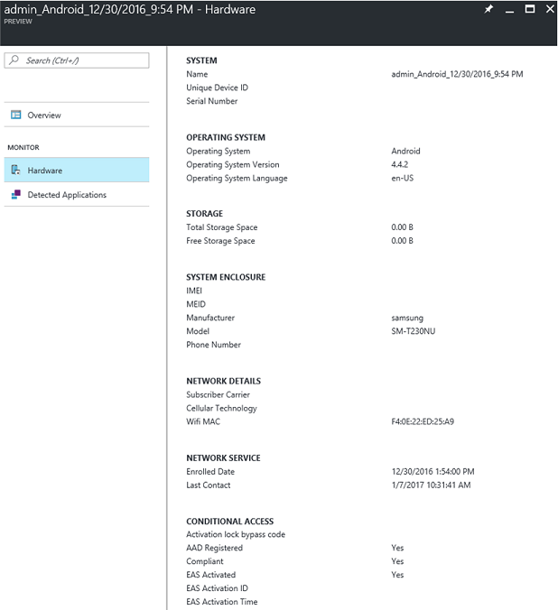

---
# required metadata

title: View Intune device inventory 
titleSuffix: "Intune on Azure"
description: Learn how to view the devices you manage with Intune, and understand their hardware and installed apps."
keywords:
author: robstackmsft
ms.author: robstack
manager: angrobe
ms.date: 07/11/2017
ms.topic: get-started-article
ms.prod:
ms.service: microsoft-intune
ms.technology:
ms.assetid: e71c6bdb-d75c-404f-8e38-24a663be81c2

# optional metadata

#ROBOTS:
#audience:
#ms.devlang:
#ms.reviewer: angrobe
ms.suite: ems
#ms.tgt_pltfrm:
ms.custom: intune-azure

---

# How to view Intune device inventory

[!INCLUDE[azure_portal](./includes/azure_portal.md)]

The **Devices** workload gives you insights into the devices you manage, including their hardware capabilities, and the apps installed on them. 

To view device inventory:

1. Sign into the Azure portal.
2. Choose **More Services** > **Monitoring + Management** > **Intune**.
3. On the **Intune** blade, choose **Devices**.

Now, choose one of the following options:

- **Overview** Get information about devices you've enrolled, and the operating systems each device runs.
- **Manage** - Choose **All Devices** to see a list of all the devices you manage.
	Select one of those devices in the list to open the <*device name*> **Overview** blade where you can select one of:
	- **Overview**  - See general information about the device including its name, owner, whether it is a BYOD device, when it checked-in, and more.
	
	- **Hardware** - See more detailed information about the device including its free storage space, model and manufacturer, and more.
	
	- **Discovered apps** - Displays a list of all apps that Intune found installed on the device.
	
	
>[!NOTE]
> Intune collects app inventory only on corporate-owned devices. Apps are not inventoried on personal devices. 
> On Windows 10 PCs, only modern app inventory is collected on corporate-owned devices. Intune does not collect information about Win32 apps on the device.

	- **Device compliance** - Displays the compliance state of all compliance policies that have been assigned to the device.
	- **Device configuration** - Displays the compliance state of all device configuration policies that have been assigned to the device.
- **Monitor** Choose **Device Actions** to see a list of device actions that have been performed on devices you manage and their current state.
- **Setup** > **TeamViewer Connector** - Let's you configure remote administration on devices using the TeamViewer software. For details, see [Provide remote assistance for Intune managed Android devices](/intune/device-profile-android-teamviewer).

