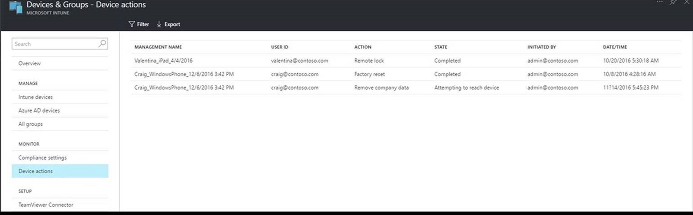

---
# required metadata

title: Manage devices with Intune
titleSuffix: "Intune on Azure"
description: Learn how to see the devices you manage with Intune, and perform various operations on them."
keywords:
author: dougeby
ms.author: dougeby
manager: dougeby
ms.date: 02/21/2018
ms.topic: get-started-article
ms.prod:
ms.service: microsoft-intune
ms.technology:
ms.assetid: d2412418-d91a-4767-a3d6-bc88bb29caa2

# optional metadata

#ROBOTS:
#audience:
#ms.devlang:
#ms.reviewer: angrobe
ms.suite: ems
#ms.tgt_pltfrm:
ms.custom: intune-azure

---

# What is Microsoft Intune device management?

[!INCLUDE[azure_portal](./includes/azure_portal.md)]

As an IT admin, you must ensure that managed devices are providing the resources your end users need to do their work while protecting that data from risk.

The **Devices** workload gives you insights into the devices you manage, and lets you perform remote tasks on those devices. To access the workload:

1. Sign into the [Azure portal](https://portal.azure.com).
2. Choose **All services** > **Intune**. Intune is located in the **Monitoring + Management** section.
3. In **Intune**, choose **Devices**.
4. You can view information about devices and perform the remote device actions as follows:
	- **Overview** - A snapshot of the enrolled devices you can manage.
	- **All devices** - A list of the enrolled devices you manage. Choose **Filter** or **Columns** to refine the information displayed. Select a device to [view device inventory](device-inventory.md).
	- **Azure AD devices** - A list of the devices registered or joined with Azure Active Directory (AD). Learn more about [Azure AD device management](https://docs.microsoft.com/azure/active-directory/device-management-introduction).
	- **Device actions** - A history of the remote actions performed on devices including the action, its status, who initiated the action, and the time.

    	

	- **Audit logs** - Audit logs provide you with a record of activities that generate a change in Microsoft Intune. Learn more about [Audit logs](monitor-audit-logs.md).
	- **TeamViewer Connector** - TeamViewer service allows users of Intune-managed Android devices to get remote assistance from their IT administrator. Learn more about [TeamViewer](device-profile-android-teamviewer.md).
	- **Help and Support** - Troubleshoot, request support, or view Intune status.	
	
## Available device actions
The actions available depend on the device platform, and the configuration of the device.

- [View device inventory](device-inventory.md)
- Perform remote device actions:
	- [Remove company data](devices-wipe.md#remove-company-data)
	- [Factory reset](devices-wipe.md#factory-reset)
	- [Remote lock](device-remote-lock.md)
	- [Reset passcode](device-passcode-reset.md)
	- [Bypass Activation Lock](device-activation-lock-bypass.md) (iOS only)
	- [Fresh Start](device-fresh-start.md) (Windows only)
	- [Lost mode](device-lost-mode.md) (iOS only)
	- [Locate device](device-locate.md) (iOS only)
	- [Restart](device-restart.md) (Windows only)
	- [Windows 10 PIN reset](device-windows-pin-reset.md)
	- [Remote control for Android](device-profile-android-teamviewer.md)
	- [Synchronize device](device-sync.md)

## Next steps

- Choose **Device actions** to see the status of actions taken on devices you manage.
