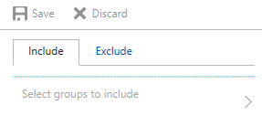

---
# required metadata

title: How to assign device profiles with Intune
titleSuffix: "Intune on Azure"
description: Once you've created an Intune device profile, use this topic to learn how to assign it to devices."
keywords:
author: robstackmsft
ms.author: robstack
manager: angrobe
ms.date: 07/05/2017
ms.topic: article
ms.prod:
ms.service: microsoft-intune
ms.technology:
ms.assetid: f6f5414d-0e41-42fc-b6cf-e7ad76e1e06d

# optional metadata

#ROBOTS:
#audience:
#ms.devlang:
ms.reviewer: heenamac
ms.suite: ems
#ms.tgt_pltfrm:
ms.custom: intune-azure

---

## Assign a device profile

1. Sign into the Azure portal.
2. Choose **More Services** > **Monitoring + Management** > **Intune**.
3. On the **Intune** blade, choose **Device configuration**.
1. On the **Device configuration** blade, choose **Manage** > **Profiles**.
2. In the list of profiles blade, choose the profile you want to manage, and then, on the <*profile name*> **Reports** blade, choose **Manage** > **Assignments**.
3. On the next blade, choose either **Include** (to include groups) or **Exclude** (to exclude groups), then choose **Select groups**.

4. On the **Select groups** blade, choose the Azure AD groups, which you want to include in, or exclude from the assignment. You can hold down the **CTRL** key to select multiple groups.
4. When you are done, on the **Select groups** blade, choose **Select**.

## How to exclude groups from a device profile assignment

Intune device configuration profiles let you exclude groups from policy assignment. For example, you could assign a device profile to the **All corporate users** group, but exclude any members of the **Senior Management Staff** group.

When you exclude groups from an assignment, exclude only user, or only device groups, not a mixture of groups. Intune does not take into account any user to device association when excluding groups. Including user groups while excluding device groups is unlikely to produce the results you need. 
In case where mixed groups are used, or there are other conflicts, inclusion takes precedence over exclusion.

For example, you want to assign a device profile to all devices in your organization, except kiosk devices. You include the **All Users** group, but exclude the **All Devices** group.

In this case, all your users and their devices get the policy, even if the user’s device is part of the **All Devices** group. 

Exclusion only evaluates the direct members of the groups, and does not include devices that are associated with a user. However, devices that don't have a user do not get the policy because they have no association to the **All Users** group. 

If you include **All Devices**, but exclude **All Users**, all the devices receive the policy. The intent in this case is to exclude devices that have an associated user from this policy. However, it does not because the exclusion feature only compares direct group members. 

>[!Tip]
>Exclusions are not currently available for compliance policies or app assignment. 
>To exclude members from an assignment, you can use the Available, and Not applicable assignment intents. For example, you assign an app to **All corporate users** with the **Available** intent, and to **Senior Management Staff** with the **Not applicable** intent. the app is assigned to all users *except* users in the **Senior Management Staff** group. If you assign the app to **All corporate users** with the **Required** intent, the users in the **Senior Management Staff** group are not excluded.
 
 	
### Next steps
See [How to monitor device profiles](device-profile-monitor.md) for information to help you monitor device profile assignments.
