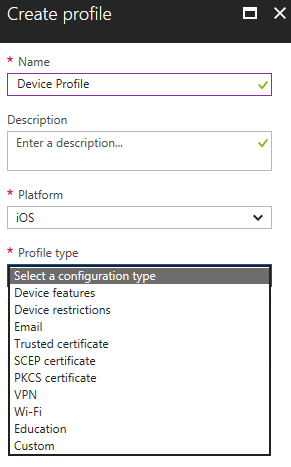

---
# required metadata

title: Create device profiles in Microsoft InTune - Azure | Microsoft Docs
description: Add or configure a device profile in Microsoft InTune, including selecting the platform type, and configuring the settings within the Azure portal
keywords:
author: MandiOhlinger
ms.author: mandia
manager: dougeby
ms.date: 03/01/2018
ms.topic: article
ms.prod:
ms.service: microsoft-intune
ms.technology:
ms.assetid: d98aceff-eb35-4e3e-8e40-5f300e7335cc

# optional metadata

#ROBOTS:
#audience:
#ms.devlang:
ms.reviewer: heenamac
ms.suite: ems
#ms.tgt_pltfrm:
ms.custom: intune-azure

---

# Create a device profile in Microsoft Intune

[!INCLUDE[azure_portal](./includes/azure_portal.md)]

## Create the profile
1. In the [Azure portal](https://portal.azure.com), select **All Services**, and search for **Microsoft Intune**.
2. In **Microsoft Intune**, select **Device configuration**, select **Profiles**, and then select **Create Profile**.
3. Enter the following properties: 

	- **Name**: Enter a descriptive name for the new profile
	- **Description**: Optional but recommended. Enter an description for the profile.
	- **Platform**: Select the platform type:  

		- **Android**
		- **Android for Work**
		- **iOS**
		- **macOS**
		- **Windows Phone 8.1**
		- **Windows 8.1 and later**
		- **Windows 10 and later**

	- **Profile type**: Select the type you want to create. The list depends on the platform you choose.
	- **Settings**: The following topics describe the settings for each profile type:

		-  [Device feature settings](device-features-configure.md)
		-  [Device restriction settings](device-restrictions-configure.md)
		-  [Email settings](email-settings-configure.md)
		-  [VPN settings](vpn-settings-configure.md)
		-  [Wi-Fi settings](wi-fi-settings-configure.md)
		-  [Windows 10 edition upgrade settings](edition-upgrade-configure-windows-10.md)
		-  [Certificate settings](certificates-configure.md)
		-  [Windows Information Protection settings](windows-information-protection-configure.md)
		-  [Education settings](education-settings-configure.md)
		-  [Custom settings](custom-settings-configure.md)

	

4. Select **Create** when finished. 

The profile is created and appears in the list. To assign this profile to groups, see [How to assign device profiles](device-profile-assign.md).

## Next steps
To assign device profiles, see [How to assign device profiles with Microsoft Intune](device-profile-assign.md).