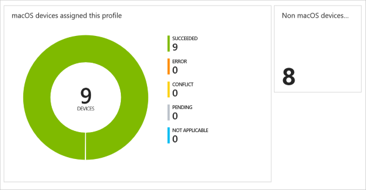

---
# required metadata

title: See device profiles with Microsoft Intune - Azure | Microsoft Docs
description: View and manage the device configuration profile details in Microsoft Intune, see a graphical chart of the number of devices assigned to a profile, and see which devices have profiles assigned or deployed. Can also troubleshoot profiles that have conflict settings. 
keywords:
author: MandiOhlinger
ms.author: mandia
manager: dougeby
ms.date: 06/25/2018
ms.topic: conceptual
ms.service: microsoft-intune
ms.localizationpriority: high
ms.technology:
ms.assetid: 9deaed87-fb4b-4689-ba88-067bc61686d7

# optional metadata

#ROBOTS:
#audience:
#ms.devlang:
ms.reviewer: heenamac
ms.suite: ems
search.appverid: MET150
#ms.tgt_pltfrm:
ms.custom: intune-azure
ms.collection: M365-identity-device-management
---

# Monitor device profiles in Microsoft Intune

[!INCLUDE [azure_portal](./includes/azure_portal.md)]

Intune includes some features in the Azure portal to help monitor and manage your device configuration profiles. For example, you can check the status of a profile, see which devices are assigned, and update the properties of a profile.

## View existing profiles

1. Sign in to [Intune](https://go.microsoft.com/fwlink/?linkid=2090973).
3. Select **Device configuration** > **Profiles**.

All of your existing profiles are listed, includes details such as the platform, and shows if the profile is assigned to any devices.

## View details on a profile

After you create your device profile, Intune provides graphical charts. These charts display the status of a profile, such as it being successfully assigned to devices, or if the profile shows a conflict.

1. Select an existing profile. For example, select a macOS profile.
2. Select the **Overview** tab.

    The top graphical chart shows the number of devices assigned to the specific device profile. For example, if the configuration device profile applies to macOS devices, the chart lists the count of the macOS devices.

    It also shows the number of devices for other platforms that are assigned the same device profile. For example, it shows the count of the non-macOS devices.

    

    The bottom graphical chart shows the number of users assigned to the specific device profile. For example, if the configuration device profile applies to macOS users, the chart lists the count of the macOS users.

3. Select the circle in the top graphical chart. **Device status** opens.

    The devices assigned to the profile are listed, and it shows if the profile is successfully deployed. Also note that it only lists the devices with the specific platform (for example, macOS).

    Close the **Device status** details.

4. Select the circle in the bottom graphical chart. **User status** opens. 

    The users assigned to the profile are listed, and it shows if the profile is successfully deployed. Also note that it only lists the users with the specific platform (for example, macOS).

    Close the **User status** details.

5. Back in the **Profiles** list, select a specific profile. You can also change existing properties:
    - **Properties**: Change the name, or update any existing settings.
    - **Assignments**: Include or exclude devices that the policy should apply. Choose **Selected Groups** to choose specific groups.
    - **Device status**: The devices assigned to the profile are listed, and it shows if the profile is successfully deployed. You can select a specific device to get even more details, including the installed apps.
    - **User status**: Lists the user names with devices impacted by this profile, and if the profile successfully deployed. You can select a specific user to get even more details.
    - **Per-setting status**: Filters the output by showing the individual settings within the profile, and shows if the setting is successfully applied.

## View conflicts

In **Devices** > **All devices**, you can see any settings that are causing a conflict. When there's a conflict, you are also shown all the configuration profiles that contain this setting. Administrators can use this feature to help troubleshoot, and fix any discrepancies with the profiles.

1. In Intune, select **Devices** > **All Devices** > select an existing device in the list. An end user can get the device name from their Company Portal app.
2. Select **Device configuration**. All configuration policies that apply to the device are listed.
3. Select the policy. It shows you all the settings in that policy that apply to the device. If a device has a **Conflict** state, select that row. In the new window, you see all the profiles, and the profile names that have the setting causing the conflict.

Now that you know the conflicting setting, and the policies that include that setting, it should be easier to resolve the conflict. 

## Next steps
[Assign user and device profiles](device-profile-assign.md)  
[Common issues and resolutions with device profiles](device-profile-troubleshoot.md)
