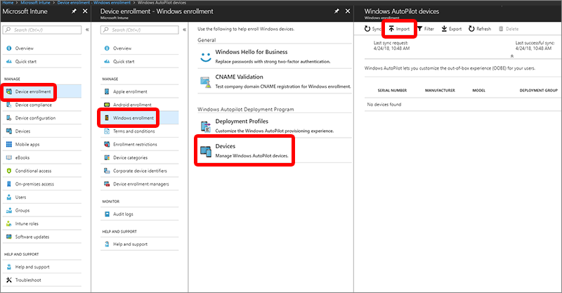
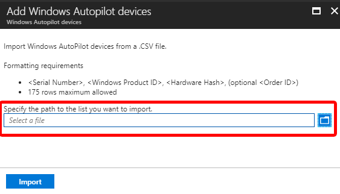

---
# required metadata

title: Enroll devices using Windows AutoPilot
titleSuffix: Microsoft Intune
description: Learn how to enroll Windows 10 devices using Windows AutoPilot.
keywords:
author: ErikjeMS
ms.author: erikje
manager: dougeby
ms.date: 04/25/2018
ms.topic: article
ms.prod:
ms.service: microsoft-intune
ms.technology:
ms.assetid: a2dc5594-a373-48dc-ba3d-27aff0c3f944

---

# Enroll Windows devices by using the Windows AutoPilot
The Windows AutoPilot simplifies device provisioning. Building and maintaining customized operating system images is a time-consuming process. You might also spend time applying these custom operating system images to new devices to prepare them for use before giving them to your end users. With Microsoft Intune and AutoPilot, you can give new devices to your end users without the need to build, maintain, and apply custom operating system images to the devices. When you use Intune to manage AutoPilot devices, you can manage policies, profiles, apps, and more after they're enrolled. For an overview of benefits, scenarios, and prerequisites, see [Overview of Windows AutoPilot](https://docs.microsoft.com/windows/deployment/windows-autopilot/windows-10-autopilot).

## Prerequisites
- [Windows automatic enrollment enabled](https://docs.microsoft.com/intune-classic/deploy-use/set-up-windows-device-management-with-microsoft-intune#enable-windows-10-automatic-enrollment)
- [Azure Active Directory Premium subscription](https://docs.microsoft.com/azure/active-directory/active-directory-get-started-premium) <!--&#40;[trial subscription](http://go.microsoft.com/fwlink/?LinkID=816845)&#41;-->

## Add devices

You can add Windows AutoPilot devices by importing a CSV file with their information.

1. In [Intune in the Azure portal](https://aka.ms/intuneportal), choose **Device enrollment** > **Windows enrollment** > **Devices** > **Import**.

    

2. Under **Add Windows Autopilot devices**, browse to a CSV file listing the devices that you want to add. The file should contain the serial numbers, Windows product IDs, hardware hashes, and optional order IDs of the devices.

    

3. Choose **Import** to start importing the device information. Importing can take several minutes.

## Synchronize devices
Synchronize your registered devices into Intune so that you can configure them.

1. In [Intune in the Azure portal](https://aka.ms/intuneportal), choose **Device enrollment**.
2. Choose **Windows enrollment**, and in the **Windows AutoPilot** section, choose **Devices**.
3. Click **Sync** to import your registered devices. A message displays that the synchronization is in progress.
4. Refresh the view to see the new devices. The process might take a few minutes to complete, depending on how many devices are being synchronized.

## Create an AutoPilot device group

1. In [Intune in the Azure portal](https://aka.ms/intuneportal), choose **Groups**.
2. In the **Group** blade:
    1. For **Group type**, choose **Security**.
    2. Type a **Group name** and **Group description**.
    3. For **Membership type**, choose either **Assigned** or **Dynamic Device**.
3. If you chose **Assigned** for **Membership type** in the previous step, then in the **Group** blade, choose **Members** and add AutoPilot devices to the group.
    AutoPilot devices that aren't yet enrolled are devices where the name equals the serial number of the device.
4. If you chose **Dynamic Devices** for **Membership type** above, then in the **Group** blade, choose **Dynamic device members** and type any of the following code in the **Advanced rule** box.
    - If you want to create a group that includes all of your AutoPilot devices, type `(device.devicePhysicalIDs -any _ -contains "[ZTDId]")`
    - If you want to create a group that includes all of your AutoPilot devices with a specific order ID, type: `(device.devicePhysicalIds -any _ -eq "[OrderID]:179887111881") `
    - If you want to create a group that includes all of your AutoPilot devices with a specific Purchase Order ID, type: `(device.devicePhysicalIds -any _ -eq "[PurchaseOrderId]:76222342342")`
    
    After adding the **Advanced rule** code, choose **Save**.
5. Choose **Create**.

## Create an AutoPilot deployment profile
AutoPilot deployment profiles are used to configure the AutoPilot devices.
1. In [Intune in the Azure portal](https://aka.ms/intuneportal), choose **Device enrollment** > **Windows enrollment** > **Deployment Profiles** > **Create Profile**.
2. Type a **Name** and optional **Description**.
3. For **Deployment mode**, choose one of these two options:
    - **User-driven**: Devices with this profile are associated with the user enrolling the device. User credentials are required to provision the device.
    - **Self-deploying (preview)**: (Windows 10 Insider Preview Build 17672 or later) Devices with this profile aren't associated with the user enrolling the device. User credentials aren't required to provision the device.
4. In the **Join to Azure AD as** box, choose **Azure AD joined**.
5. Choose **Out-of-box experience (OOBE)**, configure the following options, and then choose **Save**:
    - **Language (Region)***: Choose the language to use for the device. This option is only available if you chose **Self-deploying** for **Deployment mode**.
    - **Automatically configure keyboard***: If a **Language (Region)** is selected, skip the keyboard selection page. This option is only available if you chose **Self-deploying** for **Deployment mode**.
    - **End-user license agreement (EULA)**: (Windows 10, version 1709 or later) Choose whether or not to show the EULA to users.
    - **Privacy settings**: Choose whether or not to show privacy settings to users.
    - **User account type**: Choose whether or not the user's account type is an **Administrator** or **Standard** user. 

6. Choose **Create** to create the profile. The AutoPilot deployment profile is now available to assign to devices.

*Both **Language (Region)** and **Automatically configure keyboard** are only available if you chose **Self-deploying (preview)** for **Deployment mode** (Windows 10 Insider Preview Build 17672 or later).

## Assign an AutoPilot deployment profile to a device group

1. In [Intune in the Azure portal](https://aka.ms/intuneportal), choose **Device enrollment** > **Windows enrollment** > **Deployment profiles** > choose a profile.
2. In the specific profile blade, choose **Assignments**. 
3. Choose **Select groups**, then in the **Select groups** blade, choose the group(s) that you want to assign the profile to, then choose **Select**.

## Edit an AutoPilot deployment profile
After you've created an AutoPilot deployment profile, you can edit certain parts of the deployment profile.   

1. In [Intune in the Azure portal](https://aka.ms/intuneportal), choose **Device enrollment**.
2. Under **Windows enrollment**, in the **Windows AutoPilot** section, choose **Deployment Profiles**.
3. Select the profile you would like to edit.
4. Click **Properties** on the left to change the name or description of the deployment profile. Click **Save** after you make changes.
5. Click **Settings** to make changes to the OOBE settings. Click **Save** after you make changes.

> [!NOTE]
> Changes to the profile are applied to devices assigned to that profile. However, the updated profile won't be applied to a device that has already enrolled in Intune until after the device is reset and reenrolled.

## Alerts for Windows AutoPilot unassigned devices  <!-- 163236 -->
You can view an alert to see how many devices from the AutoPilot program don't have AutoPilot deployment profiles assigned. Use the information in the alert to create profiles and assign them to the unassigned devices. When you click the alert, you see a full list of Windows AutoPilot devices and detailed information about them.

To see alerts for unassigned devices, in [Intune in the Azure portal](https://aka.ms/intuneportal), choose **Device enrollment** > **Overview** > **Unassigned devices**.  

## Delete AutoPilot devices

You can delete Windows AutoPilot devices that aren't enrolled.

1. If the devices are enrolled in Intune, you must first [delete them from the Azure Active Directory portal](devices-wipe.md#delete-devices-from-the-azure-active-directory-portal).

2. In the [Intune in the Azure portal](https://aka.ms/intuneportal), choose **Device enrollment** > **Windows enrollment** > **Devices**.

3. Under **Windows AutoPilot devices**, choose the devices you want to delete, and then choose **Delete**.

4. Confirm the deletion by choosing **Yes**. It can take a few minutes to delete.

## Using AutoPilot in other portals
If you aren't interested in mobile device management, you can use AutoPilot in Microsoft Store for Business, for example. While using other portals is an option, we recommend that you only use Intune to manage your AutoPilot deployments. If you use Intune and another portal, Intune isn't able to:
- Display changes to profiles created in Intune, but edited in another portal
- Synchronize profiles created in another portal
- Display changes to profile assignments done in another portal
- Synchronize profile assignments done in another portal
- Display changes to the device list that were made in another portal

## Next steps
After you configure Windows AutoPilot for registered Windows 10 devices, learn how to manage those devices. For more information, see [What is Microsoft Intune device management?](https://docs.microsoft.com/intune/device-management)
