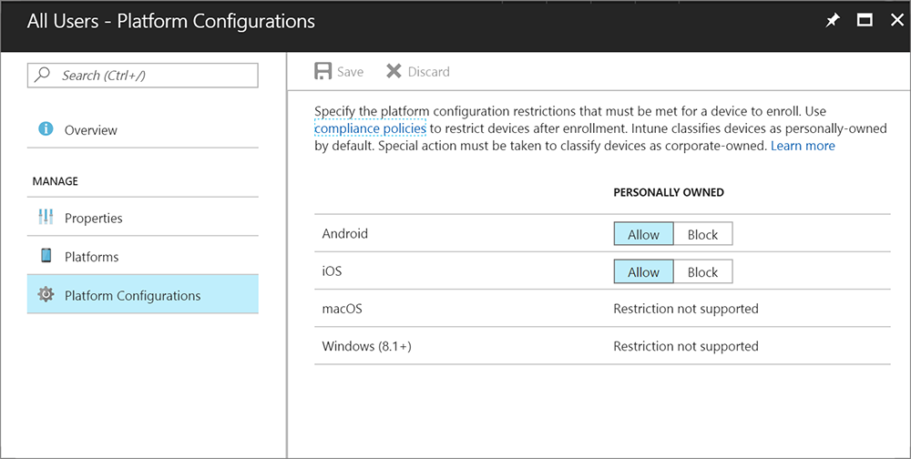

---
# required metadata

title: Set enrollment restrictions in Intune
titleSuffix: "Intune on Azure"
description: Restrict enrollment by platform and set a device enrollment limit in Intune. "
keywords:
author: nathbarn
ms.author: nathbarn
manager: angrobe
ms.date: 07/28/2017
ms.topic: article
ms.prod:
ms.service: microsoft-intune
ms.technology:
ms.assetid: 9691982c-1a03-4ac1-b7c5-73087be8c5f2

# optional metadata

#ROBOTS:
#audience:
#ms.devlang:
ms.reviewer: dagerrit
ms.suite: ems
#ms.tgt_pltfrm:
ms.custom: intune-azure
---

# Set enrollment restrictions

[!INCLUDE[azure_portal](./includes/azure_portal.md)]

As an Intune admin, you can determine which devices can enroll into management with Intune. Use the Intune portal to set the following restrictions for device enrollment:

- Maximum number of enrolled devices
- Device platforms that can enroll:
  - Android
  - iOS
  - macOS
  - Windows
- Platform operating system version (iOS and Android only)
  - Minimum version
  - Maximum version
- Restrict personally owned devices (iOS, Android, macOS only)

>[!NOTE]
>Enrollment restrictions are not security features. Compromised devices can misrepresent their character. These restrictions are a best-effort barrier for non-malicious users.

## Set device type restrictions
The default enrollment restrictions apply to all users and userless enrollments.
1. Sign into the Azure portal.
2. Choose **More Services** > **Monitoring + Management** > **Intune**.
3. Choose **Device enrollment** > **Enrollment restrictions**.
4. Under **Enrollment restrictions** > **Device Type Restrictions**, select **Default**.
5. Under **All Users**, select **Platforms**. Choose **Allow** or **Block** for each platform:
  - **Android**
  - **iOS**
  - **macOS**
  - **Windows**

  Click **Save**.
6. Under **All Users**, select **Platform Configurations** and select the following configurations. For each platform allowed, you can configure the following options:
  - **Versions** - Specify **Min** and **Max** platform operating system versions for Android and iOS devices. Operating system versions don't apply to devices enrolling with Device Enrollment Program, Apple School Manager, or the Apple Configurator app.
  - **Personally Owned** - Specify whether to **Allow** or **Block** for Android, iOS, and macOS devices.
  
  Click **Save**.

>[!NOTE]
>If you block personally owned Android devices from enrollment, personally owned Android for Work devices can still enroll.

## Set device limit restrictions
The default enrollment restrictions apply to all users.
1. Sign into the Azure portal.
2. Choose **More Services** > **Monitoring + Management** > **Intune**.
3. Choose **Device enrollment** > **Enrollment restrictions**.
4. In the Intune portal, choose **Device enrollment**, choose **Enrollment restrictions**.
5. Choose **Enrollment restrictions** > **Device Limit Restrictions**.
6. Under **All Users**, select **Device Limit**. Specify the maximum number of enrolled devices per user.  

  Click **Save**.
