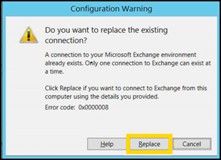
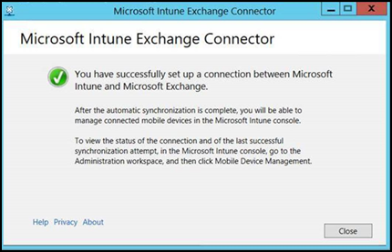

---
# required metadata

title: Set up Microsoft Intune on-premises Exchange connector
titleSuffix: Microsoft Intune
description: Use the on-premises Exchange connector to manage device access to Exchange mailboxes based on Intune enrollment and Exchange Active Sync (EAS).
keywords:
author: brenduns
ms.author: brenduns
manager: dougeby
ms.date: 03/22/2019
ms.topic: conceptual
ms.service: microsoft-intune
ms.localizationpriority: high
ms.technology:
ms.assetid: a0376ea1-eb13-4f13-84da-7fd92d8cd63c

# optional metadata

#ROBOTS:
#audience:
#ms.devlang:
ms.reviewer: demerson
ms.suite: ems
search.appverid: MET150
#ms.tgt_pltfrm:
ms.custom: intune-azure
ms.collection: M365-identity-device-management
---

# Set up the Intune on-premises Exchange connector in Microsoft Intune
The information in this article will help you install and then monitor the Exchange Active Sync on-premises connector for Intune.  You use the Intune on-premises Exchange connector with your [Conditional Access policies to allow or block access to your Exchange on-premises mailboxes](conditional-access-exchange-create.md). 

When a device tries to access your on-premises Exchange, the Exchange connector maps Exchange Active Sync (EAS) records in Exchange Server to Intune records to check for device enrollment with Intune, and compliance to your device compliance policies. Depending on your Conditional Access policies, the device can be allowed access, or blocked. For more information, see [What are common ways to use Conditional Access with Intune?](conditional-access-intune-common-ways-use.md)

Intune supports installing multiple on-premises Exchange connectors per subscription. If you have more than one on-premises Exchange organization, you can set up a separate connector for each. However, only one connector can be installed for use each individual Exchange organization. 

The following are the general steps to set up a connection that enables Intune to communicate with the on-premises Exchange Server:

1. Download the Intune on-premises Exchange connector from the Intune portal.
2. Install and configure the Exchange connector on a computer in the on-premises Exchange organization.
3. Validate the Exchange connection.
4. Repeat these steps for each additional Exchange organization you want to connect to Intune.

## Intune on-premises Exchange connector requirements
You'll need an account with an Intune license that can be used by the connector to connect to Exchange. The account is specified when you install the connector.  

The following table lists the requirements for the computer on which you install the on-premises Exchange connector.  

|  Requirement  |   More information     |
|---------------|------------------------|
|  Operating systems        | Intune supports the on-premises Exchange connector on a computer that runs any edition of Windows Server 2008 SP2 64-bit, Windows Server 2008 R2, Windows Server 2012, Windows Server 2012 R2, or Windows Server 2016.  The connector isn't supported on any Server Core installation.  |
| Microsoft Exchange          | On-premises connectors require Microsoft Exchange 2010 SP3 or later or legacy Exchange Online Dedicated. To determine if your Exchange Online Dedicated environment is in the <strong>new</strong> or <strong>legacy</strong> configuration, contact your account manager. |
| Mobile device management authority           | [Set the mobile device management authority to Intune](mdm-authority-set.md). |
| Hardware              | The computer on which you install the connector requires a 1.6 GHz CPU with 2 GB of RAM and 10 GB of free disk space. |
|  Active Directory synchronization             | Before you can use the connector to connect Intune to your Exchange Server, you must [set up Active Directory synchronization](users-add.md) so that your local users and security groups are synchronized with your instance of Azure Active Directory. |
| Additional software         | A full installation of Microsoft .NET Framework 4.5 and Windows PowerShell 2.0 must be installed on the computer that hosts the connector. |
| Network               | The computer on which you install the connector must be in a domain that has a trust relationship to the domain that hosts your Exchange Server.  The computer requires configurations to enable it to access the Intune service through firewalls and proxy servers over Ports 80 and 443. Domains that are used by Intune include manage.microsoft.com, &#42;manage.microsoft.com, and &#42;.manage.microsoft.com. |

### Exchange cmdlet requirements

Create an Active Directory user account that will be used by the on-premises Exchange connector. The account must have permission to run the following required Windows PowerShell Exchange cmdlets:

- Get-ActiveSyncOrganizationSettings, Set-ActiveSyncOrganizationSettings
- Get-CasMailbox, Set-CasMailbox
- Get-ActiveSyncMailboxPolicy, Set-ActiveSyncMailboxPolicy, New-ActiveSyncMailboxPolicy, Remove-ActiveSyncMailboxPolicy
- Get-ActiveSyncDeviceAccessRule, Set-ActiveSyncDeviceAccessRule, New-ActiveSyncDeviceAccessRule, Remove-ActiveSyncDeviceAccessRule
- Get-ActiveSyncDeviceStatistics
- Get-ActiveSyncDevice
- Get-ExchangeServer
- Get-ActiveSyncDeviceClass
- Get-Recipient
- Clear-ActiveSyncDevice, Remove-ActiveSyncDevice
- Set-ADServerSettings
- Get-Command

## Download the on-premises Exchange connector software installation package

1. On a supported Windows Server operating system for the on-premises Exchange connector, open the [Azure portal](https://portal.azure.com) and sign in with a user account that is an administrator in the on-premises Exchange server, and that has a license to use Exchange Server.

2. Go to **Intune** > **Exchange access**  

3. Under **Setup**, choose **Exchange ActiveSync on-premises connector**, and then select **Add**.

4. On the **Add Connector** page, select **Download the on-premises connector**. The on-premises Exchange connector is in a compressed (.zip) folder that can be opened or saved. In the **File Download** dialog box, choose **Save** to store the compressed folder to a secure location.

    > [!IMPORTANT]
    > Do not rename or move the files that are in the on-premises Exchange connector folder. Moving or renaming the folder's contents will cause the Exchange connector installation to fail.

## Install and configure the Intune on-premises Exchange connector
Perform the following steps to install the Intune on-premises Exchange connector. If you have multiple Exchange organizations, repeat these steps for each additional Exchange connector you want to set up.

1. On a supported operating system for the on-premises Exchange connector, extract the files in **Exchange_Connector_Setup.zip** to a secure location.

2. After the files are extracted, open the extracted folder and double-click **Exchange_Connector_Setup.exe** to install the on-premises Exchange connector.

   > [!IMPORTANT]
   > If the destination folder is not a secure location, you should delete the certificate file **MicrosoftIntune.accountcert** when you are finished installing your on-premises connectors.

3. In the **Microsoft Intune Exchange Connector** dialog box, select either **On-premises Microsoft Exchange Server** or **Hosted Microsoft Exchange Server**.

   

   For an on-premises Exchange server, provide either the server name or the fully qualified domain name of the Exchange server that hosts the **Client Access Server** role.

   For a hosted Exchange server, provide the Exchange server address. To find the hosted Exchange server URL:

   1. Open Outlook on the web for Office 365.

   2. Choose the **?** icon at the upper left, and then select **About**.

   3. Locate the **POP External Server** value.

   4. Choose **Proxy Server** to specify proxy server settings for your hosted Exchange server.
       1. Select **Use a proxy server when synchronizing mobile device information**.

       2. Enter the **proxy server name** and the **port number** to be used to access the server.

       3. If it's necessary to provide user credentials to access the proxy server, select **Use credentials to connect to the proxy server**. Then enter the **domain\user** and the **password**.

       4. Choose **OK**.

4. In the **User (Domain\user)** and **Password** fields, enter the credentials that are necessary to connect to your Exchange server. The account you specify must have a license to use Intune. 

5. Provide the necessary credentials to send notifications to a user’s Exchange Server mailbox. This user can be dedicated to just notifications. The notifications user needs an Exchange mailbox to send notifications by email. You can configure these notifications with Conditional Access policies in Intune.  

   Ensure that the Autodiscover service and Exchange Web Services are configured on the Exchange Client Access Server. For more information, see [Client Access server](https://technet.microsoft.com/library/dd298114.aspx).

6. In the **Password** field, provide the password for this account to enable Intune to access the Exchange Server.

   > [!NOTE]
   > For the connection to be successfull, the account that you use to sign in to the tenant needs to be at least Intune Service Administrator. Without it you will get a failed connection with error: "The remote server returned an error: (400) Bad Request".

7. Choose **Connect**.

   > [!NOTE]
   > It might take a few minutes for the connection to be configured.

During configuration, the Exchange connector stores your proxy settings to enable access to the Internet. If your proxy settings change, you'll have to reconfigure the Exchange connector to apply the updated proxy settings to the Exchange connector.

After the Exchange connector sets up the connection, mobile devices that are associated with users that are managed in Exchange are automatically synchronized and added to the Exchange connector. This synchronization might take some time to complete.

> [!NOTE]
> If you have installed the on-premises Exchange connector, and if at some point you delete the Exchange connection, you must uninstall the on-premises Exchange connector from the computer onto which it was installed.

## Install connectors for multiple Exchange organizations
Intune supports multiple on-premises Exchange connectors per subscription. For a tenant with multiple Exchange organizations, you can set up a connector for each Exchange organization, but only a single connector for any single organization. 

If you'll install connectors to connect to multiple Exchange organizations, download the .zip folder one time and then reuse that same download for each connector you install. For each additional connector, follow the steps in the previous section to extract and run the setup program on a server in the Exchange organization.

The high availability, monitoring, and manual sync features described in the following sections are supported for each Exchange organization that connects to Intune.

## On-premises Exchange connector high availability support 
High availability for the on-premises Exchange connector means that should the Exchange Client Access Server (CAS) that the connector uses become unavailable, the connector can switch over to use a different CAS for that Exchange organization. The Exchange connector itself does not support high availability. If the connector fails, there is no automatic failover and you must replace that connector by [installing a new connector](#reinstall-the-on-premises-exchange-connector). 

To accomplish failover, after the connector creates a successful connection to Exchange using the specified CAS, the connector discovers additional CASs for that Exchange organization. Knowledge of additional CASs enables the connector to failover to another CAS if one is available, until the primary CAS becomes available. By default, discovery of additional CASs is enabled. You can turn off failover by using the following procedure:  
1. On the server where the Exchange connector is installed, go to %*ProgramData*%\Microsoft\Windows Intune Exchange Connector. 
2. Using a text editor, open **OnPremisesExchangeConnectorServiceConfiguration.xml**.
3. Change &lt;IsCasFailoverEnabled&gt;**true**&lt;/IsCasFailoverEnabled&gt; to &lt;IsCasFailoverEnabled&gt;**false**&lt;/IsCasFailoverEnabled&gt; to disable the feature.  
 
## Optional Performance tuning for the Exchange connector  

When you support 5,000 or more devices with Exchange ActiveSync, you can configure an optional setting to improve the performance of the connector. Increased performance is achieved by enabling Exchange to use multiple instances of a PowerShell command run-space. 

Before you make this change, ensure the account you use to run the Exchange connector isn't used for other Exchange management purposes. This is because Exchange has a limited number of run-spaces per account, most of which will be used by the connector. 

This performance change isn't suitable for connectors that run on older or slower hardware.  

1. On the server where the connector installed, open the connectors installation directory.  The default location is *C:\ProgramData\Microsoft\Windows Intune Exchange Connector*. 
2. Edit the file *OnPremisesExchangeConnectorServiceConfiguration.xml*.
3. Locate **EnableParallelCommandSupport** and set the value to **true**:  
     
   \<EnableParallelCommandSupport>true\</EnableParallelCommandSupport>
4. Save the file, and then restart the Microsoft Intune Exchange connector service.

## Reinstall the on-premises Exchange connector
You might need to reinstall an Exchange connector. Because a single connector is supported to connect to each Exchange organization, if you install a second connector for an organization, the new connector you install replaces the original connector.

1. Use the steps from [Install and configure the Intune on-premises Exchange connector](#install-and-configure-the-intune-on-premises-exchange-connector) to start installation of the new connector. 
2. When prompted, select **Replace** to install the new connector.  
   

3. Continue using the steps form the previous procedure, and log into Intune again.
4. When presented with the final screen, select **Close** to complete the install.  
   
 

## Monitor the Exchange connector activity

After you have successfully configured the Exchange connector, you can view the status of the connections and the last successful synchronization attempt. To validate the Exchange connector connection:

1. On the Intune Dashboard, choose **Exchange access**.
2. Select **Exchange on-premises access** to verify the connection status for each Exchange connector.

You can also check the time and date of the last successful synchronization attempt.
--> 

### System Center Operations Manager management pack

Beginning with the Intune 1710 release, you can use the [Operations Manager management pack for Exchange connector and Intune](https://www.microsoft.com/download/details.aspx?id=55990&751be11f-ede8-5a0c-058c-2ee190a24fa6=True&e6b34bbe-475b-1abd-2c51-b5034bcdd6d2=True&fa43d42b-25b5-4a42-fe9b-1634f450f5ee=True). Using the management pack gives you different ways of monitoring the Exchange connector when you need to troubleshoot issues.

## Manually force a quick sync or full sync
An on-premises Exchange connector automatically synchronizes EAS and Intune device records regularly. If the compliance status of a device changes, the automatic sync process regularly updates records so that device access can be blocked or allowed.

- **Quick sync** occurs regularly, several times a day. A quick sync retrieves device information for Intune-licensed and on-premises Exchange Conditional Access-targeted users that have changed since the last sync.

- **Full sync** occurs once per day by default. A full sync retrieves device information for all Intune-licensed and on-premises Exchange Conditional Access-targeted users. A full sync also retrieves Exchange server information and ensures that the configuration specified by Intune in the Azure portal is updated on the Exchange server. 

You can force a connector to run a sync by using the **Quick Sync** or **Full Sync** options on the Intune dashboard with the following steps:

   1. On the Intune dashboard, choose **Exchange access**.
   2. Select **Exchange on-premises access**.
   3. Select the connector you want to sync, and then choose **Quick Sync** or **Full Sync**.

## Next steps
[Create a Conditional Access policy for Exchange on-premises](conditional-access-exchange-create.md)
