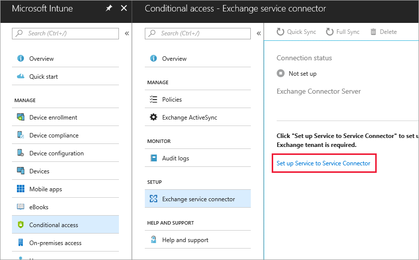

---
# required metadata

title: Intune Exchange connector for Exchange Online
titleSuffix: 
description: Connect Intune to Office 365 Exchange service to support Exchange ActiveSync mobile device management (MDM).
keywords:
author: msmimart
ms.author: mimart
manager: dougeby
ms.date: 05/01/2018
ms.topic: article
ms.prod:
ms.service: microsoft-intune
ms.technology:
ms.assetid: 

# optional metadata

#audience:
#ms.devlang:
ms.reviewer: muhosabe
ms.suite: ems
#ms.tgt_pltfrm:
ms.custom: intune-azure

---

# Configure the Exchange service connector for Intune and Exchange Online

This article shows you how to connect the Microsoft Intune service to Exchange Online or the new Exchange Online Dedicated service. To determine whether your Exchange Online Dedicated environment is the **new** or **legacy** version, contact your account manager.

## Service to Service Connector requirements
The **Service to Service Connector** supports only Exchange Online or Exchange Online Dedicated and has no requirements for an on-premises infrastructure.

|              Requirement               |                                                                                                            More information                                                                                                            |
|----------------------------------------|----------------------------------------------------------------------------------------------------------------------------------------------------------------------------------------------------------------------------------------|
| Exchange Online configured and running |                                                                                 [Exchange Online](https://technet.microsoft.com/library/jj200580.aspx)                                                                                 |
|   Mobile device management authority   |                                                       [Set the mobile device management authority to Microsoft Intune](mdm-authority-set.md)                                                       |
|       Microsoft Exchange version       |                                                                                      Exchange Online or the new Exchange Online Dedicated service                                                                                      |
|    Active Directory synchronization    | Before you can use the Intune Connector, you must [set up Active Directory synchronization](/intune/users-add) so that your local users and security groups are synchronized with your instance of Azure Active Directory. |

### Exchange cmdlet requirements

You must also create an Exchange Online user account that is used by the Intune Exchange service connector. The account must have permission to run the following required Windows PowerShell Exchange cmdlets:

 - Get-ActiveSyncOrganizationSettings, Set-ActiveSyncOrganizationSettings
 - Get-MobileDeviceMailboxPolicy, Set-MobileDeviceMailboxPolicy, New-MobileDeviceMailboxPolicy, Remove-MobileDeviceMailboxPolicy
 - Get-ActiveSyncDeviceAccessRule, Set-ActiveSyncDeviceAccessRule, New-ActiveSyncDeviceAccessRule, Remove-ActiveSyncDeviceAccessRule
 - Get-MobileDeviceStatistics
 - Get-MobileDevice
 - Get-ActiveSyncDeviceClass

## Set up the Service to Service Connector

1. Sign in to the [Azure portal](http://portal.azure.com) with a user account that has Exchange admin rights and permissions for the cmdlets [described earlier](#exchange-cmdlet-requirements). Microsoft Intune uses the email address of the currently signed-in user to set up the connection.

2. Choose **All services** from the left menu, then type **Intune** in the text box filter.

3. Choose **Intune** to open the Microsoft Intune dashboard. Choose **Conditional access**, and then under **Setup**, choose **Exchange service connector**.

4.  On the **Conditional access - Exchange service connector** page, choose **Set Up Service to Service Connector**. 
   
     

The Service to Service Connector automatically configures and synchronizes your Exchange Online or new Exchange Online Dedicated environment.

## Validate your Exchange connection

After you have successfully configured the Exchange Service to Service Connector, validate the Exchange Connector Server information on the **Conditional access - Exchange service connector** page.

You can also check the **Connection status** and the time and date of the last successful synchronization attempt.

## Next steps
[Monitor Exchange conditional access in Microsoft Intune](conditional-access-exchange-monitor.md)