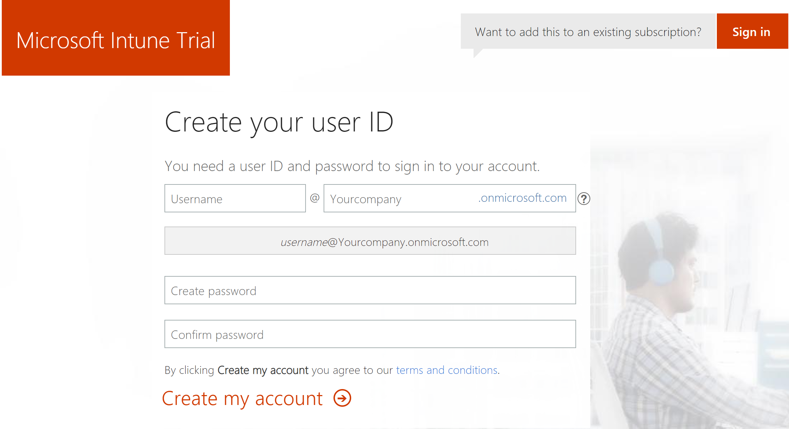
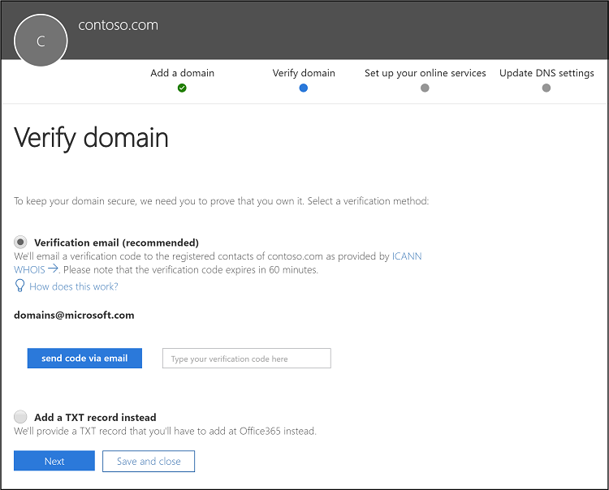

---
# required metadata

title: Quickstart - Try Microsoft Intune for free
titlesuffix: 
description: In this quickstart you will create a free trial subscription, understand supported configurations and networking requirements, and optionally configure your domain name.
keywords:
author: Erikre
ms.author: erikre
manager: dougeby
ms.date: 09/12/2018
ms.topic: quickstart
ms.prod:
ms.service: microsoft-intune
ms.technology:
ms.assetid: 195931c0-8208-43bd-b0af-b1f8e469a32c

# optional metadata

#ROBOTS:
#audience:
#ms.devlang:
ms.reviewer:
ms.suite: ems
#ms.tgt_pltfrm:
ms.custom: intune-azure

---

# Quickstart: Try Microsoft Intune for free 

Microsoft Intune helps you protect your workforce's corporate data by managing devices and apps. In this quickstart, you will create a free subscription to try Intune in a test environment.

Intune provides mobile device management (MDM) and mobile app management (MAM) from a secure cloud-based service that is administered using the Microsoft Azure portal. Using Intune, you ensure your workforce's corporate resources (data, devices, and apps) are correctly configured, accessed, and updated, meeting your company's compliance policies and requirements. 

## Prerequisites
Before setting up Microsoft Intune, review the following requirements:

   - [Supported operating systems and browsers](supported-devices-browsers.md) 
   - [Network configuration requirements and bandwidth](network-bandwidth-use.md)

## Sign up for a Microsoft Intune free trial

Trying out Intune is free for 30 days. If you already have a work or school account, **sign in** with that account and add Intune to your subscription. Otherwise, you can **sign up** for a new account to use Intune for your organization.

> [!IMPORTANT]
> You can't combine an existing work or school account after you sign up for a new account.

1. Go to the [Microsoft Intune Trial](https://go.microsoft.com/fwlink/?linkid=2019088) page and fill out the form.

    

    If most of your IT operations and users are in a different locale than you, you may want to select that locale under **Country or region**. Azure uses your regional information to deliver the right services. This setting can't be changed later.

2. Create an account using your company name followed by **.onmicrosoft.com**. 

    

    If your organization has its own custom domain that you want to use without **.onmicrosoft.com**, you can change that in the Office 365 Admin Portal discribed later in this article.

3. View your new account information at the end of the sign-up process.

     

## Sign in to the Azure portal

1. Open a new browser window and enter **https://portal.azure.com** in the address bar. 
2. Use the credentials you were given in the steps above to sign in.

    

3. To view Microsoft Intune in the Azure port, select **All services** from the sidebar on the left side of the page.
4. Search for **Microsoft Intune** in the filter box and select it.
5. Select the **star** to add Intune to the bottom of the list of your favorite services and open the Intune dashboard.

When you sign up for a trial, you will also receive an email message that contains your account information and the email address that you provided during the sign-up process. This email confirms your trial is active.

## Configure your custom domain name (Optional)

As mentioned above, if your organization has its own custom domain that you want to use without **.onmicrosoft.com**, you can change it in the Office 365 Admin Portal. You will add, verify and configure your custom domain name.  

> [!IMPORTANT]
> You cannot rename or remove the initial **onmicrosoft.com** domain name. You can add, verify or remove custom domain names used with Intune to keep your business identity clear.

1. Go to [Office 365 management portal](https://portal.office.com/Admin/Default.aspx) and sign in using your administrator account.

2. In the navigation pane, choose **Setup** > **Domains** > **Add domain**.

3. Type your custom domain name. Then, select **Next**.

   

4. Verify that you are the owner of the domain that you entered in the previous. 
    
    Selecting **send code via email** will send an email to the registered contact of your domain. After you receive the email, copy the code and enter it in the field labeled **Type your verification code here**. If the verification code matches, the domain will be added to your tenant. The email displayed may not look familiar. Some registrars hide the real email address then what was provided when the domain was registered.

   

   > [!NOTE]
   > For TXT record verification details related to GoDaddy, see [Create DNS records at GoDaddy for Office 365](https://support.office.com/article/Create-DNS-records-at-GoDaddy-for-Office-365-f40a9185-b6d5-4a80-bb31-aa3bb0cab48a). For TXT record verification details related to Register.com, see [Create DNS records at Register.com for Office 365](https://support.office.com/article/Create-DNS-records-at-Register-com-for-Office-365-55bd8c38-3316-48ae-a368-4959b2c1684e#BKMK_verify).

## Admin experiences

There are two portals that you might use:
- The Intune dashboard in Azure ([portal.azure.com](https://portal.azure.com)) is where you can explore the [capabilities of Intune](what-is-intune.md). Normally, you’ll do your work in the Intune dashboard.
- The Office 365 Admin center ([portal.office.com](https://portal.office.com)) is where you can add and manage users, if you are not using Azure Active Directory for that. You can also manage other aspects of your account, including billing and support.

## Next steps

In this quickstart, you've created a free subscription to try Intune in a test environment and optionally configured a custom domain name. To learn more about Microsoft Intune, continue to the next quickstart to add users and assign licenses.

> [!div class="nextstepaction"]
> [Quickstart: Add users and assign licenses](what-is-intune.md)
