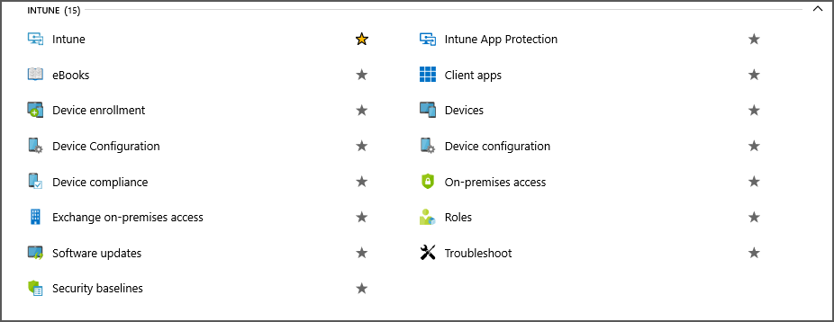
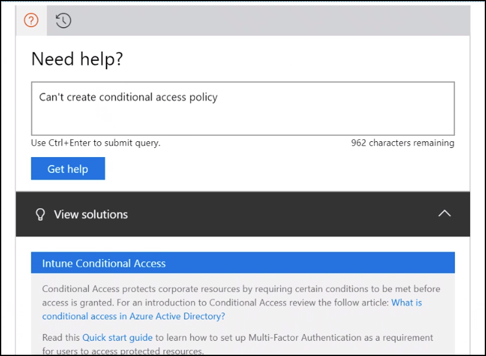
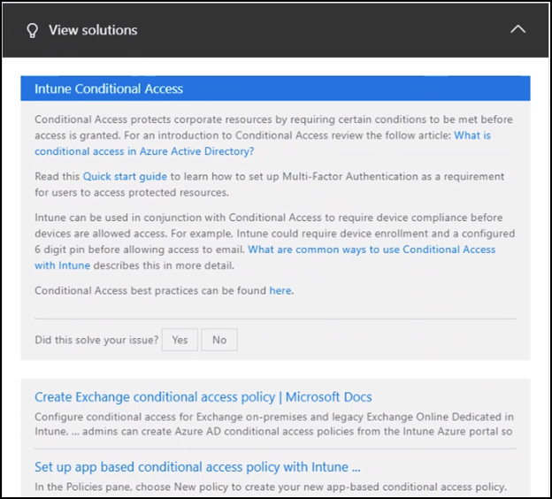
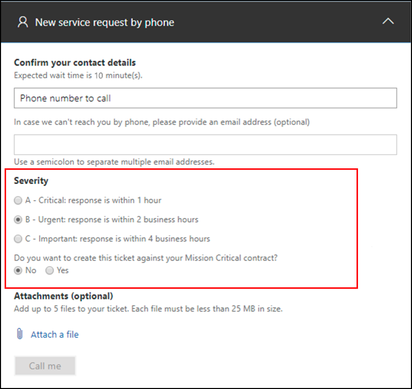
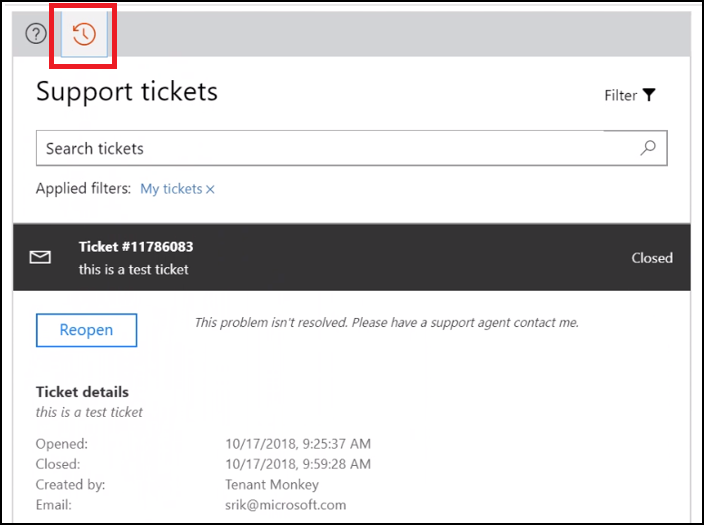
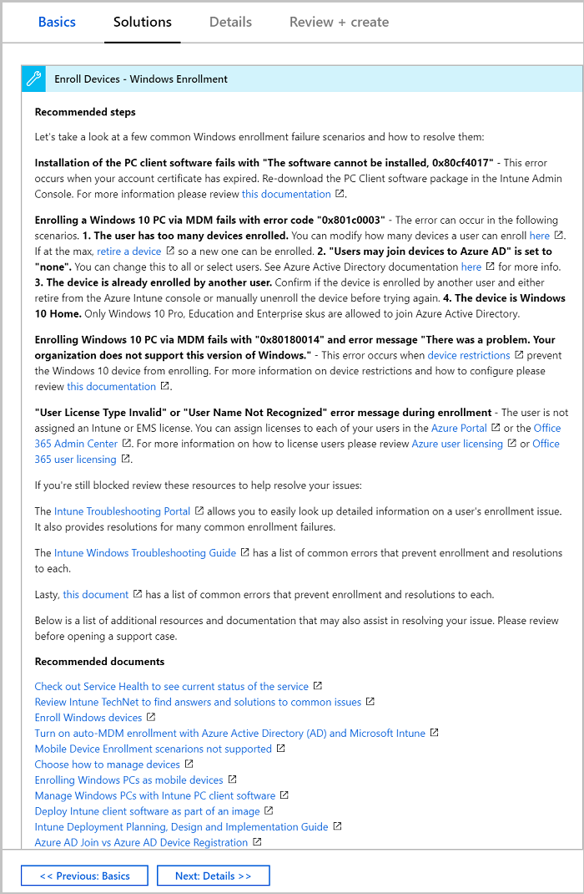
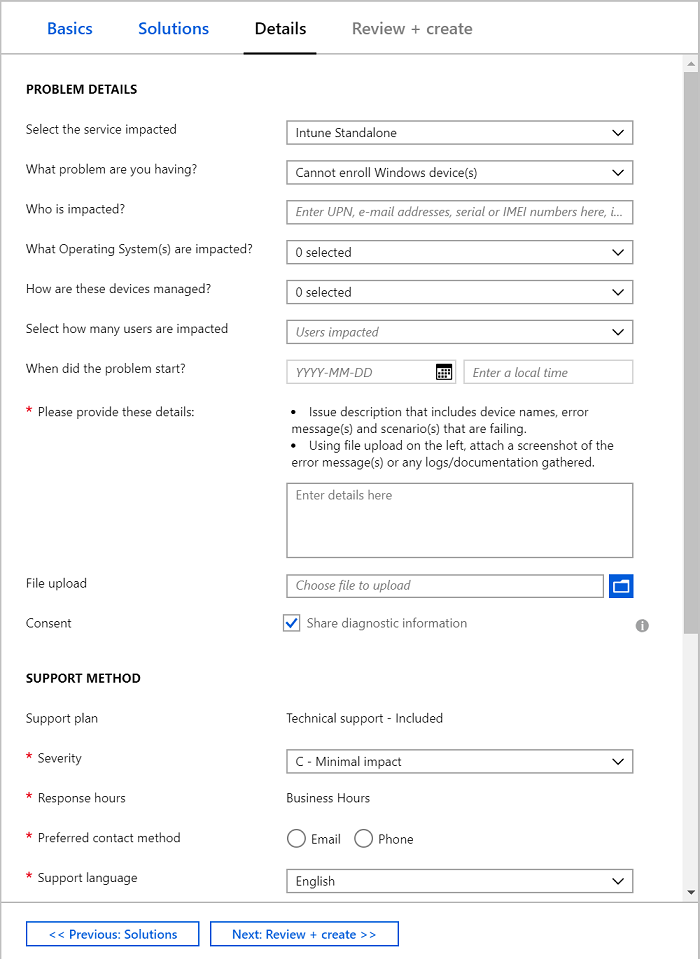

---
# required metadata

title: How to get support for Microsoft Intune
titleSuffix: Microsoft Intune
description: Get online and telephone support for Microsoft Intune paid and trial subscriptions.
keywords:
author: brenduns
ms.author: brenduns
manager: dougeby
ms.date: 06/04/2019
ms.topic: conceptual
ms.service: microsoft-intune
ms.localizationpriority: high
ms.technology:
ms.assetid: 7fc95d17-098e-4da5-8a09-a96476569dd9

# optional metadata

#audience:
#ms.devlang:
ms.reviewer: cacamp
ms.suite: ems
search.appverid: MET150
#ms.tgt_pltfrm:
ms.custom: intune-classic
ms.collection: M365-identity-device-management
---

# How to get support for Microsoft Intune  

[!INCLUDE [azure_portal](./includes/note-for-both-portals.md)]  
  
Microsoft provides global technical, pre-sales, billing, and subscription support for Microsoft Intune. Support is available both online and by phone for paid and trial subscriptions. Online technical support is available in English and Japanese. Phone support and online billing support are available in additional languages.

As an Intune admin, you can use the **Help and Support** option to file an on-line support ticket for Intune from the Azure portal. To create and manage a support incident, your account must have an Azure Active Directory (Azure AD) role that includes the *action* **microsoft.office365.supportTickets/tickets/manage**. For information about Azure AD roles and permissions that are required to create a support ticket, see [administrator roles in Azure Active Directory](https://docs.microsoft.com/azure/active-directory/active-directory-assign-admin-roles-azure-portal).  

>[!IMPORTANT]  
> For technical support with third-party products that work with Intune (like Saaswedo, Cisco, or Lookout), contact the supplier of that product first. Before you open a request with Intune support, make sure you configured the other product correctly.
>
> For information about troubleshooting issues related to Microsoft Intune, see the [Troubleshoot section](help-desk-operators.md) of the Intune documentation.

## Known issues for creating support incidents  

If your account has the required permissions but fails to successfully access Help and Support, or create or manage a support incident, review the following known issues, and resolutions:  
- Stale user token for your account. To resolve this issue, sign out of all active console sessions, sign in again, and then attempt to create or manage a support incident. 
- Multiple active sessions. If you're signed in with more than one user or session, sign out all but one console. Then, with a single active session, attempt to create or manage a support incident.

Additional actions that might be necessary to resolve access issues:
- Clear all cookies for your active browser session, and then retry creating or managing a support incident.
- Use an InPrivate browsing session to sign in to Intune, and try to create or manage a support incident.  

If the preceding workarounds don't help, go to [Microsoft 365 admin center](https://admin.microsoft.com) and create a support ticket from there. We're currently working on a fix that will be available in late summer.  

## Help and support experience  

The Help and support experience for Intune is available from the [Microsoft 365 Device Management portal](http://devicemanagement.microsoft.com) and from all of the blades (or pages) under Intune in the Azure portal. 

The *Help and support* experience is similar to the experience seen in the [Microsoft 365 admin center](https://admin.microsoft.com/), and replaces the previous *Help + support*, which remains in place for other services in Azure. 

To access Help and support, use the following options:  
- **Device Management Dashboard:**
  - Select any available option for **Help and support**
  - Select the **?** icon in the upper-right corner of the portal

- **In the Azure portal:**
  - Select **Help and support** from any Intune blade or page

  In the Azure portal, if you select either the **?** icon from the upper-right corner, or **Help + support** from the left-side navigation pane, you open *Help + support* for Azure. From Azure *Help + Support*, you can’t open an Intune support incident directly but you can get to the Intune *Help and support* page by doing the following actions: 
  1. Select New support request.
  2. For Issue type, specify Technical.
  3. For Service, specify Microsoft Intune.
  4. Select the link Intune Help and Support page.

> [!NOTE]  
> If your instance of Intune is hosted on the Government Compute Cloud (GCC), also known as a sovereign cloud like Azure Government, see Intune support for Government Compute Cloud, later in this article. The Intune *Help and support* experience won’t be available on the GCC until later this year. 

When you open *Help and support*, the portal displays a view that depends on whether or not you have active support incidents, and when you have Premier Support, some additional elements and options:
- **No active support incidents**: You'll see the **Need help?** page, as seen in the following image from the Device Management dashboard.  
- **Active support incidents**: You’ll see the [Support tickets](#view-support-cases) page, which displays the list of your active incidents.  
- **Premier support contract**: Your experience is the same as the first two options, though you'll see the following additional elements on the Need help? page: 
  - After the page title **Need Help?**, you’ll see the Premier Support banner:  
    
  - In the **Get support** section of the page, you can set the initial **Severity** level when you create a service request by phone.

In this view you can do the following actions:

1. [Specify details](#specify-details-about-an-issue) about the specific problem you want help with  
2. [View context-sensitive help](#view-context-sensitive-help) and related solutions that are based on the details you specified  
3. [Get support](#get-support), using either email or the phone  
4. [View support cases](#view-support-cases) you have previously opened using this new workflow  

### Specify details about an issue 

When you open Help and support from a location that is supported by the new experience, the **Need help?** page opens. On this page, you can specify details about an issue. As you enter details, the console offers common queries based on the keywords you use. Select an offered choice or complete your own issue description. If you enter your own description, select **Get help** to submit it. After you submit a query, the console returns context-sensitive information that can help to solve the issue.

The following are examples of queries you might submit:
  
- *Can’t restore iOS device*  
- *Can’t create Conditional Access policy*  

### View context-sensitive help 

After you select an offered choice or submit your own query, context-sensitive results appear under **View solutions**. These results include both Intune specific self-help guidance and additional results returned from a web-search based on the query criteria.  

### Get support 

If the self-help or web-based guidance doesn’t help you resolve the problem, use the console to open an email or phone support issue.  
On the **Need help?** page, select the option you want to use.  

  > [!NOTE] 
  > Email requests for support are not available for all tenants.  

- For an email request, provide your email address and optionally, you can add attachments to your submission. Select **Send** to open the request. 

  
  
- For a phone request, provide your phone number. Optionally, you can include your email address and add attachments to your submission. Select Call me to submit the request.  

   

**Premier support**:  
If you have a Premier support contract, you have the same options to create a phone support incident. You can also specify the **Severity** for the support call-back, and choose to create the support ticket against your Mission Critical contract.  

### View support cases  

Select the history button to view the support incidents that you've created.  

- Only the support cases that you open by using the new workflow are visible from within this workflow. To view them, use a Help and support view from the Device Management console or from an Intune blade in the Azure portal. These cases have numbers that are eight digits long. You can also view these cases from the Microsoft 365 admin center.  

- Cases that you opened when not using the Intune Help and support experience are unchanged. To view them, you must use a Help and support view that isn't part of the Intune experience, or Device Management dashboard. These cases have numbers that start with **117** or **118** and are 15 digits long. To view them:

    1. Sign in to  Azure (<https://portal.azure.com>) with your Intune admin credentials, select the *?* icon in the upper-right corner of the portal, and then select *Help + support* to go to the [Azure Help + support](https://ms.portal.azure.com/#blade/Microsoft_Azure_Support/HelpAndSupportBlade/overview) page.

    2. On the **Help + support** page you can view the list of **Recent support requests**, and select them to view additional details.
 

## Azure Help + support experience 

When you use the left navigation pane **Help + support**, or use the **?** option in the upper-right corner of the Azure portal, you open the Azure Help + support experience, which is distinct from the Intune Help and support experience.  

Beginning in April of 2019, you can't access the Azure *Help + support* experience to get assistance with Intune, unless your subscription is on the Government Compute Cloud (GCC).  

If your instance of Intune doesn't run on GCC, navigating through Azure *Help + support* redirects you to the Intune *Help and support* experience to create and manage support incidents.  

## Intune support for Government Compute Cloud  

When your Intune subscription hosted on the Government Compute Cloud (GCC), which is also known as a sovereign cloud like Azure Government, you don’t yet have access to the newer Intune Help and support experience.  Instead, use the following information go get support for Intune. 

### Create an online support ticket 

>[!IMPORTANT]    
> As *Help and support* transitions to a new system which is not yet available for the GCC, when you create a support incident, the portal identifies a support case that uses a 15 digit identification number. When the 15-digit case is created, a mirror of that case is created for use by Microsoft Support. This mirror case is created in a new support system, uses an 8-digit case ID, and is used by support services to track all work and communications for your support incident. Shortly after your 15-digit case is created, you’ll receive an email that identifies the 8-digit number of the mirrored support case that is used by support services.  
> 
> Support personal work and communicate from the 8-digit support case, and only use the 8-digit support case to log communications and track incident progress. Therefore, you’ll receive email updates from that 8-digit support case that serve as your case-work track record. No details are logged into the 15-digit support incident. When support concludes and the 8-digit support case closes, that status is reflected in by the 15-digit support case that you can view from within the azure portal.  No other updates or status changes should be expected for the 15-digit support case.  
> 
> When transitions between support tools completes later this year, the support experience Intune hosted on the government cloud will resemble the default *Help and support* experience that’s currently available for Intune subscriptions hosted on the public cloud.  

1. Sign in to the Azure portal (<https://portal.azure.com>) with your Intune admin credentials, select the **?** icon in the upper-right corner of the portal, and then select **Help + support** to go to the [Azure Help + support](https://portal.azure.com/#blade/Microsoft_Azure_Support/HelpAndSupportBlade/overview) page.

   

2. On the Azure **Help + support** page, select **New support request**.

   

3. On the **Basics** tab, for most Intune technical support issues, choose the following options:
   - **Issue type**: **Technical**
   - **Subscription**: <*your subscription*>
   - **Service**: **Microsoft Intune**
   - **Problem type**: Choose your problem type from the drop-down menu.
   - **Problem subtype**: Choose the problem subtype from the drop-down menu.
   - **Subject**: Briefly describe the issue you want help with.

   

   Choose **Next: Solutions** to continue.
4. On the **Solutions** tab, review the recommended steps that might help you solve your problem without filing a ticket. If you still want to create a support request after looking through the steps, click **Next: Details**.

   
5. On the **Details** tab, fill out the details for your problem, the support method, your contact information, and then click **Next: Review + create**.

   
6. Review the information, verify that it's correct, and then choose **Create** to submit your support request.

   

>[!IMPORTANT]
>If you have a billing or subscription question, you can open a case to get support through the [Microsoft 365 admin center](https://admin.microsoft.com/Support/SupportEntry.aspx).

### View support requests  

You can view your support requests from within the Azure portal. However, limited information is available.  To view your incidents: 

1. Sign in to  Azure (<https://portal.azure.com>) with your Intune admin credentials, select the **?** icon in the upper-right corner of the portal, and then select **Help + support** to go to the [Azure Help + support](https://portal.azure.com/#blade/Microsoft_Azure_Support/HelpAndSupportBlade/overview) page.

2. On the **Help + support** page you can view the list of **Recent support requests**.

   > [!IMPORTANT]  
   > Government Compute Cloud customers can only view the 15-digit support case number, and the incident status. All case communications and tracking of work or alerts are sent by email and reference the 8-digit support case number that is created as a mirror of the support case opened from within the Intune console.   

## Additional resources  

- [Billing and subscription management support](https://support.office.com/article/Contact-Office-365-for-business-support-Admin-Help-32a17ca7-6fa0-4870-8a8d-e25ba4ccfd4b)
- [Volume licensing](https://go.microsoft.com/fwlink/p/?LinkID=282015)
- [Troubleshoot Intune issues](help-desk-operators.md)
