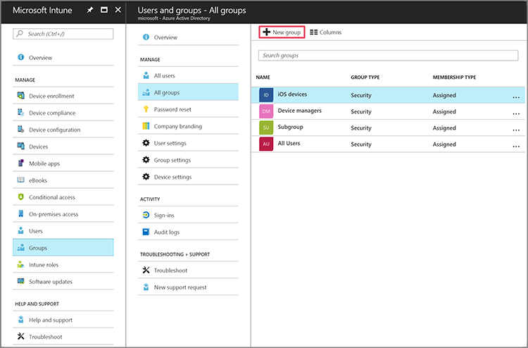
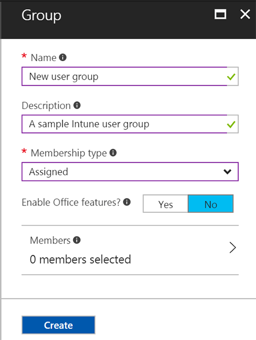

---
# required metadata

title: Add groups to organize users and devices
titlesuffix: Microsoft Intune
description: Add groups to organize users and devices by geography, department, or hardware specifics.
keywords:
author: ErikjeMS
ms.author: erikje
manager: dougeby
ms.date: 02/26/2018
ms.topic: article
ms.prod:
ms.service: microsoft-intune
ms.technology:
ms.assetid: f0a2b858-a824-4598-ab81-bdd8e62ac3b3

# optional metadata

#ROBOTS:
#audience:
#ms.devlang:
ms.reviewer: amyros
ms.suite: ems
#ms.tgt_pltfrm:
ms.custom: intune-azure
---

# Add groups to organize users and devices
Intune uses Azure Active Directory (AD) groups to manage devices and users. As an Intune admin, you can set up groups to suit your organizational needs. Create groups to organize users or devices by geographic location, department, or hardware characteristics. Use groups to manage tasks at scale. For example, you can set policies for many users or  deploy apps to a set of devices.

This topic explains how to add groups for use in Intune.

You can add the following types of groups:
- **Assigned groups** - Manually add users or devices into a static group
- **Dynamic groups** - (Using Azure Active Directory Premium) Let you dynamically build either user or device groups defined with either simple or advanced rules

## Add a new group

Use the following steps to create a new group.
1. Sign into the [Azure portal](https://portal.azure.com).
2. Choose **All services** > **Intune**. Intune is located in the **Monitoring + Management** section.
3. On the **Intune** pane, choose **Groups** and then choose **New group** in the **All groups** pane.
  
2. Specify a **Group type**, the **Name**, and **Description** of the new group. These properties only appear in the management portal and are not displayed to users.

3. Choose **Membership type**:
  - **Assigned** to create group with manually assigned members. Learn more about [Azure AD assigned groups](https://docs.microsoft.com/azure/active-directory/active-directory-groups-create-azure-portal).
  - **Dynamic User** to create a user group defined with a **Dynamic query**.
  - **Dynamic Device** to create a device group defined with a **Dynamic query**.

  

  Azure AD lets you create dynamic groups based on rules that define membership. Learn to [create attribute-based dynamic groups](https://docs.microsoft.com/azure/active-directory/active-directory-groups-dynamic-membership-azure-portal).

4. You can select **Enable Office features** to give user group members access to shared Office 365 apps. Learn more about [Office 365 Groups](https://support.office.com/article/Learn-about-Office-365-groups-b565caa1-5c40-40ef-9915-60fdb2d97fa2).
5. Choose **Create** to add the new group.

## See also
- [Manage access to resources with Azure Active Directory groups](https://docs.microsoft.com/azure/active-directory/active-directory-manage-groups)
- [Intune classic groups in the Azure portal](groups-get-started.md)
