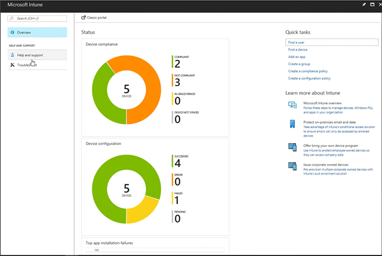

# Help users with the Troubleshooting portal in Microsoft Intune

[!INCLUDE[azure_portal](./includes/azure_portal.md)]

The troubleshooting portal lets help desk operators and Intune administrators view user information to fix user help requests. Organizations that include help desk operators in their staff can assign the **Help desk operator** to a group of users, who can then use the Troubleshoot blade to help users.

For example, when a user contacts support with a technical issue with Intune, the help desk operator enters the user's name. Intune shows useful data that can help resolve many tier-1 issues including:
- User status
- App install failure
- Compliance issues
- Device not responding
-	Device not getting VPN or Wi-Fi settings
-	App installation failure

## Add help desk operators
As an Intune admin, you can assign the Help Desk Operator role to a user group. Members of that group can use the admin portal to troubleshoot users' problems. Each help desk operator must have an Intune license to access the Intune portal. Learn how to [assign Intune licenses](licenses-assign.md).

To add help desk users:
1. [Add a user to Intune](users-add.md) if necessary
2. [Create a help desk group](groups-add.md) and add users to the group
3. [Assign the RBAC Help Desk Operator role](role-based-access-control.md#built-in-roles) or [create a custom role](role-based-access-control.md#custom-roles) with the following permissions:
  - MobileApps: Read
  - ManagedApps: Read
  - ManagedDevices: Read
  - Organization: Read

  

4. To give help desk operators permission to view the service health and open support tickets for Intune, [grant users admin permission](users-add.md#grant-admin-permissions) as a **Service administrator**.

## Access the troubleshooting portal

Help desk staff and Intune administrators can access the troubleshooting portal in two ways:
- Open [http://aka.ms/intunetroubleshooting](http://aka.ms/intunetroubleshooting) in a web browser.
  
- In the Intune portal, go **Help and Support** > **Troubleshoot**.

Click **Select user** to view a user and that user's details.

## Use the troubleshooting portal

In the troubleshooting portal, you can choose **Select user** to view a users' information. User information can help you understand the current state of users and their devices. The troubleshooting portal shows the following troubleshooting details:
- **Tenant status**
- **User status**
- **Devices** with device actions
- **Group membership**
- **App protection status**
