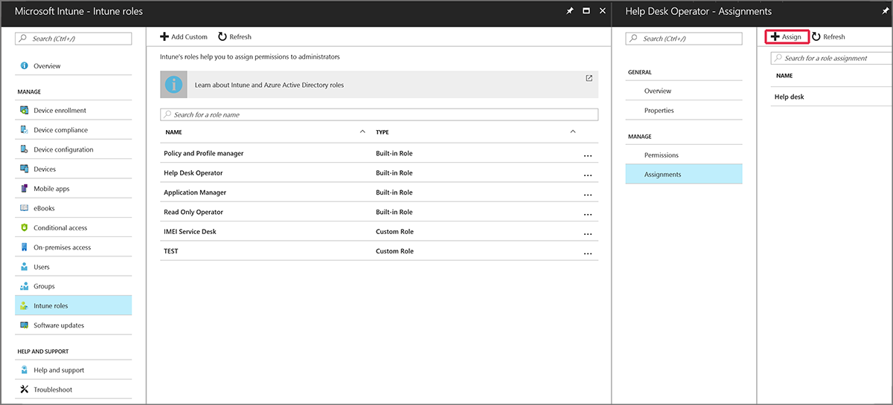
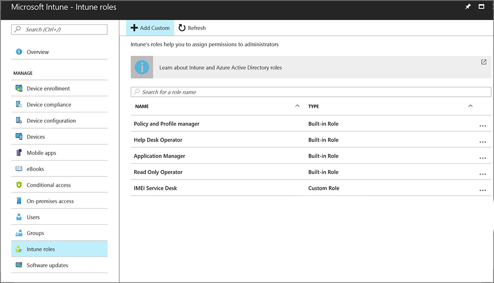
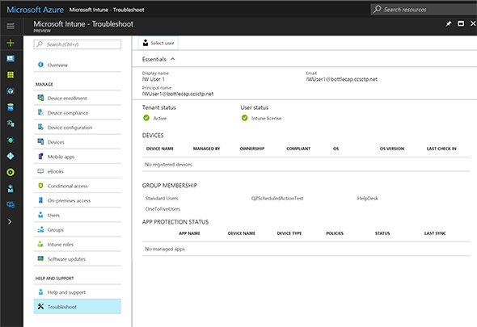

# Help users with the Troubleshooting portal in Microsoft Intune

[!INCLUDE[azure_portal](./includes/azure_portal.md)]

The troubleshooting portal lets help desk operators and Intune administrators view user information to fix user help requests. Organizations that include help desk operators in their staff can assign the **Help desk operator** to a group of users, who can then use the Troubleshoot blade to help users.

For example, when a user contacts support with a technical issue with Intune, the help desk operator enters the user's name. Intune displays pertinent information that can help resolve many tier-1 issues such as user status, app installation failure, or compliance issues. Issues addressed can include:
- Device not responding
-	Device not getting VPN or Wi-Fi settings
-	App installation failure

## Add help desk operators
An Intune administrator can assign help desk operator permission to users in two ways:
- Assign the built-in **Help Desk Operator** role
- Create and assign a custom role

## Assign help desk operator role
As an Intune admin, you can assign the Help Desk Operator role to a user group. Members of that group can use the admin portal. Each help desk operator must have an Intune license to access the Intune portal. Learn how to [assign Intune licenses](licenses-assign.md).

1. As an Intune administrator, login to Intune portal, and select **Intune roles**.
2. On the **Intune roles** workload, select **Help Desk Operator** > **Assignments**, and then select **Assign**.
  
3. Type an **Assignment name** (required), an **Assignment description** (optional), and then assign **Members (Groups)** and **Scope (Groups)**.
4. Members of the Help Desk Operator role can now use the troubleshooting portal.

For more information about Intune roles, see [Intune roles (RBAC)](role-based-access-control.md).

## Create a custom role for troubleshooting
As an Intune admin, you can create a custom role that lets users use the troubleshooting portal with permissions that suit your organization's needs. For more information about Intune roles, see [Intune roles (RBAC)](role-based-access-control.md).

To use the Intune console for a help-desk view, a custom help desk role should have the following permissions:
- MobileApps: Read
- ManagedApps: Read
- ManagedDevices: Read
- Organization: Read

## Access the troubleshooting portal

Help desk staff and Intune administrators can access the troubleshooting portal in two ways:
- Open [http://aka.ms/intunetroubleshooting](http://aka.ms/intunetroubleshooting) in a web browser.
- In the Intune portal, go **Help and Support** > **Troubleshoot**.

## Use the troubleshooting portal

In the troubleshooting portal, you can choose **Select user** to view a users' information. User information can help you understand the current state of users and their devices. The troubleshooting portal shows the following troubleshooting details:
- **Tenant status**
- **User status**
- **Devices** and device actions
- **Group membership**
- **App protection status**
