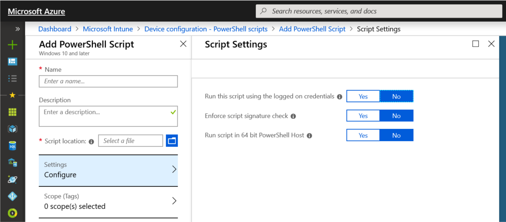
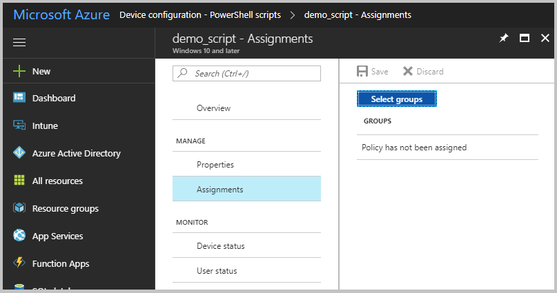
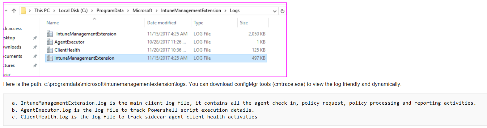

---
# required metadata

title: Add PowerShell scripts to Windows 10 devices in Microsoft Intune - Azure | Microsoft Docs
description: Create and run PowerShell scripts, assign the script policy to Azure Active Directory groups, use reports to monitor the scripts, and see the steps to delete scripts you add on Windows 10 devices in Microsoft Intune. Also see some common issues and resolutions. 
keywords:
author: MandiOhlinger
ms.author: mandia
manager: dougeby
ms.date: 05/28/2019
ms.topic: conceptual
ms.service: microsoft-intune
ms.localizationpriority: high
ms.technology:
ms.assetid: 768b6f08-3eff-4551-b139-095b3cfd1f89

# optional metadata

#ROBOTS:
#audience:
#ms.devlang:
ms.reviewer:
ms.suite: ems
search.appverid: MET150
#ms.tgt_pltfrm:
ms.custom: intune-azure
ms.collection: M365-identity-device-management
---

# Use PowerShell scripts on Windows 10 devices in Intune

Use the Microsoft Intune management extension to upload PowerShell scripts in Intune to run on Windows 10 devices. The management extension enhances Windows 10 mobile device management (MDM), and makes it easier to move to modern management.

This feature applies to:

- Windows 10 and later

## Move to modern management

End-user computing is going through a digital transformation. Classic, traditional IT focuses on a single device platform, business-owned devices, users that work from the office, and different manual, reactive IT processes. The modern workplace uses many platforms that are user and business owned, allows users to work from anywhere, and provides automated and proactive IT processes.

MDM services, such as Microsoft Intune, can manage mobile and desktop devices running Windows 10. The built-in Windows 10 management client communicates with Intune to run enterprise management tasks. There are some tasks that you might need, such as advanced device configuration and troubleshooting. For Win32 app management, you can use the [Win32 app management](apps-win32-app-management.md) feature on your Windows 10 devices.

The Intune management extension supplements the in-box Windows 10 MDM features. You can create PowerShell scripts to run on the Windows 10 devices. For example, you can create a PowerShell script that does advanced device configurations, uploads the script to Intune, assigns the script to an Azure Active Directory (AD) group, and runs the script. You can then monitor the run status of the script from start to finish.

## Prerequisites

The Intune management extension has the following prerequisites. Once these are met, the Intune management extension is installed automatically when a PowerShell script or Win32 app is assigned to the user or device.

- Devices running Windows 10 version 1607 or later. If the device is enrolled using [bulk auto-enrollment](windows-bulk-enroll.md), devices must run Windows 10 version 1703 or later. The Intune management extension isn't supported on Windows 10 in S mode, as S mode doesn't allow running non-store apps. 
  
- Devices joined to Azure Active Directory (AD), including:
  
  - Hybrid Azure AD-joined: Devices joined to Azure Active Directory (AD), and also joined to on-premises Active Directory (AD). See [Plan your hybrid Azure Active Directory join implementation](https://docs.microsoft.com/azure/active-directory/devices/hybrid-azuread-join-plan) for guidance.

- Devices enrolled in Intune, including:

  - Devices enrolled in a group policy (GPO). See [Enroll a Windows 10 device automatically using Group Policy](https://docs.microsoft.com/windows/client-management/mdm/enroll-a-windows-10-device-automatically-using-group-policy) for guidance.
  
  - Devices manually enrolled in Intune, which is when:
  
    - User signs in to the device using a local user account, manually joins the device to Azure AD (with auto-enrollment to Intune enabled in Azure AD), and then signs into the device using the Azure AD account.
    
    Or
    
    - User signs in to the device using their Azure AD account, and then enrolls in Intune.

  - Co-managed devices that use Configuration Manager and Intune. See [What is co-management](https://docs.microsoft.com/sccm/comanage/overview) for guidance.

## Create a script policy 

1. Sign in to [Intune](https://go.microsoft.com/fwlink/?linkid=2090973).
2. Select **Device configuration** > **PowerShell scripts** > **Add**.
3. Enter the following properties:
    - **Name**: Enter a name for the PowerShell script. 
    - **Description**: Enter a description for the PowerShell script. This setting is optional, but recommended. 
    - **Script location**: Browse to the PowerShell script. The script must be less than 200 KB (ASCII).
4. Choose **Configure**, and enter the following properties:
    - **Run this script using the logged on credentials**: Select **Yes** to run the script with the user's credentials on the device. Choose **No** (default) to run the script in the system context. Many administrators choose **Yes**. If the script is required to run in the system context, choose **No**.
    - **Enforce script signature check**: Select **Yes** if the script must be signed by a trusted publisher. Select **No** (default) if there isn't a requirement for the script to be signed. 
    - **Run script in 64-bit PowerShell host**: Select **Yes** to run the script in a 64-bit PowerShell (PS) host on a 64-bit client architecture. Select **No** (default) runs the script in a 32-bit PowerShell host.

      When setting to **Yes** or **No**, use the following table for new and existing policy behavior:

      | Run script in 64-bit PS host | Client architecture | New PS script | Existing policy PS script |
      | --- | --- | --- | --- | 
      | No | 32-bit  | 32-bit PS host supported | Runs only in 32-bit PS host, which works on 32-bit and 64-bit architectures. |
      | Yes | 64-bit | Runs script in 64-bit PS host for 64-bit architectures. When ran on 32-bit, the script runs in a 32-bit PS host. | Runs script in 32-bit PS host. If this setting changes to 64-bit, the script opens (it doesn't run) in a 64-bit PS host, and reports the results. When ran on 32-bit, the script runs in 32-bit PS host. |

    
5. Select **OK** > **Create** to save the script.

> [!NOTE]
> The PowerShell script runs under admin privilege (by default) when the script is set to user context and the end user on the device has admin privileges.

## Assign the policy

1. In **PowerShell scripts**, select the script to assign, and then choose **Manage** > **Assignments**.

    

2. Choose **Select Groups** to list available Azure AD groups. 
3. Select one or more groups that include the users whose devices receive the script. **Select** to assign the policy to the selected groups.

> [!NOTE]
> - End users aren't required to sign in to the device to execute PowerShell scripts.
> - PowerShell scripts in Intune can be targeted to Azure AD device security groups or Azure AD user security groups.

The Intune management extension client checks once every hour and after every reboot with Intune for any new scripts or changes. After you assign the policy to the Azure AD groups, the PowerShell script runs, and the run results are reported. Once the script executes, it doesn't execute again unless there's a change in the script or policy.

## Monitor run status

You can monitor the run status of PowerShell scripts for users and devices in the Azure portal.

In **PowerShell scripts**, select the script to monitor, choose **Monitor**, and then choose one of the following reports:

- **Device status**
- **User status**

## Troubleshoot scripts

Agent logs on the client machine are typically in `\ProgramData\Microsoft\IntuneManagementExtension\Logs`. You can use [CMTrace.exe](https://docs.microsoft.com/sccm/core/support/tools) to view these log files. 

  

## Delete a script

In **PowerShell scripts**, right-click the script, and select **Delete**.

## Common issues and resolutions

#### Issue: Intune management extension doesn't download

**Possible resolutions**:

- The device isn't joined to Azure AD. Be sure the devices meet the [prerequisites](#prerequisites) (in this article). 
- There are no PowerShell scripts or Win32 apps assigned to the groups that the user or device belongs.
- The device can't check-in with the Intune service, due to no internet access, no access to Windows Push Notification Services (WNS), and so on.
- The device is in S mode. The Intune management extension isn't supported on devices running in S mode. 

To see if the device is auto-enrolled, you can:

  1. Go to **Settings** > **Accounts** > **Access work or school**.
  2. Select the joined account > **Info**.
  3. Under **Advanced Diagnostic Report**, select **Create Report**.
  4. Open the `MDMDiagReport` in a web browser.
  5. Search for the **MDMDeviceWithAAD** property. If the property exists, the device is auto-enrolled. If this property doesn't exist, then the device isn't auto-enrolled.

[Enable Windows 10 automatic enrollment](windows-enroll.md#enable-windows-10-automatic-enrollment) includes the steps to configure automatic enrollment in Intune.

#### Issue: PowerShell scripts do not run

**Possible resolutions**:

- The PowerShell scripts don't run at every sign-in. They run:

  - When the script is assigned to a device
  - If you change the script, upload it, and assign the script to a user or device
  
    > [!TIP]
    > The **Microsoft Intune Management Extension** is a service that runs on the device, just like any other service listed in the Services app (services.msc). After a device reboots, this service may also restart, and check for any assigned PowerShell scripts with the Intune service. If the **Microsoft Intune Management Extension** service is set to Manual, then the service may not restart after the device reboots.

- The Intune management extension client checks once per hour for any changes in the script or policy in Intune.
- Confirm the Intune management extension is downloaded to `%ProgramFiles(x86)%\Microsoft Intune Management Extension`.
- Scripts don't run on Surface Hubs or Windows 10 in S mode.
- Review the logs for any errors. See [troubleshoot scripts](#troubleshoot-scripts) (in this article).
- For possible permission issues, be sure the properties of the PowerShell script are set to `Run this script using the logged on credentials`. Also check that the signed in user has the appropriate permissions to run the script.

- To isolate scripting problems, do the following:

  - Review the PowerShell execution configuration on your devices. See the [PowerShell execution policy](https://docs.microsoft.com/powershell/module/microsoft.powershell.security/set-executionpolicy?view=powershell-6) for guidance.
  - Run a sample script using the Intune management extension. For example, create the `C:\Scripts` directory, and give everyone full control. Run the following script:

    ```powershell
    write-output "Script worked" | out-file c:\Scripts\output.txt
    ```

    If it succeeds, output.txt should be created, and should include the "Script worked" text.

  - To test script execution without Intune, run the scripts in the System account using the [psexec tool](https://docs.microsoft.com/sysinternals/downloads/psexec) locally:

    `psexec -i -s`

## Next steps

[Monitor](device-profile-monitor.md) and [troubleshoot](device-profile-troubleshoot.md) your profiles.
