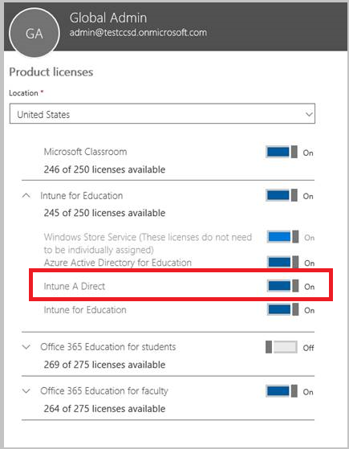

---
# required metadata

title: Assign Intune licenses
description: Assign licenses to users for your Intune subscription
keywords:
author: lindavr
ms.author: lindavr
manager: angrobe
ms.date: 06/15/2017
ms.topic: get-started-article
ms.prod:
ms.service: microsoft-intune
ms.technology:
ms.assetid: bb4314ea-88b5-44d3-92ce-4c6aff0587a4

# optional metadata

#ROBOTS:
#audience:
#ms.devlang:
ms.reviewer: amyro
ms.suite: ems
#ms.tgt_pltfrm:
ms.custom: intune-classic

---

# Assign Intune licenses to your user accounts

[!INCLUDE[both-portals](./includes/note-for-both-portals.md)]

Whether you manually add users or synchronize from your on-premises Active Directory, you must first assign each user an Intune license before users can enroll their devices in Intune.

## Assign an Intune license in the Office 365 Admin center

You can use the [Office 365 portal](http://go.microsoft.com/fwlink/p/?LinkId=698854) to manually add cloud-based users and assign licenses to both cloud-based user accounts and accounts synchronized from your on-premises Active Directory to Azure AD.

1.  Sign in to the [Office 365 portal](http://go.microsoft.com/fwlink/p/?LinkId=698854) using your tenant administrator credentials, and then choose **Users** > **Active Users**.

2.  Select the user account that you want to assign an Intune user license to, and then choose **Product licenses** > **Edit**.

3.  Toggle **Intune** or **Enterprise Mobility + Security** to **On**, and choose **Save**.

4. The user account now has the permissions needed to use the service and enroll devices into management.

> [!NOTE]
> Users will appear in the Admin console only after they have enrolled a device. Also, you can select a group of users to edit at once,  either selecting to add or replace a license for all selected users.

## Use School Data Sync to assign licenses to users in Intune for Education
If you are an educational organization, you can use School Data Sync (SDS) to assign Intune for Education licenses to synced users. Just choose the Intune for Education checkbox when you're setting up your SDS profile.  

When you assign an Intune for Education license, make sure that Intune A Direct license is also assigned.

See this [overview of School Data Sync](https://support.office.com/en-us/article/Overview-of-School-Data-Sync-and-Classroom-f3d1147b-4ade-4905-8518-508e729f2e91?ui=en-US&rs=en-US&ad=US) to learn more about SDS.

## How user and device licenses affect access to services
* Each **user** that you assign a user software license to may access and use the online services and related software (including System Center software) to manage applications and up to 15 devices.
* Each **device** that you assign a device software license to may access and use the online services and related software (including System Center software) for use by any number of users.
* If a device is used by more than one user, each requires a device software license or all users require a user software license.

## Use PowerShell to selectively manage EMS user licenses
Organizations that use Microsoft Enterprise Mobility + Security (formerly Enterprise Mobility Suite) might have users who only require Azure Active Directory Premium or Intune services in the EMS package. You can assign one or a subset of services using [Azure Active Directory PowerShell cmdlets](https://msdn.microsoft.com/library/jj151815.aspx).

To selectively assign user licenses for EMS services, open PowerShell as an administrator on a computer with the [Azure Active Directory Module for Windows PowerShell](https://msdn.microsoft.com/library/jj151815.aspx#bkmk_installmodule) installed. You can install PowerShell on a local computer or on an ADFS server.

You must create a new license SKU definition that applies only to the desired service plans. To do this, disable the plans you don’t want to apply. For example, you might create a license SKU definition that does not assign an Intune license. To see a list of available services, type:

    (Get-MsolAccountSku | Where {$_.SkuPartNumber -eq "EMS"}).ServiceStatus

You can run the following command to exclude the Intune service plan. You can use the same method to expand to an entire security group or you can use more granular filters.

**Example 1** 
Create a new user on the command line and assign an EMS license without enabling the Intune portion of the license:

    Connect-MsolService

    New-MsolUser -DisplayName “Test User” -FirstName FName -LastName LName -UserPrincipalName user@<TenantName>.onmicrosoft.com –Department DName -UsageLocation US

    $CustomEMS = New-MsolLicenseOptions -AccountSkuId "<TenantName>:EMS" -DisabledPlans INTUNE_A
    Set-MsolUserLicense -UserPrincipalName user@<TenantName>.onmicrosoft.com -AddLicenses <TenantName>:EMS -LicenseOptions $CustomEMS

Verify with:

    (Get-MsolUser -UserPrincipalName "user@<TenantName>.onmicrosoft.com").Licenses.ServiceStatus

**Example 2** 
Disable the Intune portion of EMS license for a user that is already assigned with a license:

    Connect-MsolService

    $CustomEMS = New-MsolLicenseOptions -AccountSkuId "<TenantName>:EMS" -DisabledPlans INTUNE_A
    Set-MsolUserLicense -UserPrincipalName user@<TenantName>.onmicrosoft.com -LicenseOptions $CustomEMS

Verify with:

    (Get-MsolUser -UserPrincipalName "user@<TenantName>.onmicrosoft.com").Licenses.ServiceStatus

