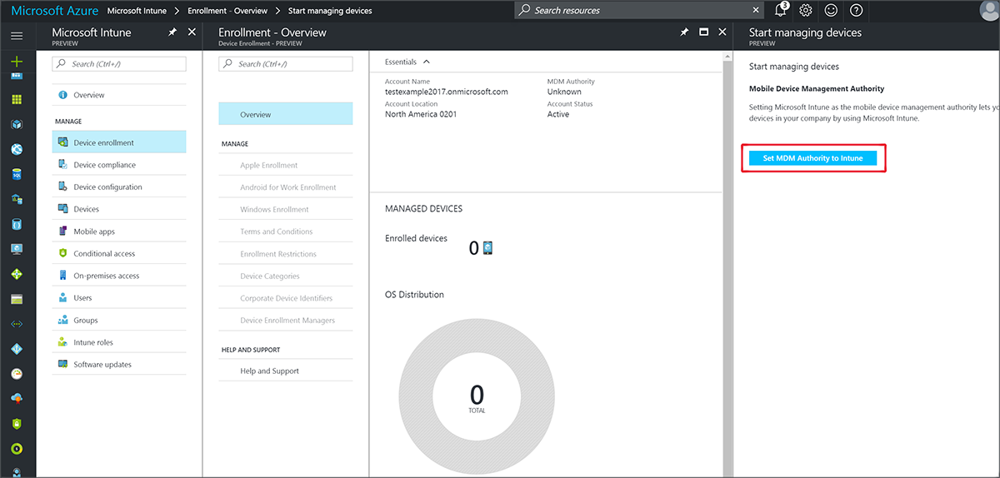

---
# required metadata

title: Set the mobile device management authority
titlesuffix: "Azure portal"
description: Learn how to set the mobile device management authority in Intune. "
keywords:
author: arob98
ms.author: angrobe
manager: angrobe
ms.date: 10/31/2017
ms.topic: article
ms.prod:
ms.service: microsoft-intune
ms.technology:
ms.assetid: 8deff871-5dff-4767-9484-647428998d82

# optional metadata

#ROBOTS:
#audience:
#ms.devlang:
ms.reviewer: damionw
ms.suite: ems
#ms.tgt_pltfrm:
ms.custom: intune-azure
---

# Set the mobile device management authority

[!INCLUDE[azure_portal](./includes/azure_portal.md)]

The mobile device management (MDM) authority setting determines how you manage your devices. As an IT admin, you must set an MDM authority before users can enroll devices for management.

Possible configurations are:

- **Intune Standalone** - cloud-only management, which you configure by using the Azure portal. Includes the full set of capabilities that Intune offers. [Set the MDM authority in the Intune console](#set-mdm-authority-to-intune).

- **Intune Hybrid** - integration of the Intune cloud solution with System Center Configuration Manager. You configure Intune by using the Configuration Manager console. [Set the MDM authority in Configuration Manager](https://docs.microsoft.com/sccm/mdm/deploy-use/configure-intune-subscription).

- **Mobile Device Management for Office 365** - integration of Office 365 with the Intune cloud solution. You configure Intune from your Office 365 Admin Center. Includes a subset of the capabilities that are available with Intune Standalone. Set the MDM authority in Office 365 Admin Center.

>[!IMPORTANT]    
In Configuration Manager version 1610 or later and Microsoft Intune version 1705, you change the MDM authority without having to contact Microsoft Support, and without having to unenroll and reenroll your existing managed devices. For details, see [What to do if you choose the wrong MDM authority setting](/intune-classic/deploy-use/prerequisites-for-enrollment#what-to-do-if-you-choose-the-wrong-mdm-authority-setting).

## Set MDM authority to Intune

1. In the [Azure portal](https://portal.azure.com), choose **More Services** > **Monitoring + Management** > **Intune**.
2. Select the orange banner to open the **Mobile Device Management Authority** setting.
3. Under **Mobile Device Management Authority**, choose your MDM authority from the following options:
  - **Intune MDM Authority**
  - **Configuration Manager MDM Authority**
  - **None**

  

  A message indicates that you have successfully set your MDM authority to Intune.

## Enable device enrollment

With Intune set as your MDM authority, users can enroll personally owned devices and gain access to resources like email in the following ways by installing the Company Portal (iOS and Android), adding work credentials (Windows), or accessing the Company Portal website (iOS, Android, macOS).

Different platforms have the following requirements to enable or simplify enrollment:
- **iOS** - (required) [Get an Apple MDM push certificate](apple-mdm-push-certificate-get.md) and then [enable enrollment for company-owned iOS devices](ios-enroll.md) (optional).
- **Android** - (optional) [Enable Android work profiles](android-enroll.md)
- **Windows** - (optional) Enable [Automatic enrollment](windows-enroll.md) or [bulk enrollment](windows-bulk-enroll.md)
- **macOS** - No requirements

## Mobile device cleanup after MDM certificate expiration

The MDM certificate is renewed automatically when mobile devices are communicating with the Intune service. If mobile devices are wiped, or they fail to communicate with the Intune service for some period of time, the MDM certificate will not get renewed. The device is removed from the Azure portal 180 days after the MDM certificate expires.
