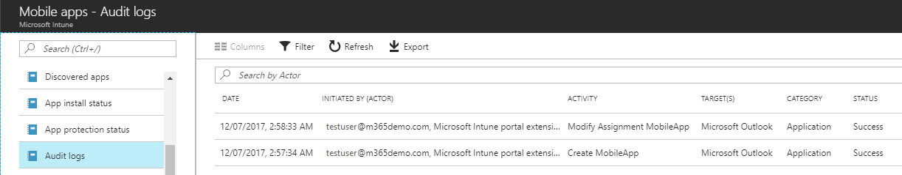
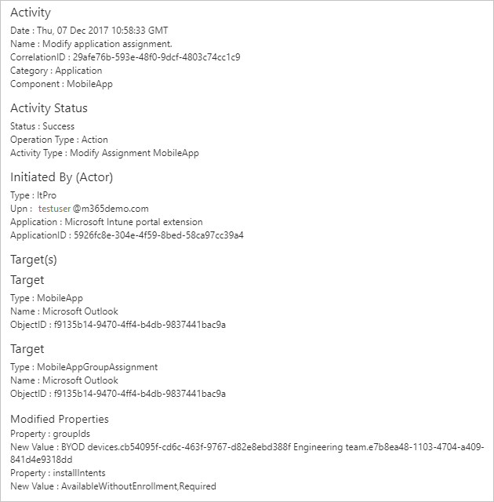

---
# required metadata

title: Audit logs for Intune activities
description: Learn how to review audit logs that record Intune activies 
keywords: 
author: dougeby
manager: dougeby
ms.date: 12/12/2017
ms.topic: article
ms.prod:
ms.service: microsoft-intune
ms.technology:
ms.assetid: 6ee841cc-5694-4ba1-8f66-1d58edec30a4

# optional metadata

#ROBOTS:
#audience:
#ms.devlang:
#ms.reviewer: [ALIAS]
#ms.suite: ems
#ms.tgt_pltfrm:
#ms.custom:

---
# Audit logs for Intune activities
Audit logs provide you with a record of activities that generate a change in Microsoft Intune. Create, Update (edit), Delete, and Assign actions, or remote tasks, generate audit events that you can review. You can review audit logs for most Intune workloads. Auditing is enabled by default for all customers and can't be disabled. Audit events began being recorded on the feature release date of December 2017; prior events are unavailable.

## Who can access the data?
Users with the following permissions can review audit logs:
- Global Administrator
- Intune Service Administrator
- Administrators assigned to an Intune role with **Audit data** - **Read** permissions

## Audit logs for Intune workloads
You can review audit logs in the Monitoring group for each Intune workload.  
1. Sign into the [Azure portal](https://portal.azure.com).
2. Choose **More Services** > **Monitoring + Management** > **Intune**.
3. On the **Intune** blade, choose the workload for which you want to review audit logs.
4. In the **Monitoring** group for the workload, choose **Audit logs**.

## Review audit events

An audit log has a default list view that shows the following items:    

- date and time of the occurrence
- Initiated by (Actor)
- Activity
- Target(s)
- Category
- Status

By clicking an item in the list view, you get all available details about it.

> [!Note]    
> The **Initiated by (actor)** section in the audit log details provides information about who performed the activity and from where it was performed. For example, if you perform the activity in Intune in the Azure portal, **Application** always lists **Microsoft Intune portal extension** and the **Application ID** always uses the same GUID. 
>    
> The **Target(s)** section can list multiple targets and the properties that were changed.  

## Filter audit events
Each workload has a menu item that pre-filters the category of audit events associated with that blade. A separate filter option lets you change to different categories, and event action details within that category. You can search by UPN (for example, the user who did the action). A date range filter allows 24 hours, 7 days, or 30-day options. By default, the last 30 days of audit events are displayed.

## Use Graph API to retrieve audit events
For details about how to use the graph API to retrieve up to one year of audit events, see 
[List auditEvents](https://developer.microsoft.com/en-us/graph/docs/api-reference/beta/api/intune_auditing_auditevent_list).