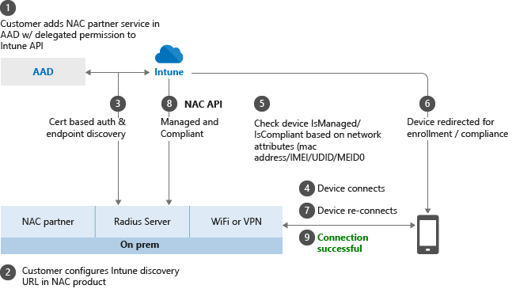

---
# required metadata

title: Network access control integration with Intune
titleSuffix: "Intune on Azure"
description: Network access control (NAC) integration with Intune
keywords:
author: andredm7
ms.author: andredm
manager: angrobe
ms.date: 06/23/2017
ms.topic: article
ms.prod:
ms.service: microsoft-intune
ms.technology:
ms.assetid: aa7ecff7-8579-4009-8fd6-e17074df67de

# optional metadata

#ROBOTS:
#audience:
#ms.devlang:
ms.reviewer: davidra
ms.suite: ems
#ms.tgt_pltfrm:
ms.custom: intune-azure

---

# Network access control (NAC) integration with Intune

Intune integrates with network access control partners to help organizations secure corporate data when devices try to access on-premises resources.

## How do Intune and NAC solutions help protect your organization resources?

NAC solutions are responsible for checking the device enrollment and compliance state with Intune to make access control decisions. If the device is not enrolled or is enrolled and not compliant with Intune device compliance policies, the device should be redirected to Intune for enrollment and/or for a device compliance check.

### Example

If the device is enrolled and compliant with Intune, the NAC solution should allow the device access to corporate resources. For example, users can be allowed or denied access when trying to access corporate Wi-Fi or VPN resources.

## NAC and conditional access

NAC works with with conditional access to provide access control decisions.

- See [common ways to use conditional access with Intune](conditional-access-intune-common-ways-use.md) for more details.

## How the NAC integration works

Here’s an overview on how the NAC integration works when integrated with Intune, the first three steps explain the onboarding process. Once the NAC solution is integrated with Intune, steps 4-9 describe the on-going operation.

1.  Register the NAC partner solution with Azure Active Directory (AAD), and grant delegated permissions to the Intune NAC API.

2.  Configure the NAC partner solution with the appropriate settings including the Intune discovery URL.

3.  Configure the NAC partner solution for certificate authentication.

4.  User connects to corporate Wi-Fi access point or makes a VPN connection request.

5.  NAC partner solution forwards the device information to Intune, and asks Intune about the device enrollment and compliance state.

6.  If the device is not compliant or not enrolled, the NAC partner solution instructs the user to enroll or fix the device compliance.

7.  The device attempts to re-verify its compliance and/or the enrollment state.

8.  Once the device is enrolled and compliant, NAC partner solution gets the state from Intune.

9.  Connection is successfully established which allows the device access to corporate resources.

## Next steps

-   [Integrate Cisco ISE with Intune](http://www.cisco.com/c/en/us/td/docs/security/ise/2-1/admin_guide/b_ise_admin_guide_21/b_ise_admin_guide_20_chapter_01000.html)

-   [Integrate Citrix NetScaler with Intune](https://docs.citrix.com/netscaler-gateway/11-1/microsoft-intune-integration/configuring-network-access-control-device-check-for-netscaler-gateway-virtual-server-for-single-factor-authentication-deployment.html)

-   [Integrate HP Aruba Clear Pass with Intune](https://support.arubanetworks.com/Documentation/tabid/77/DMXModule/512/Command/Core_Download/Default.aspx?EntryId=23757)
